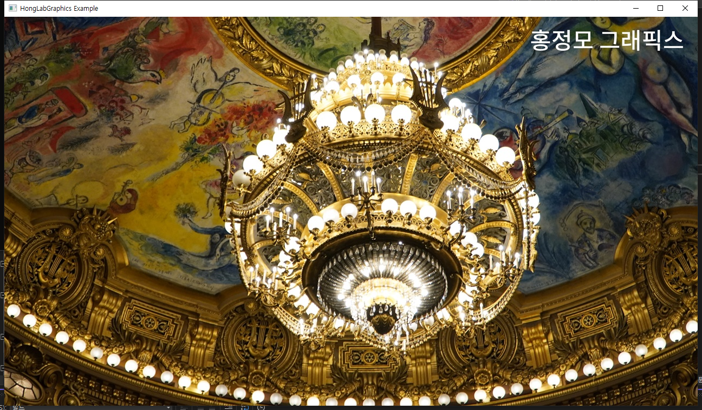
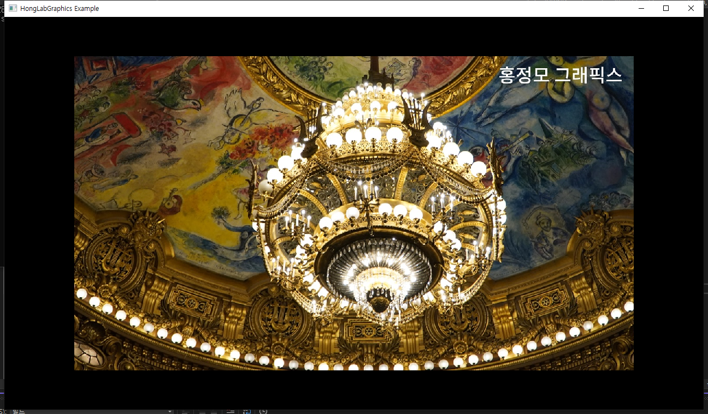
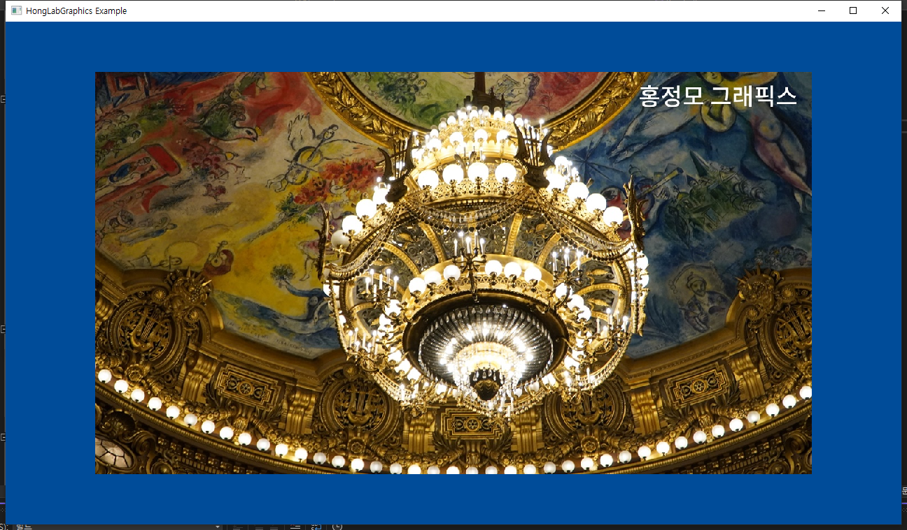
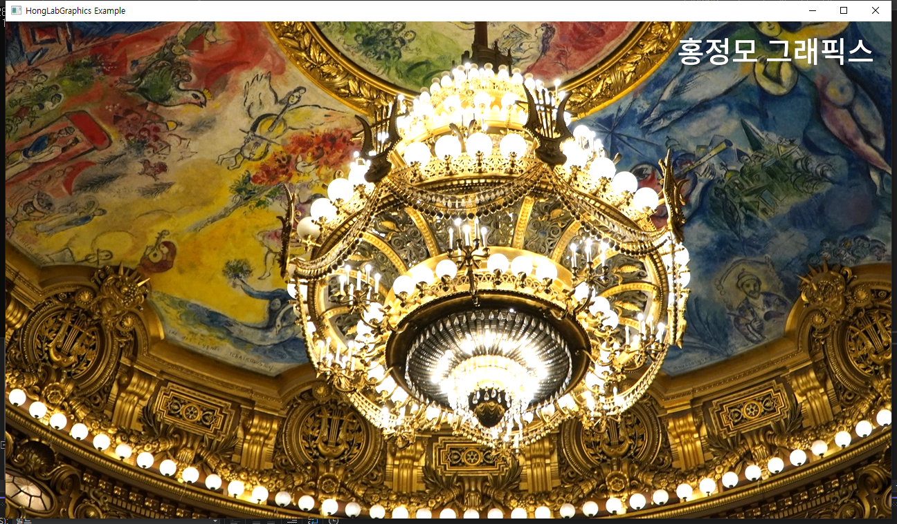
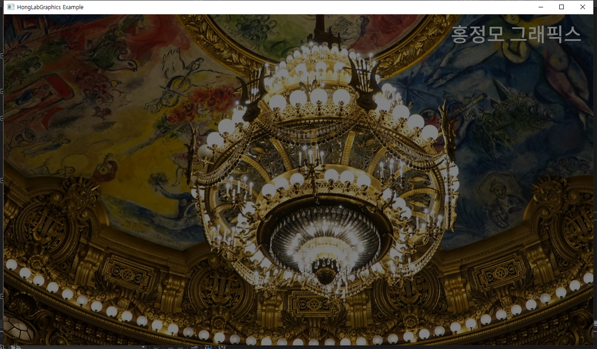
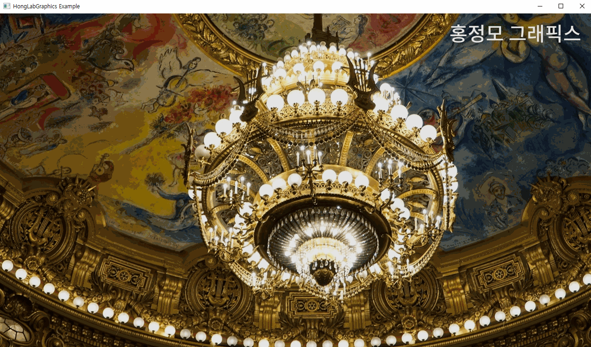
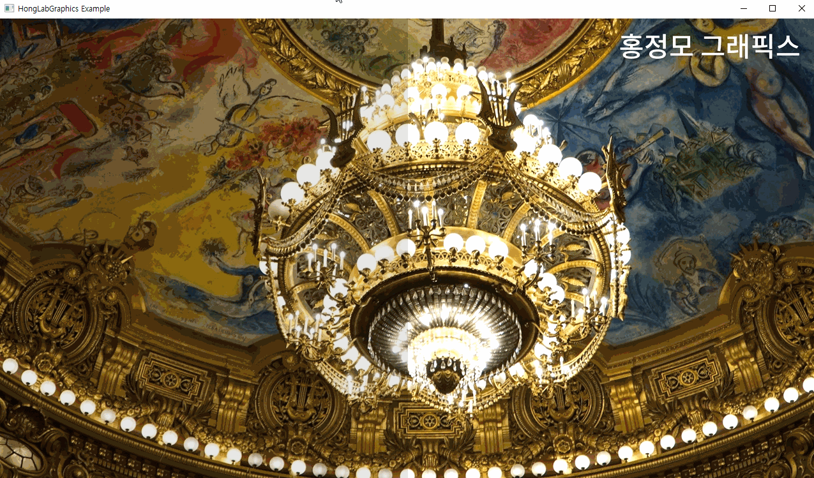

# 이미지 처리 기초

### Introduction

블룸 효과 만들기 4단계 中

1. ***이미지 읽고 저장하기***
2. 컨벌루션 이해하기
3. 가우시안 필터 만들기
4. 블룸 효과 만들기

이번 실습도 마찬가지로 예제 코드의 일부분만 바꿔가며 이해하는 방식으로 진행한다.

### 이미지 읽어들이기

```cpp
class Image
{
public:
    int width = 0, height = 0, channels = 0;
    std::vector<Vec4> pixels;

    void ReadFromFile(const char* filename); // 파일 읽기
    void WritePNG(const char* filename); // 파일 저장하기
    Vec4& GetPixel(int i, int j); // 파일의 픽셀 값 가져오기

    void BoxBlur5();
    void GaussianBlur5();
    void Bloom(const float& th, const int& numRepeat, const float& weight = 1.0f);
};
```

예제 코드에 Image class가 정의되어 있다.

Image는 width, height, channels와 지난 시간에 등장했던 Vec4 구조의 형태의 pixels로 이뤄져 있다.

밑 6줄 中 이미 구현되어 있는 위 3줄이 이미지를 읽는데 사용되며, 나머지는 향후 실습에 사용될 3줄이다.

이렇게 정의한 Image는 함수에서 다음과 같이 사용된다.

```cpp
// 이미지 읽어들이기
image.ReadFromFile("image_1.jpg");
// 이미지 저장하기
image.WritePNG("result.png");
// 읽어드린 이미지를 사이즈에 맞게 화면에 띄우기
Initialize(window, width, height, image.width, image.height);
// GPU로 복사
memcpy(ms.pData, image.pixels.data(), image.pixels.size() * sizeof(Vec4));
```

예제 코드를 실행하면 다음 화면이 출력된다. (다른 사진으로 바꿔서 실습하려고 했다가 결국 실패했다..)



## 이미지를 나타내는 원리 이해하기

현대 컴퓨터 그래픽스 파이프라인에서는 사진을 보여줄 때도 3차원으로 물체를 그린다는 개념을 잊으면 안된다. 위 예시 사진도 캔버스 위에 사진을 나타내기 위한 사각형 공간을 따로 그려주는 원리가 숨어있다.

### 1. 사각형 공간의 존재

```cpp
const std::vector<Vertex> vertices =
            {
                { { -1.0f, -1.0f, 0.0f, 1.0f }, { 0.f, 1.f },},
                { {  1.0f, -1.0f, 0.0f, 1.0f }, { 1.f, 1.f },},
                { {  1.0f,  1.0f, 0.0f, 1.0f }, { 1.f, 0.f },},
                { { -1.0f,  1.0f, 0.0f, 1.0f }, { 0.f, 0.f },},
            };
```

Initialize 함수 안에 다음과 같은 코드가 들어있다. 여기서 앞의 두 좌표를 1.0 → 0.8로 바꾸면 이런 현상이 발생한다.

 

0.8로 바꿔준 만큼 사진의 공간이 줄어들었다. 즉, 사진을 나타내기 위한 사각형 공간이 존재하며 그 부분이 위 코드라는 것을 알 수 있다.

### 2. 뒷배경의 존재

```cpp
void Render()
    {
        float clearColor[4] = { 0.0f, 0.0f, 0.0f, 1.0f };
        deviceContext->RSSetViewports(1, &viewport);
        deviceContext->OMSetRenderTargets(1, &renderTargetView, nullptr);
        deviceContext->ClearRenderTargetView(renderTargetView, clearColor);

        ...
  }
```

Render 함수에 들어있는 코드다. 여기서 clearColor의 숫자를 조정해주면 출력 결과가 다음과 같이 변한다.


 

이 코드는 렌더링을 하기 전, 화면에 해당하는 메모리 부분을 어떻게 초기화할 것인지를 담당한다. 우리가 1번 화면에서 보았던 뒤의 검은색 배경이 단순히 빈 부분이 아니라, 실제 메모리 값이 존재하는 공간이라는 것을 알 수 있다.

## 이미지 처리 실습

### 이미지 밝기 조절하기

```cpp
for (int i = 0; i < image.height * image.width; i++)
{
    image.pixels[i].v[0] = std::clamp(image.pixels[i].v[0] * 1.2f, 0.0f, 1.0f);
    image.pixels[i].v[1] = std::clamp(image.pixels[i].v[1] * 1.2f, 0.0f, 1.0f);
    image.pixels[i].v[2] = std::clamp(image.pixels[i].v[2] * 1.2f, 0.0f, 1.0f);
}
```

이미지를 밝게 하려면 모든 픽셀의 RGB 값을 높여주면 되므로 예시처럼 1.2배 곱해주는 코드를 작성하였다. 여기서 주의할 점은 1.0f를 넘어가면 overflow가 발생하기 때문에, clamp로 최소값과 최대값을 제한해주었다.

마찬가지로 0.5배를 곱해준다면 같은 원리로 이미지를 어둡게 만들 수 있다.

 

### 이미지 밝기를 애니메이션으로 처리하기

```cpp
//반복이므로 update 함수 내에 작성
for (int i = 0; i < image.height; i++) 
        {
            for (int j = 0; j < image.width; j++)
            {
                const int idx = i * image.width + j;
                image.pixels[idx].v[0] = std::clamp(image.pixels[idx].v[0] * 0.9f, 0.0f, 1.0f);
                image.pixels[idx].v[1] = std::clamp(image.pixels[idx].v[1] * 0.9f, 0.0f, 1.0f);
                image.pixels[idx].v[2] = std::clamp(image.pixels[idx].v[2] * 0.9f, 0.0f, 1.0f);
            }
        }
```

화면을 점점 어둡게 혹은 밝게 만드려면 반복을 통해 계속해서 효과를 적용해주면 된다. 따라서 이전 실습 때처럼 update 함수 안에 코드를 작성하면 애니메이션 효과를 줄 수 있다. 조금 응용하면 우측의 효과도 줄 수 있다.

 