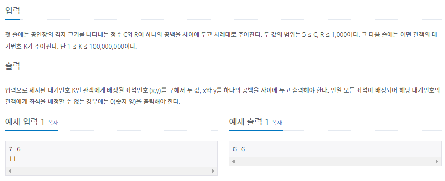
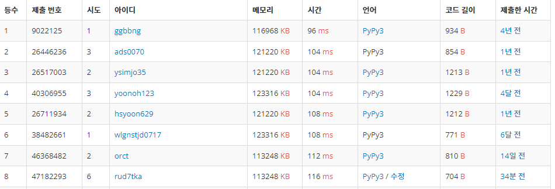

# 20220804_백준10157_자리배정_송경삼

**1. 문제**




문제를 접하고 처음 든 생각은 굉장히 쉽게 풀 수 있을 것 같은데 왜 정답 비율이 37% 밖에 안될까? 였습니다. 다른 방법은 어떤 방식으로 문제를 풀지 답을 찾는 느낌이었다면, 이 문제는 어떤 방식으로 풀어볼까? 라고 방법을 여러가지 생각한 문제였습니다. 그 중에 만만해보였던 것이 수학적으로 접근해서 연산량을 줄이는 방법 한가지와 재귀함수를 써서 코드 길이를 짧게하는 방법이었습니다. 그런데 재귀함수의 경우, 파이썬에서 최대 재귀 깊이가 500밖에 안된다는 것을 알고 있었습니다. 별도로 재귀 깊이를 늘리는 방법이 있다고는 배웠는데, 나중에 코딩테스트할 때도 그렇게 할 수 있을거라 생각이 안들어서, 수학적인 방법으로 연산량을 줄이는 방법을택했습니다. 이렇게하면 금방 쉽게 풀 수 있을 것 같아서, 이렇게 풀고 다른방법으로도 풀어보려고 생각하고 시작했습니다.


**2. 나의 풀이**

```python

X,Y=map(int, input().split())
N=int(input())  #인풋을 받습니다.

x,y=1,0 #초기 위치입니다.
if N>X*Y:   #N이 자리개수보다 크다면
    print(0)    #0을 출력하고 종료합니다.
else:   #아니라면
    for cnt in range(0,N,2): #cnt(한바퀴 상수)를 2씩늘려가면서 
        if N<=0:    #N이 남아있지않으면
            break   #종료
        if N-(Y-cnt)>=0:    #위로 쭉 갈 수 있으면 갑니다. 
            y+=Y-cnt    #y축을 갱신하고
            N-=Y-cnt    #이동한 만큼 N값을 줄여줍니다.
        else:       #쭉 갈수 없다면
            y+=N    #N만큼 이동하고
            break   #종료
        
        if N-(X-1-cnt)>=0:  #위와 같은 메커니즘으로 오른쪽으로 갑니다.
            x+=(X-1-cnt)
            N-=(X-1-cnt)
        else:
            x+=N
            break
        
        if N-(Y-1-cnt)>=0: #위와 같은 메커니즘으로 아래로갑니다.
            y-=(Y-1-cnt)
            N-=(Y-1-cnt)
        else:
            y-=N
            break 
        
        if N-(X-2-cnt)>=0: #위와 같은 메커니즘으로 왼쪽으로 갑니다.
            x-=(X-2-cnt)
            N-=(X-2-cnt)
        else:
            x-=N
            break
    
    print(x,y) #다 이동했으면 x,y를 출력하고 종료합니다.

```


그런데 쉽게 생각한 것과 달리 굉장히 많이 틀렸습니다.

솔직히 말하면 코딩하는 시간보다, 코드를 어딜 수정해야되는 건가 찾는 시간이 더 오래걸렸습니다. 아무리 봐도 제 알고리즘은 맞고, 제대로 작성한 것 같은데 왜 어디서 무엇때문에 틀린걸까? 고민하는시간이 길어졌습니다. 그렇게 한참 찾은 결론은, 복사할때 +와 -를 안바꾼 이유 변수를 추가하면서 괄호를 추가 안한 이유, 그리고 의도하지 않았던 오타 때문이었습니다.


**3. 다른풀이와 비교**

```python
c, r = map(int, input().split())
k = int(input())
tc, tr = 1, 0
n = 0

if k > c * r:
    print(0)
    exit(0)
for i in range(0, c+r):
    n += r
    tr += r
    if n >= k:
        print(tc, tr - (n-k))
        break
    c -= 1
    n += c
    tc += c
    if n >= k:
        print(tc - (n-k), tr)
        break
    r -= 1
    n += r
    tr -= r
    if n >= k:
        print(tc, tr + (n-k))
        break
    c -= 1
    n += c
    tc -= c
    if n >= k:
        print(tc + (n-k), tr)
        break
    r -= 1
```


백준 아이디 [johh2012](https://www.acmicpc.net/user/johh2012) 님의 풀이입니다.

늘 그렇듯 메모리와 수행시간을 먼저 봤는데, 마음이 많이 아팠습니다.  수학적인 방법을 이용해서 좀 짧게 푼것같은데 왜이렇게 차이가 많이날까? 그런데 이분의 제출은 python 3 이었다는 것을 보고 제가 제출한건 pypy여서 pypy로 다시찾아봤습니다.



pypy끼리 비교하면 메모리랑 시간 상황이 비슷한 것 같아서, 약간의 안도를 했습니다.

그럼 시간과 메모리는 괜찮은거라 생각하고 랭커분이 푸신 알고리즘을 비교 분석해봤습니다. 솔직히 말하면 거의 비슷했습니다. 시작점도 똑같고, 4가지 경우의 수로 나눈 점도 똑같고, 수학적인 방법으로 연산량을 줄인 것도 비슷했습니다. 변수 이름의 차이가 가장 큰 것 같았습니다.

**4. 느낀점**

오늘 접근은 쉬웠으나, 제 실수를 만회하긴 어려웠고, 결과는 괜찮았다. 라고 요약할 수 있겠습니다. 정말 앞으로도 많이 실수할 것 같긴하지만, 다음에는 복사 붙여넣기를 할 때 특히 조심하고, 비슷한 것들에 계산식을 추가할 때 괄호를 특히 더 조심해서 해야겠다고 다짐했습니다.


*출처

https://www.acmicpc.net/problem/10157
