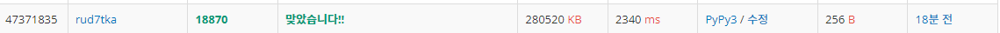
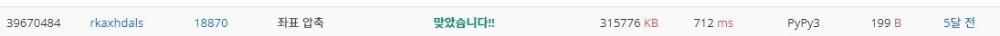

# 20220808_백준18870_좌표 압축_송경삼

**1. 문제**


처음에는 쉬워보였습니다. 하지만 문제풀이를 시작한 후, 제한 조건을 보고 지레 겁먹고 코딩을 어떻게할지 상당히 고민했던 문제였습니다. 주어진 N값과 X의 값이 문제에서 요구하는 시간 복잡대 대로 풀지 않으면 시간초과로 실패하는 문제라고 생각했고, 시간 복잡도에 대하여 혼자 학습하는 시간이 꽤나 많이 소요 됐습니다.


**2. 나의 풀이**

```python
import sys
N=int(input()) 
L=list(map(int, sys.stdin.readline().split()))  #input을 받습니다.
sub=sorted(enumerate(L), key=lambda x:x[1])
        #L을 enumerate 한 배열을 값을 기준으로 정렬합니다.
ans=[0]*N   #정답을 저장할 리스트입니다.
cnt=0   #값을 지정할 변수 입니다.
for v in range(1,N):    #1부터 차례대로
    if sub[v][1]>sub[v-1][1]:   #이전항보다 현재항이 크다면
        cnt+=1  #cnt를 1증가해줍니다.
    ans[sub[v][0]]=cnt  #숫자의 위치를 찾아서 cnt 숫자로 갱신해줍니다.
A=' '.join(map(str, ans))   #숫자 리스트를 문자열로 바꿉니다.
print(A)

```



첫 제출에 시간초과로 실패했을때, sort()함수에 대해 의문이 들었습니다. 내가 최적의 정렬을 하는 방법으로 접근해야하나? 라는 생각이 들었고, list의 각종 method가 가진 시간 복잡도부터 검색하기 시작했습니다. 그 때, 제한에 따른 요구 시간복잡도 정보를 접했습니다. 문제에서 요구하는 N의 크기는 1e6으로 NlogN의 시간복잡도로 풀어야 한다는 것을 깨달았습니다. 또한, sort함수는 이미 NlogN의 시간복잡도로 잘 설계된 구조였고, 함수를 사용하는 게 문제가 아니라 제가 이상한 풀이을 해놨기 때문에 실패했다고 깨달았습니다.

그리고 생각한 것이 최소한의 정렬만으로 푸는 방법이었습니다. 그래서 enumerate 함수를 이용해야겠다 생각했고 위와같이 풀이를 했습니다.


**3. 다른풀이와 비교**

```python
import sys
stdin = sys.stdin.buffer

stdin.readline()
arr = list(map(int, stdin.read().split()))
dic = {x: i for i, x in enumerate(sorted(set(arr)))}
print(' '.join(map(str, [dic[x] for x in arr])))
```



백준 아이디 [rkaxhdals](https://www.acmicpc.net/user/rkaxhdals) 님의 풀이입니다. 보자마자 제 풀이와 상당한 시간차이가 나는 이유를 바로 깨달았습니다. 

첫번째, set()함수를 통해 중복된 값을 제거했습니다. 이렇게하면 sorted 함수에 들어가는 크기 자체가 줄어들기 때문에, 의미있는 시간을 절약할 수 있을 겁니다. 

두번째, dict를 활용했습니다. 저는 새로운 리스트를 갱신하는 식으로 접근했기 때문에, 각 항의 위치가 필요했습니다. 그래서 그 정보를 담아 내려는 의미에서 enumerate 함수를 사용했는데, 이 분은 enumerate를 값을 지정하는 용도로 사용했습니다. 게다가 이 정보를 dict로 저장했습니다. 이렇게하면 항의 위치 정보를 기록할 필요가 없습니다. 해당 숫자가 무슨 값으로 압축되는 지만 정보를 담고 이 정보로 원래 리스트를 갱신하면 되는 방식이라 감탄했습니다.


**4. 느낀점**

시간 복잡도에 관련한 문제는 어느정도 알고리즘의 최적화 하는 학습이 요구된다고 생각합니다. 따라서 평소에 무작정 해결하기만 했던 과정들에 대해서 얼마나 복잡한 시간 복잡도를 갖는지 돌아보는 계기가 된 문제였습니다. 앞으로는 문제의 제한조건을 보고 문제에서 요구하는 최대 시간복잡도를 유추할 수 있게 된 점도 좋은 공부가 됐습니다.


*출처

https://www.acmicpc.net/problem/18870
