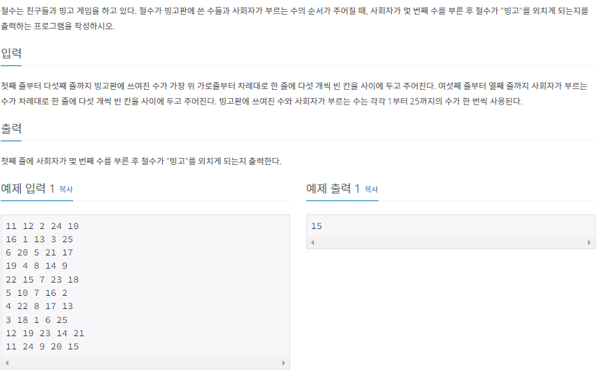
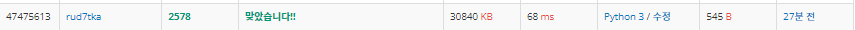

# 2022080810_백준2578_빙고_송경삼

**1. 문제**




2차원 배열을 얼마나 잘 다룰까에 대한 문제라고 생각했습니다. 마침 어제 음수 인덱스를 활용하면 쉽게 풀린다던 문제가 이 문제도 해당된다고 느꼈습니다. 따라서, 이를 활용해 쉽게 풀어보고자 했습니다.

**2. 나의 풀이**

```python
r=range(5)
def check(N):   #값을 읽어 좌표를 반환해주는 함수입니다.
    for x in r:
        for y in r:
            if L[x][y]==N:return x,y

def bingo(x,y,dx,dy):   #현재 좌표와 방향을 받아 빙고체크를하는 함수입니다.
    for c in r:
        if L[x-c*dx][y-c*dy]!=0:
            return 0
    return 1 

L=[list(map(int,input().split())) for _ in r]#빙고판
A=[]
for _ in r:
    A+=list(map(int,input().split()))#부를번호

cnt=0 #빙고횟수 체크용

for n in range(25): #25개의 번호를 순서대로 부릅니다.
    x,y=check(A[n]) #부를 번호의 좌표를 체크합니다.
    L[x][y]=0   #해당 좌표를 0으로 바꾸면서 체크합니다.
    if bingo(x,y,1,0)==1:cnt+=1 #해당 좌표의 x축 빙고를 체크합니다.
    if bingo(x,y,0,1)==1:cnt+=1 #해당 좌표의 y축 빙고를 체크합니다.
    if x==y and bingo(x,y,1,1)==1:cnt+=1    #x와 y가 같다면 대각선까지 체크합니다.
    if x+y==4 and bingo(4,0,1,-1)==1:cnt+=1 #x와 y가 합이 4라면 다른 대각선까지 체크합니다.
    if cnt>=3:break #cnt가 3이상이 되면 종료합니다.
print(n+1)  #부른 번호 개수를 반환합니다.
```



우선 한가지 확인할 것이 필요했습니다. 음수 인덱스가 상상하는 그대로 2차원 배열에서도 적용이될까? 확인하기 위해 테스트를 해봤습니다. 결론은, 생각하던 그대로 작동했습니다. 따라서 앞으로는 index 연산할때 양의 방향으로 하지않고 음의 방향을 주로 써야겠다 생각했습니다. 그렇게 생각하고 코딩을 하니 index error를 크게 신경쓰지 않아 정말 편했습니다.

로직은 크게 숫자를 부르면 -> 해당좌표찾는 함수에서 좌표받음 -> 그 위치를 0으로 표시 -> 가로빙고 확인, 세로빙고확인, 대각선위에있다면 대각선도 확인 -> cnt 개수가 3넘어설때까지 반복 -> 출력의 순서입니다.  

**3. 다른풀이와 비교**

```python
m=[];d={};z=range(5);a=[];c=0;f=0
for i in z:
 r=input().split();m+=[r]
 for j in z:d[r[j]]=(i,j)
for i in z:a+=input().split()
for i in a:
 f+=1;y,x=d[i];m[y][x]=0;c+=all([m[i][x]==0 for i in z])+all([m[y][i]==0 for i in z])
 if x==y:c+=all(m[i][i]==0 for i in z)
 if x+y==4:c+=all(m[i][4-i]==0 for i in z)
 if c>2:break
print(f)
```


오늘도, 코딩 길이와 시간 모두 랭커들과 큰 차이가 나지 않길래 숏코딩 1등 분의 코드를 가져왔습니다.

처음 정말 신기했던 점은 input().split() 을 그냥 순회시켰다는 점입니다. 지금 저 것이 어떻게 돌아가는지 정말 모르겠던 저는 코드를 돌려보아도 안됩니다. 7년 전에는 됐던 코드였나 봅니다...

두 번째로 all()함수의 활용에 놀랐습니다. all()함수 설명을 읽었을 때 이런걸 어디다 쓰는거지 했는데 이럴 때 쓰는 것이었습니다. 저는 for문을 돌려서 if문으로 일일히 비교했는데, all함수를 이용하면 정말 짧게 코딩이 가능했습니다.


**4. 느낀점**

오늘 또한 문제 난이도가 어렵지 않은 문제였기에, 큰 어려움 없이 문제 푸는데에 성공했습니다. 어제 음수 인덱스 활용방법을 다른 사람의 코딩을 통해 배우고 오늘 활용했듯이, 앞으로 2차원 배열에서 조건을 만족하는지 확인하는 데에 활용해볼 생각입니다.


*출처

https://www.acmicpc.net/problem/2578
