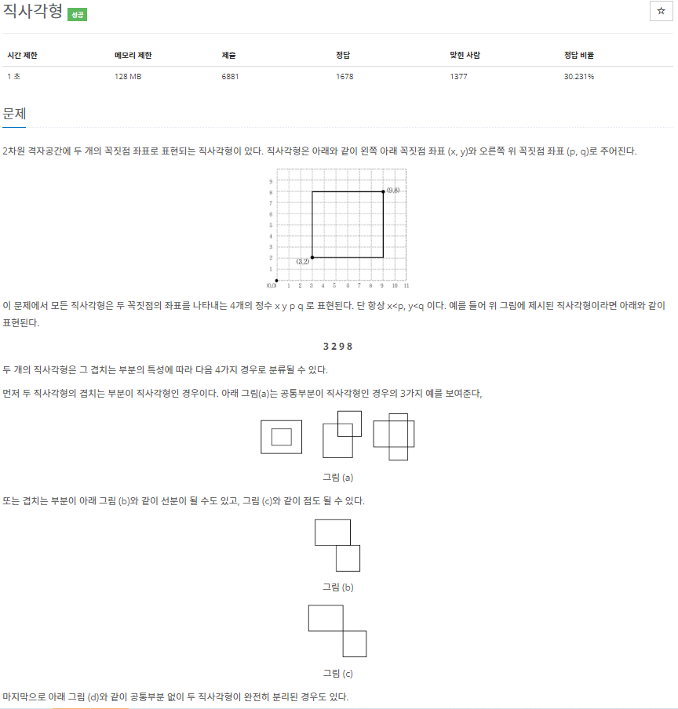

# 2022080811_백준2527_직사각형_송경삼

**1. 문제**




두 직사각형의 좌표를 보고 조건을 찾아 구현해야되는 문제였습니다.


**2. 나의 풀이**

```python
for _ in range(4):
    L = list(map(int, input().split()))
    x1, y1, x2, y2 = L[0], L[1], L[2], L[3]
    p1, q1, p2, q2 = L[4], L[5], L[6], L[7]
    if (x2<p1) or (p2<x1) or (q1>y2)r(y1>q2):
        print('d')
    elif (x2 == p1 and y2 == q1) or (x2 == p1 and y1 == q2) or (x1 == p2 and y1 == q2) or (x1 == p2 and y2 == q1):
        print('c')
    elif p1 == x2 or x1 == p2 or y1 == q2 or y2 == q1:
        print('b')
    else:print('a')
```


항상 한 사각형에서 앞에나온 숫자가 뒤에나온 숫자보다 작다는 특징을 이용해서 구현했습니다. 이렇게되면 두 사각형의 위치가 사각형의 각 좌표를 비교해서 가능하기 때문입니다.

**3. 다른풀이와 비교**

```python
for _ in range(4):
    x1, y1, x2, y2, x3, y3, x4, y4 = map(int, input().split())
    a1 = max(x1, x3)
    a2 = min(x2, x4)
    b1 = max(y1, y3)
    b2 = min(y2, y4)
    if a1 < a2 and b1 < b2:
        print('a')
    elif a1 <= a2 and b1 <= b2:
        print('b' if (a1, b1) != (a2, b2) else 'c')
    else:
        print('d')
```


min과 max를 사용해 제 풀이보다 좀더 간단하게 표현했습니다. 그 외에 로직은 비슷하다고  생각했습니다.

**4. 느낀점**

오늘은 간단한 문제고, 어려운 점도 없었기 때문에 기분좋게 끝냈습니다.

*출처

https://www.acmicpc.net/problem/2527
