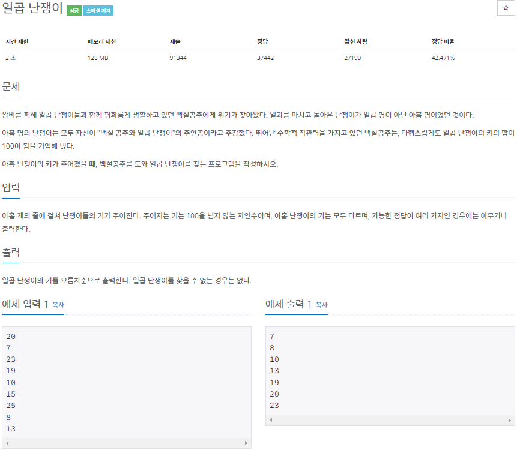

# 2022080813_백준2309_일곱난쟁이_송경삼

**1. 문제**



이 문제는 굉장히 쉬운 문제였습니다. 따라서 시간을 단축하는 법, 코드를 짧게 쓰는 법 등을 신경써서 풀려고 해봤습니다.


**2. 나의 풀이**

```python
L=[];R=range(9)
for _ in R: #list를 만듭니다.
    L.append(int(input()))
S=sum(L)-100    #두 수만 비교하기 위해 전체합에서 100을 빼줍니다.
for i in R[:-1]:    #첫번째 포인터
    for j in R[i+1:]:      #두번째 포인터
        if L[i]+L[j]==S:    #두 포인터의 합이 S와 같다면
            L.pop(j)    #포인터가 가르키는 두 요소를 제외
            L.pop(i)
            break #중지
    else:
        continue
    break  
L.sort() #정렬
print(*L,sep='\n') #출력
```


이 문제를 풀면서 시간을 줄이기 위해 시도한 테크닉이 있습니다.

리스트 += 연산을 쓰지않고, append 함수를 썼습니다.

리스트를 돌면서 7개의 수를 다 더하지않고 S라는 변수에 전체합-100을 저장해놓고, 두개의 수만 더해서 S와 비교했습니다.

for문 안에 print를 넣지않고, *와 sep="\n"을 통해, 반복되는 print 호출을 자제해봤습니다.


**3. 다른풀이와 비교**

```python
a=[]
for i in range(9):
    a.append(int(input()))

def findD():
    for i in range(9):
        for j in range(i+1,9):
            if (sum(a[:i])+sum(a[i+1:j])+sum(a[j+1:]))==100:
                a.pop(j)
                a.pop(i)
                return

findD()
a.sort()
print('\n'.join(map(str,a)))
```


백준 아이디 [bkh751](https://www.acmicpc.net/user/bkh751) 님의 풀이입니다.

쉬운 문제이다보니, 어느정도의 틀은 비슷했습니다.

제 풀이와 크게 다른 점은, 단 한번의 호출임에도 함수로 구성한 점 이를 통해 2중 for문을 탈출하는데에 return 하나만 사용해서 코드 길이적 이득을 취했습니다., 리스트를 딱맞춰 설계하지는 않고 인덱싱으로 처리한 점, 그래서 7개의 수를 모두 더하는 연산을 2중 for문을 통해 했습니다. 이 중 가장 궁금했던 것은 7개의 수를 계속 더하면서 순회하는 방식이 제 생각보다 빠르다는 점입니다.


**4. 느낀점**


쉬운 문제임에도 알아낸 테크닉은 몇개 있습니다.

우선, 2중 for문을 탈출하는데에 변수의 사용없이 탈출하는 법을 깨달았습니다. 또한, print 안에서 \* 를 이용할 때 sep= 아규멘트를 사용하는 법을 깨달았습니다


*출처

https://www.acmicpc.net/problem/2309


