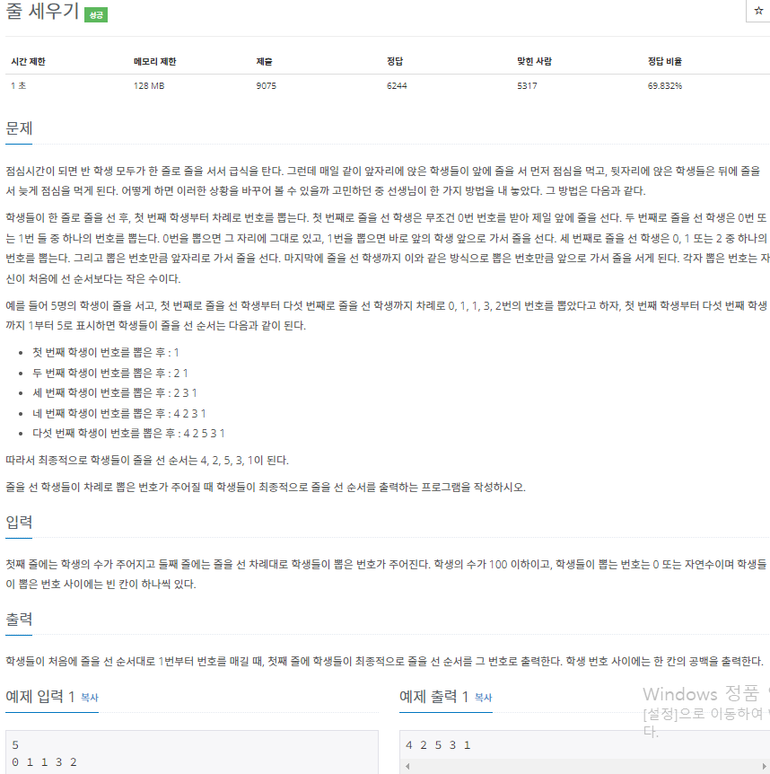
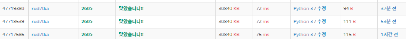

# 2022080814_백준2605_줄세우기_송경삼

**1. 문제**



요즘 푸는 문제가 쉽다고 느껴졌는데, 오늘은 더 쉬워보였습니다. 따라서 처음 생각나는 대로 풀이해보고 같은 풀이를 다른 표현으로 할 수 있는지를 더 공부하고자 했습니다.


**2. 나의 풀이**

```python
N=int(input());A=[]
L=list(map(int,input().split()))
for i in range(N):
    A.insert(L[i] ,i+1)
print(*reversed(A))
```

첫번째 풀이입니다. 풀이를 하면서 다른 표현으로 더 쉽게 표현할 수 있지않을까? 생각한 부분이 reversed 함수와 insert 함수 였습니다.


```python
I=input;N=int(I());A=[]
L=list(map(int,I().split()))
for i in range(N):
    A.insert(L[i] ,i+1)
print(*A[::-1])
```

그렇게 첫번째로 슬라이싱을 활용해 프린트하는 법이 떠올라 해봤습니다. 그러니까 시간이 줄었습니다.


```python
I=input;a=I();a=1;A=[];L=list(map(int,I().split()))
for i in L:A[i:i]=[a];a+=1
print(*A[::-1])
```

insert를 다른 방법으로 하는 법도 배웠습니다. 이 방법으로 바꾼 후 시간은 변화없었으나, 코드의 길이가 짧아졌습니다. 무엇이 좋은 방법인지는 더 연구해봐야할 것 같습니다.




**3. 다른풀이와 비교**

```python
n = int(input())
a = map(int, input().split())
b = []

for i, k in enumerate(a, start=1):
    b.insert(k, i)
print(*b[::-1])
```


백준 아이디 [pazu0522](https://www.acmicpc.net/user/pazu0522) 님의 풀이입니다.


enumerate 함수는 쓰임새도 이해하고 있고, 어떤 방식으로 활용할 줄 알아도 제 수족처럼 아직 활용하지 못하고 있다고 생각했습니다. enumerate 함수를 통해 두 변수를 활용해주면 for문 안에 연산자를 없앨 수 있어 제 풀이보다 시간이 더 적게 걸렸다고 이해했습니다.


**4. 느낀점**

오늘 새롭게 배운 것은 print함수 안에서 reversed함수를 쓰는 것보다  [::-1]을 쓰는 것이 좀더 빨랐다는 것, L[i:i]=[a] 가 L.inser(i,a) 와 똑같은 동작을 한다는 것입니다. 그리고 enumerate 함수를 활용했으면 하는 지금의 이 아쉬움을 잊지않고 앞으로는 더욱 다양한 방법을 적절하게 활용해서 해결해볼 생각입니다.


*출처

https://www.acmicpc.net/problem/2605