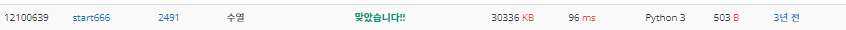

# 2022080815_백준2491_수열_송경삼

**1. 문제**


처음에 문제를 잘못 읽어서 가장 긴 증가하는 부분 수열, 가장 긴 감소하는 부분 수열을 찾는 문제인줄 알고 풀이했습니다.

**2. 나의 풀이**

```python
N=int(input())
inc=dec=cnt_i=cnt_d=1   #최대증가구간,최대감소구간,각 카운트용변수 2개
L=list(map(int,input().split()))
for i in range(1,N):
    if L[i-1]<=L[i]:    #증가라면
        cnt_i+=1        #수증가
        if cnt_i>inc:inc=cnt_i  #최대값 갱신
    else:   #아니라면
        cnt_i=1 #초기화
    if L[i-1]>=L[i]:    #감소에서의 마찬가지
        cnt_d+=1
        if cnt_d>dec:dec=cnt_d
    else:
        cnt_d=1
print(max(inc,dec)) #최대길이 인쇄
```


처음에 문제를 잘못 읽어서 다시 푼 후 자만으로 인해서 한번 틀렸습니다. 카운트 후에 바로 최대값, 최소값을 갱신해주었어야했는데, 갱신의 위치를 잘못 잡아놔서 수열이 증가하는채로, 혹은 감소하는채로 가장긴 부분이 끝난다면 갱신이 되지않아서 한번 문제를 실패했습니다.


**3. 다른풀이와 비교**

```python
import sys
N = int(input())
iterator = map(int,sys.stdin.readline().split())
prev = next(iterator)
inc_cnt = 1
dec_cnt = 1
max_inc_cnt = 1
max_dec_cnt = 1
for val in iterator:
    dec_cnt += 1
    inc_cnt += 1
    if prev < val:
        if max_dec_cnt < dec_cnt:
            max_dec_cnt = dec_cnt - 1
        dec_cnt = 1
    elif prev > val:
        if max_inc_cnt < inc_cnt:
            max_inc_cnt = inc_cnt - 1
        inc_cnt = 1
    prev = val

print(max(max_dec_cnt,max_inc_cnt, dec_cnt, inc_cnt))
```

풀이 자체는 굉장히 비슷했습니다. 다만 next() 함수를 썼다는 점은 인상깊었습니다. 잘 
쓰이지 않는 함수라고는 하지만, 따로 초항을 지정해주지않는데에는 도움이 되어 보였습니다.

**4. 느낀점**

오늘은 쉬운 문제만 풀다보니 너무 신중하지 못하게 문제를 풀었습니다. 앞으로는 쉬운문제더라도 이러지는 말아야겠다는 점을 깨달았습니다. 하지만, 잘못읽어서 가장 긴 증가하는 부분 수열 문제를 복습한 점은 나쁘지 않았습니다.

*출처

https://www.acmicpc.net/source/12100639
