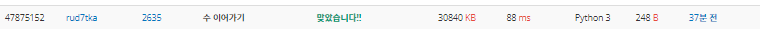
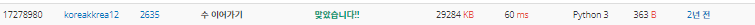

# 2022080817_백준2635_수이어가기_송경삼

**1. 문제**


최근 며칠간 자만으로 틀린 제출들의 여파 때문인지 시작하기 조심스러웠습니다. 우선, 1초라는 시간이 얼마 만큼의 여유가 있는지 가늠을 못했고 그 때문에 탐색의 범위를 최대한 좁혀야한다는데에 꽂혀서 풀이를 시작했습니다.


**2. 나의 풀이**

```python
N=int(input())
max=0
MAX=[]
R1=int(3*N/5) if int((3*N/5))!=0 else 1 #시작점
R2=int(2*N/3)+2 #끝점
for i in range(R1,R2):
    sub=[N,i]   #리스트생성
    while sub[-2]>=sub[-1]:
        sub.append(sub[-2]-sub[-1]) #수이어가기
    if len(sub)>max:max=len(sub);MAX=sub    #더 긴 sub를 만들경우 갱신
print(max)
print(*MAX)
```



우선, 종이와 펜을 이용해 3/5 지점밑과 2/3 지점 위에서 짧아질수밖에 없는 현상을 발견했습니다. 따라서 위와 비슷한 틀로 코딩을 했는데, 실수한 부분이 있었습니다. 

`while sub[-2]>=sub[-1]:` 이부분을 >= 을 안쓰고 >를 처음에 했었습니다. 제 생각으로는 틀린 로직이 아닌것같은데 틀린 부분이었습니다. 하지만 처음에는 이 부분을 발견하지 못하고 N이 1~10과 같이 작을 때 양의 정수로만 출력하지 않고 0으로 시작하기 때문에 틀렸다고 생각했습니다. 하지만 이 부분이 틀린걸 깨닫고 수정 후 바로 통과 했습니다.


**3. 다른풀이와 비교**

```python
N = int(input())
a = int(2 * N / (1 + (5**.5)))
result = []
string = ''

for i in range(a-1, a+3):
    lst = [N, i]
    idx = 2
    while lst[idx-2] - lst[idx-1] >= 0:
        lst.append(lst[idx-2] - lst[idx-1])
        idx += 1
    result.append(lst)

for j in max(result, key=len):
    string += str(j) + ' '

print(len(max(result, key=len)))
print(string[:-1])
```



신기한 것은 가장 긴 특정 값을 바로 구했다는 것입니다. 이 문제가 수식으로 표현될 줄 몰랐습니다. 수학적인 접근이 제가 부족했습니다. 또한, 신기한건 N=1일 경우 a가 0이 되서 반복문이 -1부터 2까지 도는데 음의 정수 구간을 신경쓰지 않았다는 것입니다. 몇번 검증을 해보면 인쇄가 안되겠구나 생각은 할 수 있겠지만 예외처리를 전혀 하지 않았다는 점이 신기했습니다.


**4. 느낀점**

코딩에 너무 익숙해지다보니 수학적인 접근으로 특정 값을 계산하는것 보다 탐색하는데에 초점을 맞춰서 푼 것 같습니다. 시간을 신경쓰느라 범위를 줄이는데에 집중했는데, 처음부터 계산을 했으면 해결될 일이었습니다.

또한, 문제를 풀기전에 망설였던 점 때문에, 시간복잡도와 N의 관계를 복습할 필요가 있다고 생각했습니다. 복습한 후 다음부터는 코딩하기전에 이정도면 시간초과가 안되겠구나 짐작하고 시작하는 것이 앞으로 큰 도움이 될 것 같습니다.


*출처

https://www.acmicpc.net/problem/2635
