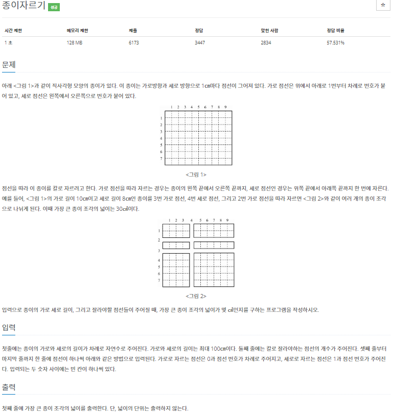

# 2022080820_백준2628_종이자르기_송경삼

**1. 문제**



넓이로 접근하면 까다로운 문제입니다. 사각형의 특성을 이용해서 가로 길이의 집합, 세로 길이의 집합으로 나눠서 풀기 시작했습니다.


**2. 나의 풀이**

```python
J,I=map(int,input().split())
P=[[0,I],[0,J]] #저장공간
N=int(input())
for i in '_'*N:
    s,c=map(int,input().split())
    P[s].append(c)  #i축이면 i축저장공간에,j축이면 j축 저장공간에 저장합니다
for i in (0,1): #각 축을
    P[i].sort() #정렬하고
    P[i]=[x-y for x,y in zip(P[i][1:],P[i][:-1])]   #간격을 구해 줍니다
print(max(P[0])*max(P[1]))  #최대간격끼리 곱한값을 출력
```


**3. 다른풀이와 비교**

```python
f=lambda:map(int,input().split())
w,h=f();w,h=[0,w],[0,h]
for i in range(*f()):o,t=f();[h,w][o]+=[t]
w.sort();h.sort()
print(max((w-v)*(y-x)for v,w in zip(w,w[1:])for x,y in zip(h,h[1:])))
```


백준 아이디 [scvhero](https://www.acmicpc.net/user/scvhero) 님의 풀이입니다.

다른 랭커들의 풀이들을 많이 봤지만 가로 세로의 리스트를 구하고 max값으로 곱하는 알고리즘 자체는 거의 다 비슷했습니다. 물론, 리스트를 저장할 때, 인덱싱을 쓰지않고 따로따로 집합을 만들어 if문을 쓰신분도있고 각 리스트의 차를 구할 때 zip을 쓰지않고 range를 정해서 for문으로 돌리신 분도 있었습니다. 하지만, 이 분의 풀이에서 몇 가지 디테일을 배웠기에 선정해봤습니다. zip 함수를 쓸 때 저는 [:-1]의 슬라이싱도 했지만 zip 함수의 특징상 짧은 함수를 기준으로 끝나기에 굳이 할 필요없는 슬라이싱 이었습니다. 또한, 하나짜리 int(input())을 받을 때도 여러 함수 받을 때랑 다를거 없이 받을 수 있구나, 알았습니다.


**4. 느낀점**

같은 알고리즘의 풀이어도 디테일에서 시간차이가 꽤 날 수 있구나 느꼈습니다. 처음에는 zip함수 등 함수의 호출이 많아서 더 시간이 많이 걸린건가 했는데 랭커의 풀이를 보니 zip 함수를 써도 저보다 빠른 등 이유를 정확히 분석할 수 없었습니다. 좀 더 연구해볼 필요가 있을 것 같습니다.


*출처

https://www.acmicpc.net/problem/2628
