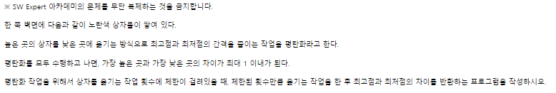
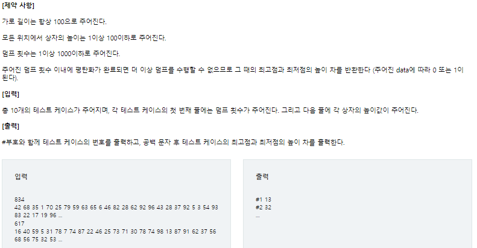

# 20220903_Cpp__SWEA_1208__Flatten_송경삼

**1. 문제**





python으로 한번 풀어봤던 문제입니다. 현재 cpp를 구현에 초점을 맞추는게 필요해보여 python 으로 풀었던 알고리즘 최적화와 동시에 cpp로도 풀어보기로 했습니다.


**2. 나의 풀이**

```cpp
#include <iostream>

int main() {
	std::ios::sync_with_stdio(0);
	std::cin.tie(0);
	int t = 0,sub;
	while (t++ < 10) {
		int N;
		std::cin >> N;
		int cnt_arr[101]{};					//0으로 초기화 된 카운트 배열입니다.
		for (int i = 1; i <= 100; i++) {
			std::cin >> sub;
			cnt_arr[sub] +=1;				//인풋을 받으며 인덱스만큼의 높이가 몇개있는지 체크합니다.
		}
		sub = 0;
		for (int j = 100; j >= 1; j--) {	//거꾸로 돌며 해당 높이에 총 블럭이 몇개있는지 체크합니다.
			sub += cnt_arr[j];
			cnt_arr[j] = sub;
		}

		int B = 0, B_sum=0, T = 100, T_sum=0;	//T는 탑에서 바텀으로 , B는 바텀에서 탑으로 올라갑니다.
		
		while (B_sum <= N) { B_sum += 100 - cnt_arr[++B]; }	//바텀에서 채워갑니다.
		while (T_sum <= N) { T_sum += cnt_arr[T--]; }		//탑에서 비워갑니다.
		std::cout <<"#"<<t<<" "<< T - B+2 << "\n";

	}
}
```


제 풀이의 알고리즘 순서는

쌓여있는 블럭의 높이를 받아와 해당 높이의 블럭이 몇개인지 카운트하는 배열을 따로 만들었습니다. 그리고 이 배열을 뒤에서 부터 순회하여 각 층에 몇개의 블럭이 있는지 담겨있는 배열로 바꿨습니다. 그리곤 Top과 Bottom을 따로 구분해 어느 층에 멈추는지 계산했습니다.


**3. 다른풀이와 비교(C)**

```c
#include<stdio.h>
 
int main(){
    int num_height[101];
    int num_dump;
    int max,min;
    int height;
    int result;
 
     
    for (int test = 1;test<=10;test++){
        scanf("%d",&num_dump);
        max = 0;
        min = 101;
        for(int i = 0 ; i<101;i++){
            num_height[i] = 0;
        }
        for(int i = 0 ; i<100;i++){
            scanf("%d",&height);
            num_height[height]++;
            if(max<height){
                max = height;
            }
            if(min>height){
                min = height;
            }
        }       
 
        for(int i = 0 ; i<num_dump;i++){
            num_height[max]--;
            num_height[max-1]++;
            num_height[min]--;
            num_height[min+1]++;
            if(num_height[max]==0){
                max = max-1;
            }
            if(num_height[min]==0){
                min = min+1;
            }
        }
        result = max-min;
        printf("#%d %d\n",test,result);
    }
 
}
```


오늘도 로우레벨 구현을 배우기 위해 C언어를 참고했습니다. 

카운트 배열을 만든 것 까지는 저와 동일했습니다. 하지만 이 정보를 층 별 정보로 바꾸지 않고 덤프 행위 자체를 구현한다음에 N번 돌리는 구현이었습니다.  N값이 제 생각으로는 커서 좋은 방법 같아 보이진 않았었는데 N값이 크다는건 제 생각이고 컴퓨터에겐 달랐습니다.

**4. 개선 및 후기**

python에서 cpp로 넘어오면서 가장 알쏭달쏭하면서도 재밌는 부분은 전위증가, 후위증가 연산자의 활용입니다. 제가 의도한 대로 코딩했을 때, 제가 생각한 값보다 전체적으로 2가 부족하길래 답에 +2를 해줬지만 차분히 생각해보니 전위 증가 후위 증가의 차이 때문이었습니다.

```cpp
int B = 1, B_sum=0, T = 101, T_sum=0;	//T는 탑에서 바텀으로 , B는 바텀에서 탑으로 올라갑니다.
while (B_sum <= N) { B_sum += 100 - cnt_arr[++B]; }	//바텀에서 채워갑니다.
while (T_sum <= N) { T_sum += cnt_arr[T--]; }		//탑에서 비워갑니다.
std::cout <<"#"<<t<<" "<< T - B +2 << "\n";
```

문제의 풀이입니다.

```cpp
int B = 0, B_sum=0, T = 101, T_sum=0;	//T는 탑에서 바텀으로 , B는 바텀에서 탑으로 올라갑니다.
while (B_sum <= N) { B_sum += 100 - cnt_arr[B++]; }	//바텀에서 채워갑니다.
while (T_sum <= N) { T_sum += cnt_arr[T--]; }		//탑에서 비워갑니다.
std::cout <<"#"<<t<<" "<< T - B << "\n";
```

수정 내용입니다.

최고 층의 높이는 해당 층을 다 비웠을 때 한칸 아래가 되고, 현재 최저 층의 높이는 해당 층을 다 채웠을 때 그대로 해당 층이 될줄 알았는데, 사실 다음 칸에 몇개가 더 얹어져도 최저층의 높이가 똑같아서, 아래와 같이 수정하는게 제 의도에 맞는 구현이었습니다. 


*출처

https://swexpertacademy.com/main/code/problem/problemDetail.do?contestProbId=AV139KOaABgCFAYh


