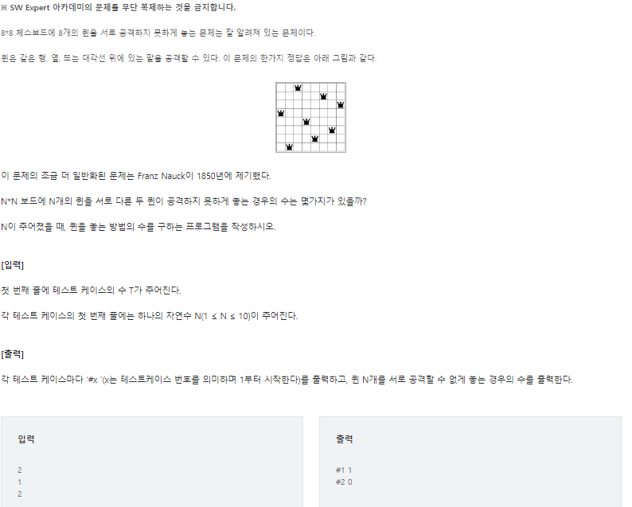

# 20220904_Cpp__SWEA_2806__N-queen_송경삼

**1. 문제**



이와 비슷한 문제를 파이썬 공부할 때 접해본 적이 있기에 솔직하게 풀 때 부터 재귀를 통한 빽트래킹을 사용하면 쉽게 풀 수 있는 문제라는 걸 알고 있었습니다. 하지만, 파이썬부터 빽트래킹 방법에 익숙하지 않았고 Cpp의 구현에 초점을 맞추고 알고리즘을 공부하고 있는 단계이기에, vector를 통한 경우의 수 제어를 통해 좀더 Cpp에 익숙해지는걸 목표로 잡고 시작했습니다. 


**2. 나의 풀이**

```cpp
#include <iostream>
#include <vector>
 
int main() {
    int T;
    std::cin >> T;
    for (int t=1; t <= T;t++) {
        int N, CAN=1;
        std::cin >> N;
        std::vector<std::vector<int>> s(1, std::vector<int> {});    //2차원 벡터생성
        std::vector<int> sub;
 
        for (int i = 0; i < N; i++) {
            std::vector<std::vector<int>> SUB;      //갱신용 서브
            for (int q = 0; q < s.size(); q++) {    //s의 모든 경우를 순회하면서
                for (int j = 0; j < N; j++) {       //N보다 작은 값이 들어갈수있는지 볼겁니다.
                    sub = s[q];                     //현재 돌고 있는 s의 q번째 항입니다.
                    int t = j, b = j, can = 1;
 
                    if (sub.empty() != 1) {         //빈 벡터가 아니라면
                        for (int k = sub.size() - 1; k >= 0; k--) {
                            if (sub[k] == j or ++t == sub[k] or --b == sub[k]) {
                                can = 0;    //이번 j에 퀸이 들어갈 수 있는지 보고 들어갈수없다면 빠져나옵니다.
                                break;
                            }
                        }
                    }
                    if (can) {                  //빈벡터거나 들어갈수 있는 자리라면
                        sub.push_back(j);       //j를 추가해주고 SUB에 추가해줍니다.
                        SUB.push_back(sub);
                    }
                }
                }
                if (SUB.empty()) { CAN = 0; break; }    //만약 SUB가 비었다면 더이상 진행할수 없으므로 빠져나옵니다.
                else s = SUB;                           //아니라면 s를 SUB로 바꾸고 진행합니다.
 
            if (CAN==0) break;
        }
 
    std::cout << "#"<<t<<" "<< (CAN?s.size():0) << "\n";} 
     
}
```


모든 경우의 수를 파악하는 알고리즘을 구현하다보니 실행시간에서 처참하게 느린 걸 확인할 수 있습니다. vector를 쓰는게 불가피하다고 느껴져서 로우레벨 구현도 하지 못했고, 너무 복잡하게 다중 for문으로 알고리즘을 풀어냈습니다.

하지만, 이런 구현을 하면서 얻은게 없지는 않습니다. vector에서는 sizeof 를 통해 크기를 연산하면 잘못된 값을 받게 된다, 2차원 vector의 초기화 방법, 3항 연산자의 정확한 사용법 등 Cpp 구현의 디테일들을 배울 수 있었습니다.


**3. 후기**

혹시나 하고 봤지만 랭커들의 풀이는 대부분 빽트래킹 방법이었습니다. 파이썬에서도 아직 어설프게 구현하고 있다 싶은 것이 경우의 수 관련된 알고리즘인데, 이에대해서는 제대로 날을 잡고 공부해야될 필요성을 느꼈습니다. 따라서, 구현에 초점을 맞춘 오늘은 빽트래킹 방법들과 비교하지 않고 다음에 빽트래킹을 Cpp로 구현 한 뒤에 비교를 하고자 합니다. 


*출처

[SW Expert Academy](https://swexpertacademy.com/main/code/problem/problemDetail.do?contestProbId=AV7GKs06AU0DFAXB)
