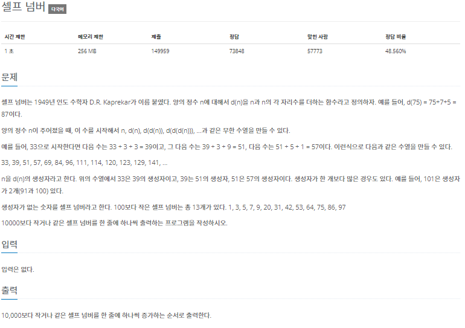

# 20220905_Cpp_백준_4673_셀프넘버_송경삼

**1. 문제**



간단한 문제를 cpp로 구현해보고자 했습니다.


**2. 나의 풀이**

```cpp
#include <iostream>

using namespace std;

int main() {
	ios::sync_with_stdio(0);
	cin.tie(0);
	int L[10001]{};
	for (int i = 1; i <= 10000; i++) {
		int j = i;  // i부터 수식을 통해 만들어지는 수를
		while (1) {
			j = j + j % 10 + (j >= 10 ? ((j / 10) % 10) : 0) + (j >= 100 ? ((j / 100) % 10) : 0) + (j >= 1000 ? ((j / 1000) % 10) : 0);
			if (j < 10000) L[j] = 1;    //다 체크합니다.
			else break;                 //만이 넘어가면 멈춥니다
		}
	}
	for (int j = 1; j < 10000; j++) {
		if (L[j] == 0) {                //체크가 안된 수를 출력합니다.
			cout << j<<"\n";
		}
	}
}
```


**3. 다른풀이와 비교**

```cpp
#include<stdio.h>
int sum(int n){int m=n;while(n>0){m+=n%10;n=n/10;}return m;}
int main(){int k[10100]={0,};for(int i=1;i<=10000;i++)k[sum(i)]=1;for(int i=1;i<=10000;i++)if(k[i]==0)printf("%d\n",i);return 0;}
```


쉬운 문제라 크게 다른건 없었고, 다만 제가 메모이제이션을 안했다는걸 깨달았습니다. 이미 만들어진 수들을 다 체크까지 해놨는데, 그걸 간단한 활용을 하는걸 잊었습니다.


**4. 개선 및 후기**

```cpp
#include <iostream>

using namespace std;

int main() {
	ios::sync_with_stdio(0);
	cin.tie(0);
	int L[10001]{};
	for (int i = 1; i <= 10000; i++) {
		int j = i;  // i부터 수식을 통해 만들어지는 수를
		while (1) {
			j = j + j % 10 + (j >= 10 ? ((j / 10) % 10) : 0) + (j >= 100 ? ((j / 100) % 10) : 0) + (j >= 1000 ? ((j / 1000) % 10) : 0);
            if (L[j]==1) continue;
            if (j < 10000) L[j] = 1;    //다 체크합니다.
			else break;                 //만이 넘어가면 멈춥니다
		}
	}
	for (int j = 1; j < 10000; j++) {
		if (L[j] == 0) {                //체크가 안된 수를 출력합니다.
			cout << j<<"\n";
		}
	}
}
```


`if (L[j]==1) j=10001;`라는 구문을 통해 이미 만들어져있는 셀프넘버라면 while문을 탈출하도록 j를 지정해줬습니다. 그러니까 중복된 연산을 할 필요가 없어졌고 바로 시간이 줄어드는 것을 확인했습니다. 


*출처

https://www.acmicpc.net/problem/4673
