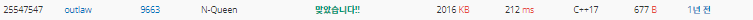

# 20220906_Cpp_백준_9663_N-queen_송경삼

**1. 문제**


저번에 SWEA에서 빽 트래킹을 쓰지 않고 풀어봤던 N-queen 문제입니다. 이번에 빽트래킹을 제대로 공부하고 다시 풀어봤습니다.


**2. 나의 풀이**

```cpp
#include <iostream>
#include <vector>

int N, cnt = 0;
std::vector<int> queen;
bool can=1;

void BT(int i) {	//i는 재귀 깊이입니다.
	if (i == N) {	//i가 깊이 끝까지 갔다면 카운트를하나 해줍니다.
		cnt++;
		return;
	}
	else {
		for (int j = 0; j < N; j++) {
			int l = j, r = j;
			for (int k = queen.size()-1; k >=0; k--) {
				if (queen[k] == j || --l == queen[k] || ++r == queen[k]) { can = 0; break; }
			}	//지금 까지 추가된 queen 배열을 통해 놓을 수 있는 n인지 확인합니다.
			if (can == 0) { can = 1; continue; }	//놓을 수 없다면 다음으로 넘어갑니다.
			queen.push_back(j); //놓을 수 있다면 j를 추가하고
			BT(i + 1);			//더 탐색합니다.
			queen.pop_back();	//탐색에 실패해서 돌아왔다면 추가했던 걸 제거 합니다.
		}
	}
	return;
}

int main() {
	std::cin >> N;
	BT(0);
	std::cout << cnt << "\n";
	return 0;
}

```


저번 실행시간 224ms에 비해 기록을 많이 앞당겼습니다. 빽트래킹의 이해도를 어느정도 쌓은것 같아 기뻤습니다. 

한 가지 아쉬운 점은 역시 시간이었습니다. 빽트래킹의 컨디션을 검사할 때, 함수를 호출 하기 전에 검사해서 호출하는 것이 좋아보여 그렇게 했는데, 이게 좋은 방법인가에 대한 의문점이 남아 있습니다.


**3. 다른풀이와 비교 & 후기**

```cpp
#define _CRT_SECURE_NO_WARNINGS
#include <iostream>
#include<algorithm>
#include<vector>
#include<stack>
#include<queue>
#include <cstring>
#include <string>
#include <cstdio>
#include <set>
#include <climits>

using namespace std;

int ans = 0;
int check=0;
void backtrack(int a, int b, int c) {
	if (a == check) {
		ans++;
		return;
	}
	
	int nxt = check & (~(a | b | c));
	while (nxt) {
		int p = nxt & -nxt;
		nxt -= p;
		backtrack(a | p, (b | p) << 1, (c | p) >> 1);
	}
}

int main() {
	ios_base::sync_with_stdio(false);
	cin.tie(NULL);
	cin.tie(NULL);
	int i, j, k;
	int n;
	scanf("%d", &n);

	check = (1 << n) - 1;
	backtrack(0, 0, 0);
	cout << ans << "\n";
	return 0;
}
```



저번 N-queen을 풀고 난 뒤 과제가 빽 트래킹을 공부해서 다시 N-queen을 푸는 것이었다면 이번 빽트래킹으로 풀고 난 후의 과제는 비트연산을 나중에 배우고 풀어야 겠다는 것이었습니다. 단적으로 위의 예시를 보면 4800ms 와 212ms는 너무 많은 차이가 난다고 생각합니다. 이만큼 비트연산을 익히면 더욱 빠른 효율적인 코딩을 할 수 있을 것이라 생각해, cpp에 익숙해지면 비트연산으로 다시 이 문제를 풀어볼 생각입니다.


*출처

https://www.acmicpc.net/problem/9663
