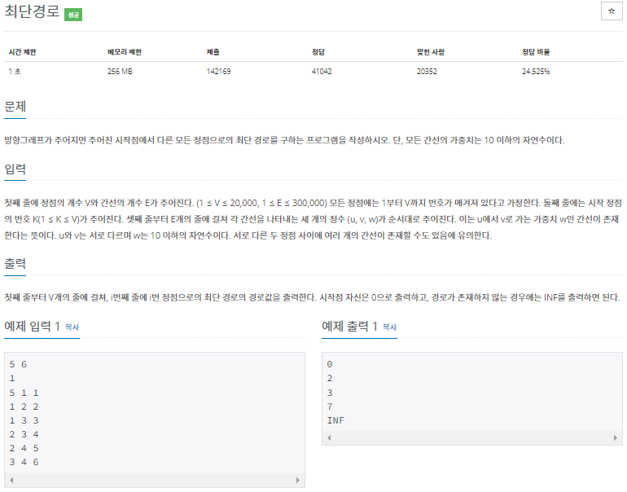
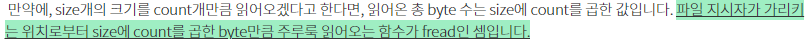

# 20220919_Cpp_백준_1753_최단경로_송경삼

### 1. 문제



다익스트라 알고리즘을 요구하는 문제라고 한 번에 알아봤습니다.

한 번 개념을 이해했던 적이 있기에, 나름 쉽게 가능하지 않을까? 하면서 풀이를 시작했습니다.


### 2. 나의 풀이

```cpp
#include <iostream>
#include <vector>
#include <queue>
using namespace std;

int V, E, S,st,ed,va,q;
vector<pair<int,int>> G[20001];		//간선의 정보를 저장할 공간입니다.
priority_queue <pair<int,int>> Q;
int ans[20001];

int main() {
	scanf("%d %d",&V, &E);
	scanf("%d", &S);
	fill(ans, ans + V + 1, 1e9);	//정답 배열을 1e9로 초기화합니다

	for (int v = 1; v <= E; ++v) {
		scanf("%d %d %d", &st, &ed, &va);
		G[st].push_back({ -va,ed });	//간선의 정보를 담아서 저장공간에 저장합니다. 근데,
	}																//우선순위큐를 최소값으로 사용하기 위해 value에 -를 붙여서 넣습니다
	Q.push({ 0,S });		//초기 값과 시작위치입니다.
	ans[S] = 0;

	while (!Q.empty()) {			//우선순위큐가 빌 때 까지
		int cost = -Q.top().first;	//최소 경로값을 지닌 간선을 꺼냅니다
		int now = Q.top().second;
		Q.pop();
		
		for (int i = 0; i < G[now].size(); ++i) {
			int to = G[now][i].second;		// 해당 경로로 이동한 노드를 탐색하면서
			int co = -G[now][i].first;
			if (cost +co < ans[to]) {			
				ans[to] = cost + co;				// 해당 노드의 경로값을 최소값으로 갱신하고
				Q.push({ -ans[to],to });		// 우선순위큐에 넣습니다.
			}
		}
		
	}

	for (int i = 1; i <= V; ++i) {
		if(ans[i]!=1e9) printf("%d\n", ans[i]);
		else printf("INF\n");
	}
}
```


문제는 문제풀이를 시작하자마자 찾아왔습니다.

우선 첫 번째 문제는 방향 가중치 그래프는 배열 그래프로 하는게 쉽긴한데, 노드의 개수가 2만개라서 할 수 가 없다는 점이었습니다. 인접 리스트 그래프로 해결하면 되는 문제라 해결방식에 대해선 깊게 고민하진 않았지만 C++에서 인접 리스트 그래프를 어떤 방식으로 만들어야 효율적일까?를 고민하기 시작했습니다. pair를 통해 해결하기로 하고 나머지 로직은 쉽게 구성했습니다.

하지만, 이 문제의 간선 개수가 30만개까지도 있다는 것을 간과했습니다. 선형 탐색으로 다익스트라 알고리즘을 구성하니, 너무나 당연하게도 시간초과가 떴습니다. 어떻게 해야 시간초과가 안날까 많은 고민 끝에 다익스트라 알고리즘 개선을 위해선 우선순위 큐를 사용해야한다는 것을 알았고, 이를 통해 정답을 받을 수 있었습니다.


### 3. 다른풀이와 비교

```cpp
#define _CRT_SECURE_NO_WARNINGS
#include <cstdio>
#include <iostream>
#include <queue>
#include <vector>
#include <algorithm>

using namespace std;


#define pii pair<int, int>
#define INF (1 << 30)

typedef struct __node {
	int node;
	int weight;
}node;

int v, e, k, from, to, weight;

vector<vector<pii>> graph;
vector<int> cost;
vector<int> visit;

int idx, bytes;
char buf[0x40000];

inline static int read()
{
	if (!(idx - bytes))
	{
		bytes = fread(buf, sizeof(char), sizeof(buf), stdin);
		idx = 0;
	}
	return buf[idx++];
}

inline static int parse()
{
	int ret = 0;
	int num = read();

	while (num - 0x0A && num - 0x20)
	{
		ret = ret * 10 + (num & 0x0F);
		num = read();
	}

	return ret;
}

void get_shortest_dist(int node)
{
	cost.resize(v + 1, INF);
	cost[node] = 0;

	visit.resize(v + 1);

	priority_queue<pii, vector<pii>, greater<pii>> pq;
	pq.push({ 0, node });
	while (1) {
		if (pq.empty())
			break;

		pii cur = pq.top(); pq.pop();

		if (cur.first > cost[cur.second])
			continue;

		visit[cur.second] = 1;
		for (auto it : graph[cur.second]) {
			if (cost[it.first] > cur.first + it.second && !visit[it.first]) {
				cost[it.first] = cur.first + it.second;
				pq.push({ cost[it.first], it.first });
			}
		}
	}
}

int main(void)
{
	cin.tie(0);
	ios_base::sync_with_stdio(0);

	scanf("%d %d %d", &v, &e, &k), read();
	//cin >> v >> e >> k;
	graph.resize(v + 1);
	for (int i = 0; i < e; i++) {
		from = parse();
		to = parse();
		weight = parse();
		//cin >> from >> to >> weight;
		graph[from].emplace_back(to, weight);
	}
	
	get_shortest_dist(k);

	for (int i = 1; i <= v; i++) {
		if (cost[i] >= INF)
			cout << "INF" << "\n";
		else
			cout << cost[i] << "\n";
	}
	return 0;
}
```


우선순위 큐를 활용하는 것을 처음해보기에, 문제를 틀렸던 것은 괜찮았습니다. 하지만 개념을 이해하고 활용했음에도 C++에서 이정도 시간 차이가 난다는 것은 최적화가 너무 안된 것이라고 생각이 들어 공부를 제대로 해야겠다 생각했습니다.

첫번째로 궁금했던 것은 fread() 함수의 쓰임이었습니다.




출처 [c언어 fread 함수 : 파일로부터 데이터를 읽는 또 다른 함수](https://codingdog.tistory.com/entry/c%EC%96%B8%EC%96%B4-fread-%ED%95%A8%EC%88%98-%ED%8C%8C%EC%9D%BC%EB%A1%9C%EB%B6%80%ED%84%B0-%EB%8D%B0%EC%9D%B4%ED%84%B0%EB%A5%BC-%EC%9D%BD%EB%8A%94-%EB%98%90-%EB%8B%A4%EB%A5%B8-%ED%95%A8%EC%88%98)

결론은 비트단위 개념으로 input을 받는다는 것으로 이해했습니다. 아직은 input과 output에서 시간 단축을 노리기 보다는 알고리즘적으로 시간단축을 공부하고 싶어서 일단 무슨 기능인지 알고 넘어갔습니다. 

두번째로 안 것은 resize()와 push_back()이 아닌 emplace_back() 입니다.

emplace_back 같은 경우는 pair를 만드는 과정까지 한 번에 해주는 함수라는 것을 알고 있긴했습니다. 하지만, 실전에 사용할 생각을 하지 않았습니다. 그리고 저 같은 경우는 vector의 사이즈를 노드를 다 포함하면서 인덱스로 바로 정보를 추가하기 위해 20001 으로 설정했지만 이 분은 resize를 통해 딱 맞게끔 했습니다.


### 4. 개선 및 후기

###### *출처

https://www.acmicpc.net/problem/1753

- 빠진 조건을 찾은 사람: [algoshipda](https://www.acmicpc.net/user/algoshipda)
- 데이터를 추가한 사람: [august14](https://www.acmicpc.net/user/august14), [djm03178](https://www.acmicpc.net/user/djm03178), [sait2000](https://www.acmicpc.net/user/sait2000), [tolelom](https://www.acmicpc.net/user/tolelom)
- 문제를 만든 사람: [author5](https://www.acmicpc.net/user/author5)
