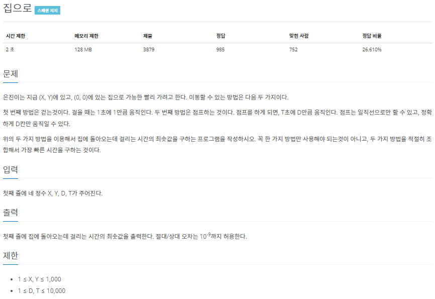

# 20220922_Cpp_백준_1069_집으로_송경삼

### 1. 문제



골드3 이상의 문제를 검색하던 중, 정말 쉬워 보이는데? 하면서 푼 문제였습니다. 딱히 알고리즘적인 기술이 필요하지 않아보였습니다.


### 2. 나의 풀이

```cpp
#include <iostream>
#include <cmath>
int main() {
	int X, Y, D, K;
	double ans = 0, case2 = 0, case3=0;
	scanf("%d %d %d %d", &X, &Y, &D, &K);
	double d = pow(pow(X, 2) + pow(Y, 2), 0.5); // 집 까지 직선거리 d
	int N = (int) d / D;
								// 직선으로 이동할 때 도착 직전까지 점프 가능 횟수
	ans = N * K + d - N * D;					// case1 : 직전까지 점프 후 앞으로 걷기 
	case2 = (N + 1)*K + (N+1)*D-d;		// case2 : 직후까지 점프 후 되돌아오며 걷기
	if (N) case3 = (N + 1)*K;					// case3 : 여러개일땐 경로를 비틀며 최소한의 점프로 도착하기
	else case3 = 2 * K;								// 점프가 한번일때 안되므로 최소한 2번
	if (case2 < ans) ans = case2;
	if (case3 < ans) ans = case3;
	if (d<ans) ans=d;									// 그냥 무작정 걷기
	printf("%.13f", ans);							// 최소값 출력
}
```


처음 생각한 대로 구현 자체는 너무 쉬운 문제였습니다. 하지만, 예제를 이해하는데에 시간이 조금 걸렸습니다.

특히


두 예제의 출력이 왜 이렇게 나오는지 이해하는 것이 이 문제의 포인트 였습니다.

답은 간단했습니다. 도착지 까지 직선으로 뛰지 않아도 된다는 것이었습니다.

그 후 구현은 쉬웠으나, 두 번 간과한 점이 있었습니다.

1. 절대/상대 오차는 $10^{-9}$까지 허용한다.

출력에서 `printf("%f", ans);` 를 사용해서 출력하니 소수점 6자리까지밖에 나오지 않았습니다. 따라서 문제에서 요구한 오차를 초과했었습니다.

2. 점프가 걷는 것보다 항상 효율적이지는 않다.

점프 거리가 도착점까지의 거리보다 작다면, 일단 무조건 뛰고보는 알고리즘이었습니다. 이렇게하니 걷는 것이 더 빠른 방법임에도 경우의 수를 찾아내지 못해, 정답을 구할 수 없었습니다.


### 3. 다른풀이와 비교

```cpp
#include<cstdio>
double sqrt(double a){double x = 2;for(int i = 0; i < 1000; i++){x=(x+(a/x))/2;}return x;}
double min(double a,double b){return a<b?a:b;}
int x,y,d,t,j;
int main(){scanf("%d %d %d %d",&x,&y,&d,&t);double D=sqrt(x*x+y*y);j=D/d;printf("%.9lf\n",min(D, min(j*t+D-j*d, j==0?min(2*t,t+d-D):(j+1)*t)));}
```


cmath를 include 하지 않고 직접 sqrt와 min을 구현한 풀이입니다.

sqrt를 직접 구현한 것이 신기했습니다.


*출처

https://www.acmicpc.net/problem/1069
