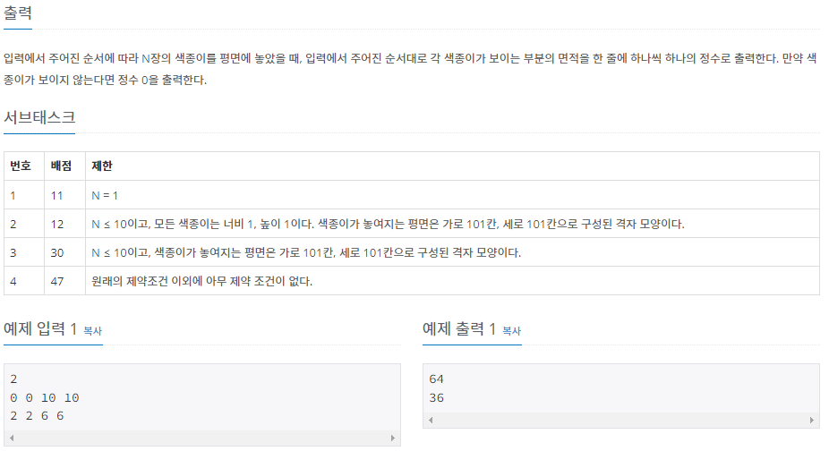
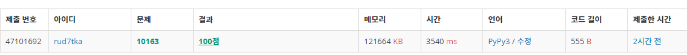

# 202208xx_백준xxxx_예시_송경삼

**1. 문제**




색종이를 놓으면서 각 색종이가 차지하는 영역의 넓이를 출력하는 문제입니다. 알고리즘의 풀이 테마는 모른채로 처음 문제를 접했습니다. 문제를 접하면서 생각한 풀이 방안이 2차원 배열을 만들고 2차원 배열의 갱신을 통해 얻은 정보로 결과를 도출해야하므로 배열 문제에 속하지 않을까 생각했습니다.


**2. 나의 풀이**

```python
import sys
N=int(input())
cp=[]   #color paper input 정보를 저장할 공간입니다.
max_x=0 #색종이를 놓일 x축의 최대값을 저장할 공간입니다.
max_y=0 #색종이를 놓일 y축의 최대값을 저장할 공간입니다.
for _ in range(N):
    x,y,xl,yl=map(int, sys.stdin.readline().split()) #input을 받습니다.
    cp.append([x,y,xl,yl])  #cp에 저장합니다.
    if x+xl>max_x:max_x=x+xl    #최대 x값을 갱신합니다.
    if y+yl>max_y:max_y=y+yl    #최대 y값을 갱신합니다.

cnt=[0]*N   #x번째 색종이의 영역을 카운트할 공간입니다.
arr=[[0 for x_ in range(max_x)] for y_ in range(max_y)]
    #최대 x,y값으로 색종이를 놓을 적당한 공간을 만듭니다.
sub=0  #몇번째 색종이인지 카운트할 임시 변수입니다.
for paper in cp: #cp에 담긴 색종이를 순회합니다.
    sub+=1  #색종이 번호가 증가함을 뜻합니다.
    for X in range(paper[0],paper[0]+paper[2]): #해당 색종이의 X축 좌표부터 길이만큼 순회합니다.
        for Y in range(paper[1],paper[1]+paper[3]): #해당 색종이의 Y축 좌표부터 길이만큼 순회합니다.
            if arr[Y][X]!=0: #이미 색종이가 놓여있는 공간이라면
                cnt[arr[Y][X]-1]-=1 #놓여있던 색종이번호의 카운트를 뺍니다
            arr[Y][X]=sub   #그런 다음 순회하고있는 색종이를 놓습니다.
            cnt[arr[Y][X]-1]+=1 #순회하고있는 색종이 번호를 카운트합니다.
for i in cnt: #카운트 한 값을 1번째부터 N번째까지 인쇄합니다.
    print(i)
```



문제 풀이 과정에서 겪은 난항 한가지는 2차원 배열에 접근할 때 [][]의 순서와 제가 생각하는 X,Y축의 순서가 같지 않다는 것이었습니다. 하지만 한 번 시험삼아 실행해본 결과로 원하는대로 돌아가지 않는 부분이 있다는 것을 판단했고, 금방 깨달아서 수정했습니다.

제출은 첫 시도만에 통과했으나, 시간이 오래걸려서 긴장됐었습니다. 어떤 부분에서 이렇게 시간이 오래걸렸을까가 제일 궁금하게 생각드는 문제였습니다.


**3. 다른풀이와 비교**

```python
def get_surface_area(points):
    ans = [0]*T
    
    for idx, point in enumerate(points):
        for i in range(point[0], point[0]+point[2]):
            for j in range(point[1], point[1]+point[3]):
                matrix[i][j] = idx+1
    
    for m in range(1001):
        for n in range(1001):
            if matrix[m][n]:
                x = matrix[m][n]
                ans[x-1] += 1
    return ans
    
    
T = int(input())
points = [list(map(int, input().split())) for _ in range(T)]
matrix = [[0]*1001 for _ in range(1001)]

results = get_surface_area(points)
for result in results:
    print(result)
```


백준 아이디 [hrookim](https://www.acmicpc.net/user/hrookim) 님의 풀이입니다.

메모리는 제가 덜 사용했으나, 시간에서 굉장히 큰 차이가 나는 것을 깨달았습니다.

전반적인 아이디어는 비슷하다고 생각합니다. 

크게 다른 점이 있다면, 제 풀이는 0행렬(색종이를 놓을 판)의 사이즈를 최소화하기 위해 input 과정을 줄이지 않았고, 이 과정에서 연산과정이 추가로 있었습니다. 하지만, 이 분의 풀이는 연산과정이 따로없이 0행렬(색종이를 놓을 판)을 최대 사이즈로 만들어 놓았고, 이 부분이 메모리는 제가 좀 덜 사용했으나 시간이 벌어진 이유 중 하나라고 판단했습니다.

정말 가장 의외인점은 제가 생각하기에 for문을 돌면서 2차원 배열을 만들놓고, 나중에 만든 2차원 배열을 다시 돌면서 횟수를 카운트하기엔 시간이 많이 걸릴 것 같다고 판단해서, 배열을 갱신하는 동시에 카운트를 하게끔 알고리즘을 짰습니다. 하지만, 이 분의 답안을 보니 그냥 1001*1001의 2차원 행렬을 돌면서 카운트해도 제 알고리즘보다 훨씬 적은 시간이 걸렸다는 점이었습니다...


**4. 느낀점**

알고리즘 적인 사고를 키우면서, 동시에 헷갈리게 된 문제였습니다.

그 이유를 설명하자면, 우선, 메모리 사용을 줄여보고자 어느정도 생각하면서 풀었던 문제였습니다. 그런데 결과로, 랭커분들과 비교할만한 메모리 사용량으로 정답을 맞추니 제가 원하는대로 된 것 같아 알고리즘적인 사고력이 올랐다고 좋아했습니다. 

하지만, 바로 헷갈리게 된 이유는 다른 분의 풀이를 분석하면서 이렇게하면 시간도 줄일 수 있겠다고 생각하는대로 안됐기 때문입니다. 제게 이런 방법이 더 빨라보였으나, 컴퓨터에겐 아니었습니다.

결과론적으로, 아직 컴퓨터의 생각을 어렴풋이만 아니까 자만하지 않고 알고리즘을 더욱 열심히 해봐야겠다고 느낀 문제였습니다.


*출처

https://www.acmicpc.net/problem/10163


