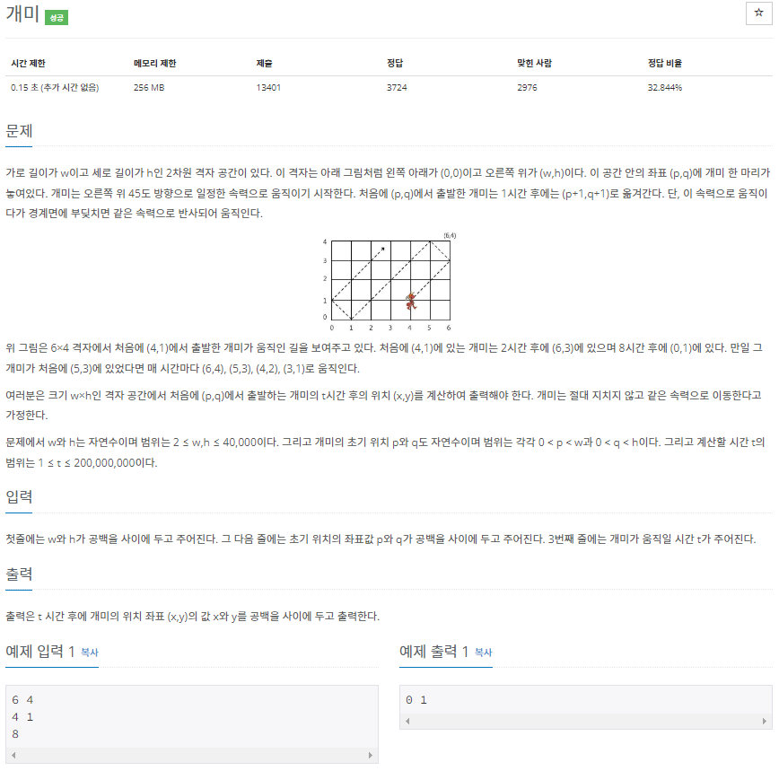

# 20220805_백준10158_개미_송경삼

**1. 문제**



문제를 찾아볼 때, 똑같은 문제이름의 다른 번호 문제가 있는 것을 몰랐습니다. 이 문제는 그 문제를 풀어 본 사람들에게 연상량을 수학적으로 줄이는 방법을 요구하는 문제란걸 풀면서 깨달았습니다. 한번의 이동에 다른 경계선 까지 이동하면 연상량을 많이 줄일 수 있겠다 라고 생각했고, 그렇게 방향에 초점을 맞춰 풀이를 시작했습니다.

**2. 나의 풀이**

```python
from sys import exit
w,h=map(int, input().split())
x,y=map(int, input().split())
t=int(input())  #인풋을 받습니다.

d=1 #첫 이동 방향 direction 1 입니다.

if (w-x)<(h-y): #x축과 y축중 가까운 거리를 판별합니다.
    d=2 #x축이 더 가깝다면 direction 2로 바꿉니다.
    if t>(w-x): #x축과의 거리보다 이동해야할 거리가 더 멀다면
        t-=(w-x)    #x축과의 거리를 이동거리에서 빼줍니다.
    else:
        print(x+t,y+t)  #이동거리가 더 짧다면 이동 후 좌표를 출력하고 끝냅니다.
        exit()
    y+=(w-x)    #끝까지 이동했다면 좌표를 바꿔줍니다. x축 끝
    x=w
else:   #위와 같은 로직인데, y축이 더 짧을 경우입니다.
    d=4 #direction 4로 바꿉니다.
    if t>(h-y):     #똑같은 끝까지 이동가능 여부 판단입니다.
        t-=(h-y)
    else:
        print(x+t,y+t)
        exit()
    x+=(h-y)
    y=h

dis=t   #첫 이동 후 남은 거리를 저장합니다.
Q=[x,y] #첫 이동 좌표를 저장합니다.
D=d     #첫 이동 후 방향을 저장합니다.

while True:     #위와 같은 끝까지 로직을 반복합니다.
    if d==1:    #입사각이 우상향일 경우입니다.
        if (w-x)<(h-y): #거리 판단
            d=2 #방향바꿈
            if t>(w-x): #도착 판단
                t-=(w-x)
            else:
                print(x+t,y+t) #루프 탈출판단
                break
            y+=(w-x)    #좌표 바꿈
            x=w
        else:   #똑같은 로직의 y축이 더가까울 경우입니다.
            d=4
            if t>(h-y):
                t-=(h-y)
            else:
                print(x+t,y+t)
                break
            x+=(h-y)
            y=h

    elif d==2:  #위와 똑같은 로직에서 입사각이 좌상향일 경우입니다.
        if x<(h-y):
            d=1
            if t>x:
                t-=x
            else:
                print(x-t,y+t)
                break
            y+=x
            x=0
        else:
            d=3
            if t>(h-y):
                t-=(h-y)
            else:
                print(x-t,y+t)
                break
            x-=(h-y)
            y=h

    elif d==3:  #똑같은 로직에서 입사각이 좌하향일 경우입니다.
        if x<y:
            d=4
            if t>x:
                t-=x
            else:
                print(x-t,y-t)
                break
            y-=x
            x=0
        else:
            d=2
            if t>y:
                t-=y
            else:
                print(x-t,y-t)
                break
            x-=y
            y=0

    else:   #우하향일 경우입니다.
        if (w-x)<y:
            d=3
            if t>(w-x):
                t-=(w-x)
            else:
                print(x+t,y-t)
                break
            y-=(w-x)
            x=w
        else:
            d=1
            if t>y:
                t-=y
            else:
                print(x+t,y-t)
                break
            x+=y
            y=0

    if [x,y]==Q and d==D:   #만약 첫 이동점에 똑같은 방향으로 도착한다면
        t=t%(dis-t) #이동거리만큼 계속 반복되므로 이동거리에서 반복횟수만큼 빼줘서 연산량을 줄입니다.
```


제가 생각한 로직은 방향에 초점을 맞췄습니다.

개미의 이동 방향은 우상향 좌상향 우하향 좌하향 4가지 경우 밖에없으니 방향 상수를 정하고 그 방향의 어느 변에 도착하는지만 보면 모든 경우를 다룰 수 있으니 크게 8가지의 경우만 살펴보면 된다고 분석했습니다. 실제로 그렇게 금방 코딩을 한 후, 제출하니 채점 50%정도에 시간초과로 실패했습니다. 그 때 이 문제의 시간제한이 엄격하다는 것을 깨달았고 다른 분석이 필요하다는 것을 깨달았습니다. 자세히 살펴보니 개미의 이동은 같은 루트가 반복되는 경우가 있다는 것을 알았습니다. 이 때 의문점이 모든 경우에 대해 반복되는 경우가 있을까? 생각들었습니다. 솔직하게 그 증명을 하진 못했습니다. 알고리즘적으로 반복되는 경우가 있다면 그 경우에 나머지 연산으로 연산량을 획기적으로 줄일 수 있다는 것을 생각했고, 증명을 하진 못하더라도 구현하면 되겠구나 생각했습니다.

그렇게 따로 첫 이동의 정보 저장을 하지 않았던 코딩에서 급하게 첫 이동을 밖으로 빼서 저장했습니다. 그리고는 마지막에 두 줄로 반복되는 경우가 있다면 한번에 다 빼버리는 코드를 작성하니 제출에 성공했습니다.

**3. 다른풀이와 비교**

```python
w,h=map(int, input().split(" "))
p,q=map(int, input().split(" "))
t=int(input())
pp=(p + t)%(w*2)
qq=(q + t)%(h*2)

pp = w - abs(w-pp)
qq = h - abs(h-qq)

print(pp, qq)
```


백준 아이디 [littelitte19](https://www.acmicpc.net/user/littelitte19) 님의 풀이입니다.

저는 어떻게 해야 반복문을 줄일 수 있고, 연상량을 줄일 수 있을까?를 너무 알고리즘적으로 갇혀서 생각했다는 걸 반성했습니다. 그리고 이 분의 수학적인 사고에 놀랐습니다. 제가 항상 반복되는 가? 여부를 어떻게 판단하고 어떻게 처리해야하나 고민할 때, 이분은 그냥 X,Y축 나눠서 두배만큼의 길이의 나머지를 취해버리면 반복되는 구간이 각자 X,Y의 요소에서 빠진다는 걸 이분의 풀이를 보고 깨달았습니다.

**4. 느낀점**

우선, 개발자라고해서 문제를 어떻게 컴퓨터 알고리즘적으로 구현하고 개선할지에 갇혀서 판단하면 안되겠구나는 생각이 들었습니다. 수학적 분석 능력 향상도 분명히 필요하다는 것을 잊지 않겠습니다.

*출처

https://www.acmicpc.net/problem/10158
