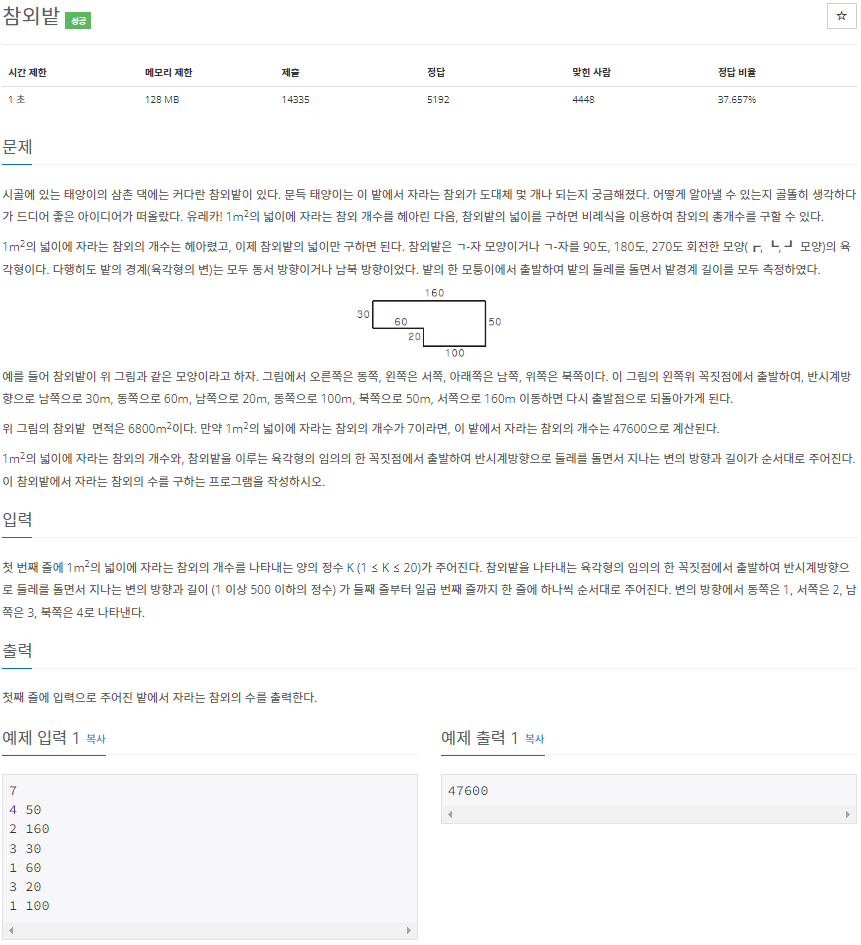

# 20220809_백준2477_참외밭_송경삼

**1. 문제**



이해하기도 간단하고 요구하는 것도 간단해서 쉽게 이해가능한 문제였습니다. 기존 함수의 이용을 최대한 자제해보자는 혼자만의 목표를 잡고 문제풀이를 시작했습니다.

**2. 나의 풀이**

```python
r=[4,3,1,2] #정해진 방향으로 부터 왔는지 알아볼 리스트이자 함수입니다.
            # ex) 1(동,항번호+1)의 값이 4(북)입니다. 
            # 이런 방식으로 사각형 순환 방이 맞는지 확인할 수 있습니다.
N=int(input())  #참외개수를 받습니다
L=[]        #값을 저장할 리스트입니다.
X,Y,S,m2=0,0,0,0    #순서대로 X축,Y축,이동방향,작은사각형 변2 입니다.
for i in range(6):  #육각형만큼 순회합니다.
    s,d=map(int,input().split())    #인풋을받고
    if i!=0:    #초항이면 넘어가고 아니면 검사합니다.
        if r[S-1]!=s:   #이번 이동이 반시계방향회전이 아닌건지 검사합니다.
            m1=d        #반시계가 아니면 작은 사각형의 변으로 저장합니다.
            m2=L[-1]    #작은사각형의 두번째변은 바로 전 길이입니다.
    L+=[d]  #L에 값을 추가합니다.
    S=s #s를 갱신합니다.
    if (s==1 or s==2) and d>X:X=d   #X의 최대길이를 갱신합니다.
    if (s==3 or s==4) and d>Y:Y=d   #Y의 최대길이를 갱신합니다.
if m2==0:   #m2가 갱신되지 않았다면 움푹파인 꼭지점에서 출발한겁니다.
    m1=L[0] #그러니까 초항이 작은 사각형의 변1이고
    m2=L[-1] #끝항이 작은 사각형의 변2입니다.
print(N*(X*Y-m1*m2))    #큰사각형의 넓이에서 작은 사각형을 빼 정답을 출력합니다.
```


제가 잡은 이 문제의 핵심 풀이는 회전 방향입니다. 문제에서 반시계 방향으로 입력이 주어진다 했기에. 원래 사각형을 반시계로 돌면 동->북->서->남->동 이 반복됩니다. 하지만, 움푹 패인 곳을 돌면 위 순서에서 벗어납니다. 이 현상을 통해서 작은 사각형의 두 변을 구하는 로직을 구성했습니다. 돌면서 최대값과 if문으로 지정해줘서 max()함수의 사용을 자제했습니다.

**3. 다른풀이와 비교**

```python
k = int(input())
a = [int(input().split()[1]) for _ in range(6)]
i = a.index(max(a))
print((a[i-1]*a[i-2]+a[i-4]*a[i-5])*k)
```


백준 아이디 [marble8](https://www.acmicpc.net/user/marble8) 님의 풀이입니다.

오늘은 시간대가 비슷비슷하고 메모리도 비슷비슷하기에, 숏코딩 랭커분과 비교하려고 가져왔습니다. 이 분 풀이에서 깨달은 것은 크게 두가지 였습니다.

1. 저는 큰사각형에서 작은 사각형을 빼야된다는 틀에 박혀서 왼쪽사각형과 오른쪽 사각형으로 나눠서 봐도 된다는 생각을 못했습니다. 제가 원래 하려고 시도했다가 안될 것 같아서 선회한 방법을 이 분은 두개의 나란한 사각형으로 풀어냈습니다. 따라서 조건을 세세하게 나눌 필요가 전혀 없이 모든 경우에 적용가능했습니다.

2. 리스트의 음수 index를 이용하면 편했었겠구나, 저는 양수 index를 써야한다는 틀에 박혀서 index에러를 대처하느라 코드가 길어졌습니다.


**4. 느낀점**

이번 문제는 깔끔하게 해결했다고 생각했습니다. 하지만 역시 랭커분들의 풀이를 보면 배우는 점이 많습니다. 특히 리스트의 음수 index를 활용하면 앞으로 쉽게 해결할 문제가 많을 것 같다고 느꼈습니다.


*출처

https://www.acmicpc.net/problem/2477
