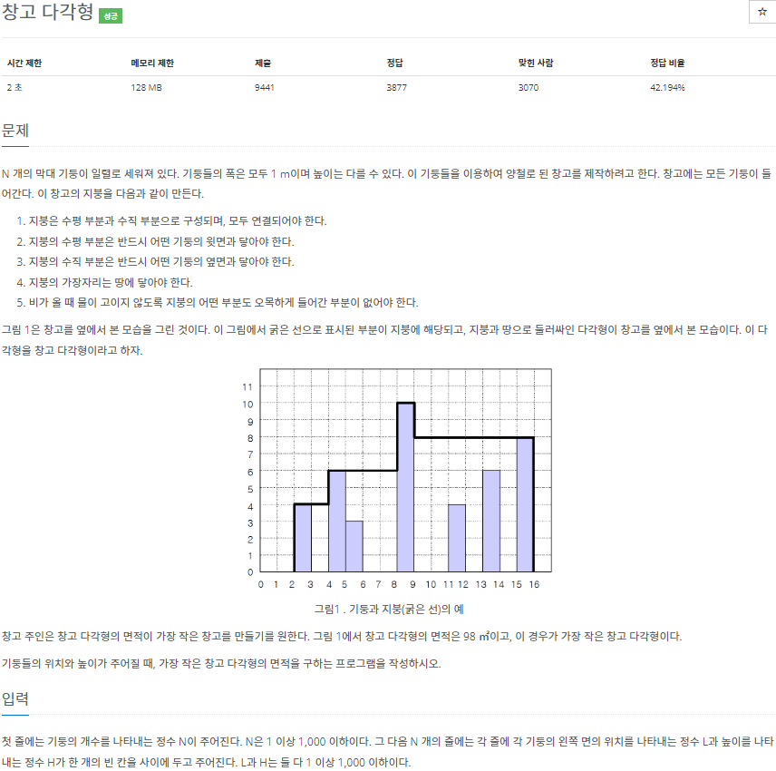
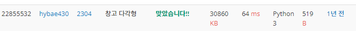

# 2022080812_백준2340_창고다각형_송경삼

**1. 문제**




움푹 파인 곳 없이 다각형을 완성해야하는 문제였습니다. 처음에는 위에서 누르면서 처음 닿는 지점 까지 좌표를 찾아 고정시키고 나머지를 계속 누르는 방식을 생각했습니다. 하지만, 양쪽에서 높은 곳을 만나면 올라가서 계속 진행하는 방식이 더 구현하기 편할 것 같아서 그렇게 진행했습니다.


**2. 나의 풀이**

```python
L=[]
for _ in range(int(input())):
    axis,height=map(int,input().split())
    if len(L)<axis: #이번 인덱스가 들어갈 공간이 없다면
        L+=[0]*(axis-len(L))+[height] #0과 해당 인덱스로 이루어진 리스트를 더합니다
    else: L[axis]=height #들어갈 공간이 있다면 껴넣습니다.
    L+=[0,0]
r=len(L)-1  #끝항
M=max(L)    #최대값을 찾습니다.
l,l_m,r_m=(0,)*3 #초항, 좌우 높은값들입니다
while L[l]!=M:  #왼쪽에서부터 오른쪽으로 가면서 높이를 채웁니다.
    if L[l]>l_m:l_m=L[l]
    else:L[l]=l_m
    l+=1
while L[r]!=M:  #오른쪽에서부터 왼쪽으로 채웁니다.
    if L[r]>r_m:r_m=L[r]
    else:L[r]=r_m
    r-=1
if l<r: #l과 r 사이에 거리가 있을경우
    for i in range(l,r+1):  #사이를 채워줍니다.
        L[i]=M
print(sum(L))
```

우선 메모리 공간을 적게 쓰는 의도로 사용되는 리스트의 길이를 줄이려고 했습니다. 그래서 for문을 통해 리스트에 들어갈 수 있다면 값을 들어가게 하고 들어갈 수 없다면 새로운 리스트를 더하는 방식으로 구현했습니다.

그리고 최대값이 나올 때까지 양쪽에서 채우면서 조여오는 방식으로 구현했습니다. 이렇게 돌리고 한번 제출했는데, 생각하지 못했던 경우가 있었습니다. 최대값을 가진 기둥이 두개고 양쪽에서 멈춰버리면 가운데 공간은 채우지 못한다는 점이었습니다. 이 공간을 채우기 위해 왼쪽과 오른쪽이 멀다면 그 사이를 채우는 방식의 로직도 추가 했습니다. 


**3. 다른풀이와 비교**

```python
import sys

N = int(sys.stdin.readline())
area = [0] * 1001
h_max, tmp, ans = 0, 0, 0

for n in range(N):
    x, h = map(int, sys.stdin.readline().split())
    if h_max < h:
        h_max = h
    area[x] = h

idx = 0
for i in range(len(area)):
    if tmp == h_max:
        idx = i
        break
    elif tmp < area[i]:
        tmp = area[i]
    ans += tmp

tmp = 0
for i in range(len(area) - 1, idx - 1, -1):
    if tmp < area[i]:
        tmp = area[i]
    ans += tmp

print(ans)
```



백준 아이디 [hybae430](https://www.acmicpc.net/user/hybae430) 님의 풀이입니다.

제가 깨달은 점 첫번째는 리스트 공간을 너무 과대평가 했다는 점입니다. 20칸 정도만 필요할 때 리스트를 1000칸 짜리를 만들어놓으면 너무 낭비되는 것 같아서 필요한만큼만 만드는 로직을 짰는데 이 로직을 구성하는데 낭비되는 시간이 더 걸린다고 깨달았습니다. 랭커들의 풀이 대부분이 [0]\*1000 과 같이 대형의 공간을 미리 만들어 놓았습니다. 그 외에 제가 생각하지 못해서 마지막에 만들었던 가운데 부분을 채우는 로직을 이분은 애초에 양쪽에서 출발하는 것에서 부터 구성해놨습니다.


**4. 느낀점**

다음 부터는 [0]\*1000과 같이 대형 공간을 만드는 것을 두려워하지 않아야겠다 느꼈습니다. 또한, 제출하기 전까지 로직에 함정은 없나 반례는 없나 한번 더 생각해볼 필요가 있다고 느꼈습니다.


*출처

https://www.acmicpc.net/problem/2304
