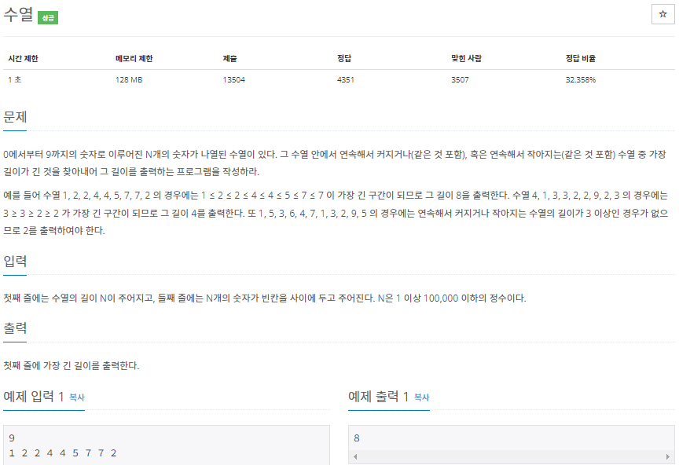

# 2022080815_백준2491_수열_송경삼

**1. 문제**




**2. 나의 풀이**

```python
N=int(input())
inc=dec=cnt_i=cnt_d=1   #최대증가구간,최대감소구간,각 카운트용변수 2개
L=list(map(int,input().split()))
for i in range(1,N):
    if L[i-1]<=L[i]:    #증가라면
        cnt_i+=1        #수증가
        if cnt_i>inc:inc=cnt_i  #최대값 갱신
    else:   #아니라면
        cnt_i=1 #초기화
    if L[i-1]>=L[i]:    #감소에서의 마찬가지
        cnt_d+=1
        if cnt_d>dec:dec=cnt_d
    else:
        cnt_d=1
print(max(inc,dec)) #최대길이 인쇄
```


**3. 다른풀이와 비교**

```python
import sys
N = int(input())
iterator = map(int,sys.stdin.readline().split())
prev = next(iterator)
inc_cnt = 1
dec_cnt = 1
max_inc_cnt = 1
max_dec_cnt = 1
for val in iterator:
    dec_cnt += 1
    inc_cnt += 1
    if prev < val:
        if max_dec_cnt < dec_cnt:
            max_dec_cnt = dec_cnt - 1
        dec_cnt = 1
    elif prev > val:
        if max_inc_cnt < inc_cnt:
            max_inc_cnt = inc_cnt - 1
        inc_cnt = 1
    prev = val

print(max(max_dec_cnt,max_inc_cnt, dec_cnt, inc_cnt))
```


**4. 느낀점**


*출처

https://www.acmicpc.net/source/12100639
