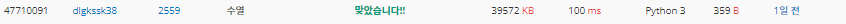

2022080816_백준2559_수열_송경삼

**1. 문제**


흔한 수열 연속수의 합을 구하는 문제였습니다. 문제는, 너무 간단하게 생각해서 금방 풀겠네 라며 매번 수를 다 더하는 로직을 처음에 구성하기 시작했습니다.


**2. 나의 풀이**

```python
def S(n):
    return sub-L[n-1]+L[n+M-1]   #이전항 제거 다음항 추가 함수
I=lambda :map(int,input().split())
N,M=I()
L=list(I())
m=sub=sum([L[i] for i in range(M)])  #초항 값 저장
for i in range(1,N-M+1):
    sub=S(i)
    if sub>m:m=sub  #max값 갱신
print(m)
```


당연하게도 첫 시도는 시간초과로 실패했습니다. 하지만, 원인을 금방 파악해서 수정해서 성공했습니다.


**3. 다른풀이와 비교**

```python
def findmax(arr, k, l):
    max_arr = sum(arr[0:k])
    last_arr = max_arr
    for i in range(k, l):
        last_arr = last_arr + arr[i] - arr[i-k]
        if max_arr < last_arr:
            max_arr = last_arr
    return max_arr

N, K = map(int, input().split()) # N 개의 숫자, K일
degrees = list(map(int, input().split()))
print(findmax(degrees, K, N))
```



매번 랭커와의 시간 차이가 나는 이유를 예전과 파이썬 프로그램의 무게가 달라졌다고 생각했었으나, 하루 전 풀이한 분과 24ms의 차이가 나는 것을 보고 반성했습니다. 함수안에 모든 것을 집어넣어서 더욱 빠르게 했다고 분석했습니다.


**4. 느낀점**

어제 분명 자만하지 말아야겠다 생각했는데, 또 쉬운 문제라면서 문제의 조건을 보지않고 조건에 맞지 않는 코딩 제출을 했습니다. 다음번엔 정말 다릅니다. 쉬운 문제라고 자만하지 않겠다고 다시 한버 다짐했습니다.


*출처

https://www.acmicpc.net/problem/2559
