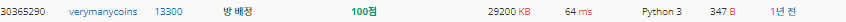

# 2022080818_백준13300_방배정_송경삼

**1. 문제**


input을 조건에 따라 분류하는 문제입니다. 시간 제한도 넉넉하고 문제도 쉽기에 편한 맘으로 풀기 시작했습니다.


**2. 나의 풀이**

```python
I=lambda :map(int,input().split())
r=[0]*12    #저장공간
N,K=I()
for _ in '_'*N:
    s,g=I()
    if s:r[g+5]+=1  #여자일경우 6~11인덱스에 저장
    else:r[g-1]+=1  #남자일경우 0~5인덱스에 저장
cnt=0
for i in r: #정리한 요소를 돌면서
    cnt+=i//K + (1 if i%K!=0 else 0)    #필요한 방개수를 카운트함
print(cnt)
```


어려운 점 없이 풀이는 쉽게 했습니다.

**3. 다른풀이와 비교**

```python
import sys

N, K = map(int, sys.stdin.readline().split())
student = [[0] * 7 for _ in range(2)]
for _ in range(N):
    S, Y = map(int, sys.stdin.readline().split())
    student[S][Y] += 1

room = 0
for i in range(2):
    for j in range(1, 7):
        room += student[i][j] // K
        if student[i][j] % K != 0:
            room += 1
print(room)
```



백준 아이디 [verymanycoins](https://www.acmicpc.net/user/verymanycoins) 님의 풀이입니다.

거의 모든 로직이 동일했습니다만, 시간에서 큰 차이가 벌어진 점은 분석해야 했습니다.

분석 결과, 딱 한 가지의 디테일에서 시간이 많이 벌어졌다고 생각합니다.

그 점은 input data를 연산하지 않고 그대로 쓰일 수 있도록 저장 공간을 만들어 놓았다는 것입니다. 쉽게 말해 컴퓨터가 일하기 쉽도록 만들어 놨습니다. 저 같은 경우는 사람이 이해하고 코딩하기 쉽게 단순히 일차원 저장공간에 맞춰 연산을 통해 인덱스를 접근했습니다. 하지만, 이 분은 성별도 연산할필요없고, 학년도 연산할 필요 없도록 2차원 배열과, 7칸의 배열은 만들었습니다. 따라서 이 연산 시간만큼 차이가 벌어진게 당연하다고 생각합니다.


**4. 느낀점**

아직 컴퓨터의 입장을 이해하지 못한채 코딩을 하고 있다고 느꼈습니다. 저장공간이 약간 늘어나는 것보다 연산을 하지 않는 것이 더욱 유효하다는 것을 체감했고, 다음 부터는 약간의 변형을 통해 연산시간을 단축 시킬 방법이 없는지도 생각하면서 코딩하면 더욱 좋겠구나 생각했습니다.


*출처

https://www.acmicpc.net/problem/13300
