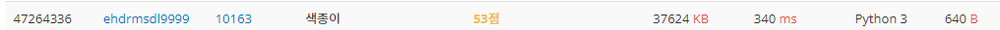
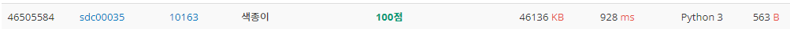

# 색종이

| 시간 제한 | 메모리 제한 | 제출   | 정답   | 맞힌 사람 | 정답 비율   |
| ----- | ------ | ---- | ---- | ----- | ------- |
| 1 초   | 64 MB  | 3883 | 1625 | 1330  | 45.054% |

## 문제

평면에 색깔이 서로 다른 직사각형 모양의 색종이 N장이 하나씩 차례로 놓여진다. 이때 색종이가 비스듬하게 놓이는 경우는 없다. 즉, 모든 색종이의 변은 서로 평행하거나, 서로 수직이거나 둘 중 하나이다. 그림-1은 1번, 2번, 3번 세 장의 색종이가 순서대로 놓인 상태를 보여준다.


그림-1

여기에 그림-2에서 보인 것처럼 4번 색종이가 하나 더 놓이면 3번 색종이는 완전히 가려서 보이지 않게 된다. 그리고, 1번 색종이와 2번 색종이는 부분적으로 가려 보이며, 4번 색종이는 완전히 보이게 된다.


그림-2

N장의 색종이가 주어진 위치에 차례로 놓일 경우, 각 색종이가 보이는 부분의 면적을 구하는 프로그램을 작성하시오. 

## 입력

입력의 첫 번째 줄에는 색종이의 장수를 나타내는 정수 N (1 ≤ N ≤ 100)이 주어진다. 이어서 N장의 색종이에 관한 입력이 각 색종이마다 한 줄씩 차례로 주어진다. 색종이가 놓이는 평면은 가로 최대 1001칸, 세로 최대 1001칸으로 구성된 격자 모양이다. 격자의 각 칸은 가로, 세로 길이가 1인 면적이 1인 정사각형이다. 

편의상 가로 6칸, 세로 6칸으로 이루어진 격자의 예를 들어 설명하면, 각 칸에 표시된 값 (a,b)는 해당 칸의 번호를 나타낸다. 가장 왼쪽 아래의 칸은 (0,0) 가장 오른 쪽 위의 칸은 (5,5)이다. 


색종이가 놓인 상태는 가장 왼쪽 아래 칸의 번호와 너비, 높이를 나타내는 네 정수로 표현한다. 예를 들어, 위 그림에서 회색으로 표시된 색종이는 (1,4)가 가장 왼쪽 아래에 있고 너비 3, 높이 2이므로 1 4 3 2로 표현한다. 색종이가 격자 경계 밖으로 나가는 경우는 없다. 

## 출력

입력에서 주어진 순서에 따라 N장의 색종이를 평면에 놓았을 때, 입력에서 주어진 순서대로 각 색종이가 보이는 부분의 면적을 한 줄에 하나씩 하나의 정수로 출력한다. 만약 색종이가 보이지 않는다면 정수 0을 출력한다. 

## 서브태스크

| 번호  | 배점  | 제한                                                                            |
| --- | --- | ----------------------------------------------------------------------------- |
| 1   | 11  | N = 1                                                                         |
| 2   | 12  | N ≤ 10이고, 모든 색종이는 너비 1, 높이 1이다. 색종이가 놓여지는 평면은 가로 101칸, 세로 101칸으로 구성된 격자 모양이다. |
| 3   | 30  | N ≤ 10이고, 색종이가 놓여지는 평면은 가로 101칸, 세로 101칸으로 구성된 격자 모양이다.                       |
| 4   | 47  | 원래의 제약조건 이외에 아무 제약 조건이 없다.                                                    |


## 나의 코딩

```python
import sys
N=int(sys.stdin.readline())
rlist=[list(map(int,sys.stdin.readline().split())) for i in range(N)]
mx=(lambda y: y[0]+y[2])(max(rlist,key=lambda x: x[0]+x[2]))#rlist의 요소의 0번,2번 인데스의 합이 가장 큰 리스트에서 0번,2번 인덱스의 합을 가져온다.
my=(lambda y: y[1]+y[3])(max(rlist,key=lambda x: x[1]+x[3]))#위와 마찬가지이며, 인덱스만 다름으로, y좌표를 의미한다.
#[[0]*mx]*my 가 안되는 이유!! list의 * 는 같은 주소값 갖는것들을 여러개 할 수 있다.
rmap=[[0]*(mx) for _ in range(my)]  #색종이로 덮이지 않은 좌표로 모두 0을 표시한다. mx는 x좌표 최댓값, my 는 y좌표 최댓값

#copy, deepcopy를 이미 알고 있었지만, *연산에서도 copy가 적용 된는 것은 경험한 적이 없어서 헤멨다.
for i in range(1,N+1):
    for j in range(rlist[i-1][1],(rlist[i-1][1]+rlist[i-1][3])): #y좌표 0,1,2,3,4 rmap[y좌표][x좌표]
        for k in range(rlist[i-1][0],rlist[i-1][0]+rlist[i-1][2]): #x좌표 0,1,2,3,4
            rmap[j][k]=i #i가 1이면 1번쨰 색종이의 보이는 면적을 1로 다 표현하고, i가 2이면, 2번쨰 색종이의 면적을 2로 다 표현한다.
            #계속 하다보면 사라지는 1 또는 2가 계속 생긴다. 왜냐하면 색종이가 위로 계속 덮이기 때문에 최종적으로 가장 위에 노출된 색종이만 표현될 것이다.

ans_list=[ans for x in rmap for ans in x]
for i in range(1,N+1):
    print(ans_list.count(i))#이제 계속 overwrite된 결과의 좌표들의 숫자들의 갯수를 카운트 하여 각 색종이 별로 보이는 면적을 구한다.
```


53점으로 시간 초과로 마지막 과제는 실패로 간주 되었다. 따라서 통과해 보고자 pypy3로 해봤는데 되긴 했으나 시간이 너무 오래 걸렸다. 그래서 새로운 방법인 set를 이용한 방법으로 해보고자 했다.

## 2번째 방법

```python
import sys
N=int(sys.stdin.readline())
rlist=[list(map(int,sys.stdin.readline().split())) for i in range(N)]
ans_list=[]
on_set=set()#가장 위의 색종이의 좌표들 저장.
mx=(lambda y: y[0]+y[2])(max(rlist,key=lambda x: x[0]+x[2]))
my=(lambda y: y[1]+y[3])(max(rlist,key=lambda x: x[1]+x[3]))
mm=mx*my #좌표의 갯수
for i in range(1,N+1)[::-1]: #가장 맨 위에있는 색종이 부터 계산하여 계산양을 줄여보았다.
    if len(on_set)==mm: #만약 좌표의 갯수가 on_set에 저장된 갯수와 같으면 
        for m in range(i,N+1):
            ans_list.append(0) #아래에 있는 모든 색종이는 안보인다. 따라서 0이다.
        break#이미 보이는 모든 색종이가 드러났으므로, 함수를 종료한다.
    cnt=0 
    for j in range(rlist[i-1][1],(rlist[i-1][1]+rlist[i-1][3])):#y좌표범위 
        for k in range(rlist[i-1][0],rlist[i-1][0]+rlist[i-1][2]):#x좌표범위 
            if (j,k) not in on_set:#y,x가 on_set에 없으면 
                on_set.add((j,k))#y,x를 추가해 줍니다 그리고 cnt에 1을 더합니다.
                cnt+=1#위와같이 하면,밑의 색종이가 위와같은 좌표가 나오면 cnt는 안올라갑니다. 
            else:
                pass
    ans_list.append(cnt) #맨 위의 색종이의 차지하는 면적이 cnt로 list에 추가되어집니다.

for i in ans_list[::-1]: #맨 위의 색종이의 면적부터 넣었기 때문에, reverse하여 출력합니다.   
    print(i)
```

set라는 방법을 써서 연산을 줄여보고자 했지만, 여전히 시간초과로 실패했고, 오히려 시간이 늘었다. 아무래도 결국에는 좌표 1개 1개마다 연산을 계속 할 수 밖에 없기 때문에 시간이 늘어나지 않았을까 생각된다. 그래서 색다른 방법으로 for문을 줄여보기로 했다.  

## 3번째 방법

```python
import sys
N=int(sys.stdin.readline())
rlist=[list(map(int,sys.stdin.readline().split())) for i in range(N)]
mx=(lambda y: y[0]+y[2])(max(rlist,key=lambda x: x[0]+x[2]))
my=(lambda y: y[1]+y[3])(max(rlist,key=lambda x: x[1]+x[3]))
rmap=[[0]*mx for _ in range(my)]#색종이들이 위치할 좌표 맵을 만들어 줍니다.
for i in range(1,N+1):
    a=i-1
    for j in range(rlist[a][1],(rlist[a][1]+rlist[a][3])):#for문이 1개 줄었습니다.
        rmap[j][rlist[a][0]:rlist[a][0]+rlist[a][2]]=[i]*rlist[a][2]
#for문이 줄은 이유는 좌표 1개에 계속 for으로 1개씩 넣었던 것을 리스트 1줄씩 한번에 넣었습니다.
#1번째는 숫자1, 2번째는 숫자2를... 마지막 색종이는 숫자 N을 좌표에 넣어 맨위의 색종이들이 보이는 면적을 알게 해줍니다. 
def counting(a):#rmap의 완성된 좌표에서 1번색종이부터 얼마나 보이는 카운팅 해주는 함수입니다. 
    cnt=0
    for j in range(0,my):
        cnt+=rmap[j].count(a) #
    return cnt

for i in range(1,N+1):
    print(counting(i))#카운팅 한 것을 출력합니다.
```

확실히 for문이 1개 줄어드니 속도가 빨라져서 python으로도 100점이라는 결과가 나올 수 있었다. 최대한 for문을 줄여서 연산량을 줄이는 것이 정말 중요하다는 것을 알았고, 다른 알고리즘에서도 항상 for문에 대해 고려하기로 다짐했다!!


## 다른사람의 빠른 코딩 1

```python
import sys
input = sys.stdin.readline
print = sys.stdout.write

N = int(input())
queries, line_x, line_y = [], set(), set()
#리스트, 집합, 집합 선언하였다.
for _ in range(N):
    q = list(map(int, input().split()))
    x1, y1, x2, y2 = q[0], q[1], q[0] + q[2], q[1] + q[3]
    #더 알아보기 편하게 변수를 만들었다. x1,y1,x1+width,y1+width 형식
    queries.append((x1, y1, x2, y2))#쿼리에 좀더 쓰기 편한 변수를 넣어줬다.
    line_x.add(x1) #x시작범위 넣어주기
    line_x.add(x2) #x끝범위 넣어주기
    line_y.add(y1) #y시작 범위 넣어주기 
    line_y.add(y2) #y끝 범위 넣어주기 

line_x = sorted(line_x)
line_y = sorted(line_y) #line_x, line_y 집합 정렬하기->정렬리스트로 됌.
comp_x = {v: i for i, v in enumerate(line_x)} line_x요소는 key값 i는 value값으로 저장. 
comp_y = {v: i for i, v in enumerate(line_y)}
dx = [line_x[i] - line_x[i - 1] for i in range(1, len(line_x))] 
#line_x의 x시작,끝 좌표들의 오름차순으로 정리된 리스트를 그 차이의 리스트로 dx에 넣어준다. 
dy = [line_y[i] - line_y[i - 1] for i in range(1, len(line_y))]

paper = [[0] * len(dx) for _ in range(len(dy))] #좌표 그림을 만들어준다.
#x의 차 갯수 만큼의 0의 리스트를 y의 차 갯수만큼 만들어준다.
for i in range(1, len(queries) + 1):
    x1, y1, x2, y2 = queries[i - 1] #쿼리 0부터 N-1까지 1번씩 받는다.
    for x in range(comp_x[x1], comp_x[x2]):#x딕셔너리의 [x1]의 value값(enumerate 순서->낮은순서)을 range로 사용한다.
        for y in range(comp_y[y1], comp_y[y2]):
            paper[y][x] = i #paper은 차의 갯수를 좌표로 만든 것이다. 즉 차의 구간을 누가 차지하냐를 나타낼 수 있다. 

ans = [0] * (N + 1)
for y in range(len(paper)):
    for x in range(len(paper[0])):
        ans[paper[y][x]] += dx[x] * dy[y] #차의 곱.

print('\n'.join(map(str, ans[1:]))) #한번에 정답을 str형태로 출력한다. \n이 을 붙여가며.
```

좌표를 누가 차지하느냐가 아니라 넓이를 누가 차지하느냐로 문제를 풀은 코드다. 따라서 색종이의 크기가 아니라 색종이의 갯수에 따라 연산하는 수가 달라지는 코드라 생각된다. 상당히 수학적으로 생각한 뒤에 코드로 옮겼다. 이를 통해서 수학적 접근법이 얼마나 중요한 것인가에 대해서 느낄 수 있었다.  이런 코드가 센스있고 fancy한 코드라고 생각한다. 알고리즘과 수학은 정말 깊이 연관이 있다는 것을 증명하는 코드다!!


## 다른 사람의 빠른 코딩 2

```python
import collections
N = int(input())
graph = [[0] * 1001 for i in range(1001)]
#최대 조건이 x축으로 1001개, y축으로 1001개라서 좌표를 이런식으로 만들었을것이다. 
for p in range(1, N+1):
    p_x, p_y, width, height = map(int, input().split())
    #리스트로 한번에 안받고 변수 1개씩 따로 변수를 받는것은 나와 다른점이다.
    #이로 인해 변수를 1번씩 쓰고 버리기 때문에 식이 더 간단해 보인다.
    #물론 나의 코딩은 리스트를 다 받고 시작하기 때문에, 최대 x값,y값을 가져와서
    #뭐가 더 빠를지는 때에따라 다를 수 있을 것이라 생각된다.
    for y in range(p_y, p_y+height):
        graph[y][p_x:(p_x+width)] = [p]*width
        #나의 코딩3 방법처럼 1줄씩 좌표에 대입하고 있다.
# for i in range(1,N+1):
#     a ,b, c, d = map(int,input().split())
#     for n in range(b,b+d):
#         for m in range(a,a+c):
#             graph[n][m] = i

result = []
for i in graph:
    for j in i:
        result.append(j) #2차원 그래프를 1차원 으로 만들어서 연산하려고 한다.

result = collections.Counter(result) #result를 collections.Counter로 하면 dictionary
#형태로 인자 x를 key값, x의 갯수를 value값으로 만들어준다.(새로 배운)
for i in range(1,N+1):
    print(result[i])#그래서 key 1부터 N까지 value값을 출력한다.
```

928ms의 속도로 상당히 빠른쪽에 속하는 코딩이였다. 그런데 collections라는 모듈을 임포트 한것은 아쉽게 느껴졌다. 그리고 나의 코딩 3번째인 모든 list를 한번에 받는 방법을 이 코딩처럼 나눠서 받았을때  1768ms에서 1776ms로 오히려 시간이 늘어난 것을 볼 수 있었고, counting 하는 방법을 바꿨을때는  940ms 시간이 확 단축됐다. 그리고 collection함수를 안쓰고 직접 딕셔너리를 만들었을 때는 1800ms정도가 나왔다. collection함수는 효율적으로 만들어 졌다는 것을 알았고, 그 차이에 대해서 차근차근 공부해야할 것 같다. 또 한가지 알게 된 점은, input과 sys.stdin.readline()을 input으로 바꿨을때 20ms정도 더 빠르게 나왔다는 것이다. 이에 대해서도 차근차근히 알아봐야할 것 같다.
