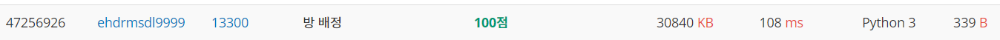
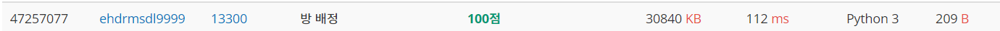
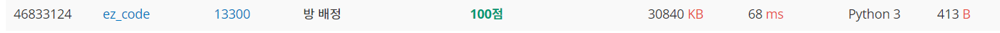

# 방 배정

| 시간 제한 | 메모리 제한 | 제출    | 정답   | 맞힌 사람 | 정답 비율   |
| ----- | ------ | ----- | ---- | ----- | ------- |
| 2 초   | 512 MB | 10962 | 6304 | 5298  | 60.342% |

## 문제

정보 초등학교에서는 단체로 2박 3일 수학여행을 가기로 했다. 여러 학년이 같은 장소로 수학여행을 가려고 하는데 1학년부터 6학년까지 학생들이 묵을 방을 배정해야 한다. 남학생은 남학생끼리, 여학생은 여학생끼리 방을 배정해야 한다. 또한 한 방에는 같은 학년의 학생들을 배정해야 한다. 물론 한 방에 한 명만 배정하는 것도 가능하다.

한 방에 배정할 수 있는 최대 인원 수 K가 주어졌을 때, 조건에 맞게 모든 학생을 배정하기 위해 필요한 방의 최소 개수를 구하는 프로그램을 작성하시오.

예를 들어, 수학여행을 가는 학생이 다음과 같고 K = 2일 때 12개의 방이 필요하다. 왜냐하면 3학년 남학생을 배정하기 위해 방 두 개가 필요하고 4학년 여학생에는 방을 배정하지 않아도 되기 때문이다.

| 학년  | 여학생    | 남학생        |
| --- | ------ | ---------- |
| 1학년 | 영희     | 동호, 동진     |
| 2학년 | 혜진, 상희 | 경수         |
| 3학년 | 경희     | 동수, 상철, 칠복 |
| 4학년 |        | 달호         |
| 5학년 | 정숙     | 호동, 건우     |
| 6학년 | 수지     | 동건         |

## 입력

표준 입력으로 다음 정보가 주어진다. 첫 번째 줄에는 수학여행에 참가하는 학생 수를 나타내는 정수 N(1 ≤ N ≤ 1,000)과 한 방에 배정할 수 있는 최대 인원 수 K(1 < K ≤ 1,000)가 공백으로 분리되어 주어진다. 다음 N 개의 각 줄에는 학생의 성별 S와 학년 Y(1 ≤ Y ≤ 6)가 공백으로 분리되어 주어진다. 성별 S는 0, 1중 하나로서 여학생인 경우에 0, 남학생인 경우에 1로 나타낸다. 

## 출력

표준 출력으로 학생들을 모두 배정하기 위해 필요한 최소한의 방의 수를 출력한다.

## 서브태스크

| 번호  | 배점  | 제한                        |
| --- | --- | ------------------------- |
| 1   | 2   | 입력 예시로 주어진 입력만 존재한다.      |
| 2   | 10  | 1학년 남학생만 참가하는 것으로 가정한다.   |
| 3   | 20  | 1학년만 참가하는 것으로 가정한다.       |
| 4   | 68  | 원래의 제약조건 이외에 아무 제약조건이 없다. |

| 예제 입력1                                                                                                                               | 예제 출력1 | 예제 입력2                      | 예제 출력2 |
| ------------------------------------------------------------------------------------------------------------------------------------ | ------ | --------------------------- | ------ |
| 16 2<br/>1 1<br/>0 1<br/>1 1<br/>0 2<br/>1 2<br/>0 2<br/>0 3<br/>1 3<br/>1 4<br/>1 3<br/>1 3<br/>0 6<br/>1 5<br/>0 5<br/>1 5<br/>1 6 | 12     | 3 3<br/>0 3<br/>1 5<br/>0 6 | 3      |

## 1. 초기 코딩

```python
K,N=list(map(int,input().split())) #K는 학생수, N은 방 하나에 넣을수 있는 사람수 
student_dict=dict() #딕셔너리로 각 학년별 남학생,여학생 수 넣기.
student_list=[] #리스트에 학생 수 반환
cnt=0
for i in range(K):
    student_list.append(tuple(map(int,input().split()))) #set로 바꾸기 위해서는 tuple형으로 변환
for i in set(student_list): #student_list의 모든 유형을 딕셔너리에 담기.
    student_dict[i]=0
for i in student_list:
    if i in student_dict: #리스트안의 요소가 딕셔너리에 있을때마다 value 값 1명씩 추가.
        student_dict[i]+=1
for i in student_dict.values():
    cnt+=-(-i//N) #각 value값에서 방 하나에 넣을 수 있는 사람 수 나눠서 올림 해주기.
print(cnt) #math 함수 대신 -(-a//b)를 하면 올림을 구현할 수 있다.(a,b는 양수)
#math함수를 쓰기 싫어서 올림 할 방법을 찾던중 -(-a//b) 를 공부하게 되었다.
```



## 2. 코드 길이 줄인 코딩

```python
K,N=list(map(int,input().split()))#K는 학생수, N은 방 1개에 넣을 수 있는 사람
student_list=[]
cnt=0
for i in range(K): #학생 리스트를 튜플 형태로 얻는다.(set을 쓰기위해)
    student_list.append(tuple(map(int,input().split())))
for i in set(student_list):
    cnt+=-(-student_list.count(i)//N) #set의 요소마다의 갯수를 구해서 방 갯수 구하기.
print(cnt)
```



## 3. sys로 받을때 시간 차이 측정

```python
import sys #sys로 데이터를 받아오면 훨씬 빠르다고 해서 사용해 보았다.
K,N=map(int,sys.stdin.readline().split()) #input()대신 사용.
student_list=[]
cnt=0
for i in range(K):
    student_list.append(tuple(sys.stdin.readline().split()))
for i in set(student_list):
    cnt+=-(-student_list.count(i)//N)
print(cnt)
#실제로 112ms에서 72ms로 줄었다.
```


# 다른사람 코딩 살펴보기

### 1.가장 빠른 코딩 분석

```python
import sys #이 사람도 sys를 써서 시간을 대폭 줄였다.

def div(a, b): #함수를 정의해서 방의 갯수를 구하게 하였다. 재사용성 굳
    if a % b == 0:
        return a // b
    else:
        return a // b + 1

key = [[0, 0] for i in range(6)] #1학년 [남,여] ~ 6학년[남,여] 를 표현

N, K = map(int, sys.stdin.readline().split()) #N 학생수, K 방 수용인원 
for i in range(N):
    S, Y = map(int, sys.stdin.readline().split())
    if S == 0: #0은 성별 남성이면 
        key[Y-1][0] += 1 #Y는 학년인데 6학년은 5번 인덱스 배정, 남자는 그 리스트의 0번 인덱스.
    else:
        key[Y-1][1] += 1 #여자는 [학년-1]인덱스의 [1]인덱스에 +1됌.

ans = 0
for year in key: #key에서 학년별, 성별 인원수들 가져오기기
    for sex in year: #학년별 남자, 여자 인원들 방의 갯수 구하기.
        ans += div(sex, K)
print(ans)
```



#### 그렇게 어렵진 않은 문제였고, 어떻게 더 효율적으로 할 지 생각해 본 계기였고, math모듈의 ceil() 대신 -(A//B)로 올림을 할 수있다는 것을 알게 되었다. 그리고 sys모듈로 라인을 받아오면 더 빠르다는 것을 알았고, 이렇게 하나하나 쌓아가다 보면 더 잘할 수 있지 않을까 생각된다.
