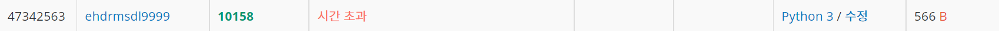
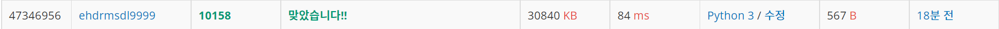

# 개미 성공

| 시간 제한             | 메모리 제한 | 제출    | 정답   | 맞힌 사람 | 정답 비율   |
| ----------------- | ------ | ----- | ---- | ----- | ------- |
| 0.15 초 (추가 시간 없음) | 256 MB | 13401 | 3724 | 2976  | 32.844% |

## 문제

가로 길이가 w이고 세로 길이가 h인 2차원 격자 공간이 있다. 이 격자는 아래 그림처럼 왼쪽 아래가 (0,0)이고 오른쪽 위가 (w,h)이다. 이 공간 안의 좌표 (p,q)에 개미 한 마리가 놓여있다. 개미는 오른쪽 위 45도 방향으로 일정한 속력으로 움직이기 시작한다. 처음에 (p,q)에서 출발한 개미는 1시간 후에는 (p+1,q+1)로 옮겨간다. 단, 이 속력으로 움직이다가 경계면에 부딪치면 같은 속력으로 반사되어 움직인다.


위 그림은 6×4 격자에서 처음에 (4,1)에서 출발한 개미가 움직인 길을 보여주고 있다. 처음에 (4,1)에 있는 개미는 2시간 후에 (6,3)에 있으며 8시간 후에 (0,1)에 있다. 만일 그 개미가 처음에 (5,3)에 있었다면 매 시간마다 (6,4), (5,3), (4,2), (3,1)로 움직인다. 

여러분은 크기 w×h인 격자 공간에서 처음에 (p,q)에서 출발하는 개미의 t시간 후의 위치 (x,y)를 계산하여 출력해야 한다. 개미는 절대 지치지 않고 같은 속력으로 이동한다고 가정한다. 

문제에서 w와 h는 자연수이며 범위는 2 ≤ w,h ≤ 40,000이다. 그리고 개미의 초기 위치 p와 q도 자연수이며 범위는 각각 0 < p < w과 0 < q < h이다. 그리고 계산할 시간 t의 범위는 1 ≤ t ≤ 200,000,000이다. 

## 입력

첫줄에는 w와 h가 공백을 사이에 두고 주어진다. 그 다음 줄에는 초기 위치의 좌표값 p와 q가 공백을 사이에 두고 주어진다. 3번째 줄에는 개미가 움직일 시간 t가 주어진다. 

## 출력

출력은 t 시간 후에 개미의 위치 좌표 (x,y)의 값 x와 y를 공백을 사이에 두고 출력한다. 

## 예제 입력 1 복사

6 4
4 1
8

## 예제 출력 1 복사

0 1

## 예제 입력 2 복사

6 4
5 3
4

## 예제 출력 2 복사

3 1

## 처음 했던 시간초과 한 코드

```python
w,h=map(int,input().split()) #좌표판 넓이w, 높이h
x,y=map(int,input().split()) #개미의 시작위치 x,y
t=int(input()) #개미가 움직인 시간 t

def ant(w,h,x,y,t):
    if w==h:
        cycle=2*w #정사각형에서 처음 상태와 완전히 똑같아지는 싸이클 
    else:
        cycle=h*w #직사각형에서 처음 상태와 완전히 똑같아지는 싸이클 
    cntx=0#x축 방향을 결정해주는 인자.
    cnty=0#y축 방향을 결정해주는 인자.
    t=t%cycle#t에서 cycle으로 나눈 나머지만큼만 움직여주면 된다.
    for i in range(t): #나머지 t만큼 개미를 움직여준다. 
        if cntx==0:
            x+=1
            if x==w:
                cntx=1     
        else:
            x-=1
            if x==0:
                cntx=0

        if cnty==0:
            y+=1
            if y==h:
                cnty=1
        else:
            y-=1
            if y==0:
                cnty=0
    return print(x,y) #개미의 좌표
ant(w,h,x,y,t)
```

## 

## 개선한 코드

```python
#처음 개미는 x,y방향으로 1칸씩 이동하는 것으로 시작된다.
#이때, 처음 벽에 닿을때 방향이 전환되는 방향이 다른 경우는 3가지 이다.
#1.우측벽에 부딪힐 때, 2. 위쪽벽에 부딪힐 때, 3. 대각선 모서리에 부딪힐 때이다.
# 위의 조건들을 수식으로 정리해보자. 우선 x축은 0부터 W까지, y축은 0부터 h까지 범위가 제한된다.
# 그리고 벽에 부딪히는 것을 계산해 봤을때, 어느 주기를 가질 수 밖에 없다는 것을 알 수 있다.
w,h=map(int,input().split()) #x축 너비는 w, y축높이는 h이다.
x,y=map(int,input().split()) #개미의 초기위치 x,y이다.
t=int(input())#t시간후의 개미위치를 구한다. (1시간에 x,y축은 1씩 변한다.)

def ant(w,h,x,y,t):

    cyclex=2*w #x축 사이클 
    cycley=2*h #y축 사이클 
#기존의 사이클 구하는 식인 w*h를 사용하면 틀렸다고 나온다. 물론 위의 처음 코드로 1칸씩 움직인다면 분명 맞긴하지만 시간이 많이 소요된다. 
    tx=t%cyclex #tx는 x좌표를 구하기 위한 나머지 값 더해준것.
    ty=t%cycley #ty는 y좌표를 구하기 위한 나머지 값 더해준것.
    if ((x+tx)//w)%2==0:
        x=(x+tx)%w #x좌표에 t값에 x의 주기싸이클을 나눈 나머지를 더한뒤 이를 바탕으로 
    else:#x좌표를 구해준다.
        x=w-(x+tx)%w

    if ((y+ty)//h)%2==0:#y좌표도 위와 동일.
        y=(y+ty)%h
    else:
        y=h-(y+ty)%h
    return print(x,y) #최종적으로 x,y좌표 출력.
ant(w,h,x,y,t) 
```

### 

### 문제를 풀기전에 제한시간이 적기때문에, 수학적으로 접근해야 한다고 생각했다. 그래서 주기가 있는지 부터 살펴보았고, 그 주기를 어떻게 계산할지 생각했다. 대각선 방향까지 완전히 똑같으려면 그 주기는 w*h로 공배수이였지만, x와 y는 사실 따로 움직이는 것이기 때문에 x,y주기만 고려하면 됐다.
