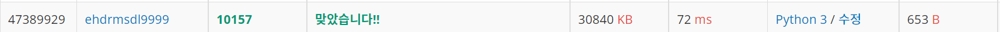
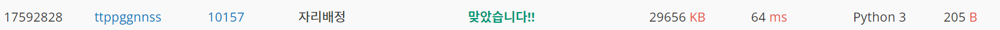

# 자리배정

| 시간 제한 | 메모리 제한 | 제출    | 정답   | 맞힌 사람 | 정답 비율   |
| ----- | ------ | ----- | ---- | ----- | ------- |
| 1 초   | 256 MB | 10843 | 3832 | 3113  | 37.082% |

## 문제

어떤 공연장에는 가로로 C개, 세로로 R개의 좌석이 C×R격자형으로 배치되어 있다. 각 좌석의 번호는 해당 격자의 좌표 (x,y)로 표시된다. 

예를 들어보자. 아래 그림은 가로 7개, 세로 6개 좌석으로 구성된 7×6격자형 좌석배치를 보여주고 있다. 그림에서 각 단위 사각형은 개별 좌석을 나타내며, 그 안에 표시된 값 (x,y)는 해당 좌석의 번호를 나타낸다. 가장 왼쪽 아래의 좌석번호는 (1,1)이며, 가장 오른쪽 위 좌석의 번호는 (7,6)이다. 

| (1, 6) |        |        |        |     |        | (7, 6) |
| ------ | ------ | ------ | ------ | --- | ------ | ------ |
|        |        |        |        |     |        |        |
|        |        |        | (4, 4) |     |        | (7, 4) |
| (1, 3) |        |        |        |     | (6, 3) |        |
| (1, 2) |        |        |        |     |        |        |
| (1, 1) | (2, 1) | (3, 1) |        |     |        | (7, 1) |

이 공연장에 입장하기 위하여 많은 사람이 대기줄에 서있다. 기다리고 있는 사람들은 제일 앞에서부터 1, 2, 3, 4, . 순으로 대기번호표를 받았다. 우리는 대기번호를 가진 사람들에 대하여 (1,1)위치 좌석부터 시작하여 시계방향으로 돌아가면서 비어있는 좌석에 관객을 순서대로 배정한다. 이것을 좀 더 구체적으로 설명하면 다음과 같다.

먼저 첫 번째 사람, 즉 대기번호 1인 사람은 자리 (1,1)에 배정한다. 그 다음에는 위쪽 방향의 좌석으로 올라가면서 다음 사람들을 배정한다. 만일 더 이상 위쪽 방향으로 빈 좌석이 없으면 오른쪽으로 가면서 배정한다. 오른쪽에 더 이상 빈자리가 없으면 아래쪽으로 내려간다. 그리고 아래쪽에 더 이상 자리가 없으면 왼쪽으로 가면서 남은 빈 좌석을 배정한다. 이 후 왼쪽으로 더 이상의 빈 좌석이 없으면 다시 위쪽으로 배정하고, 이 과정을 모든 좌석이 배정될 때까지 반복한다. 

아래 그림은 7×6공연장에서 대기번호 1번부터 42번까지의 관객이 좌석에 배정된 결과를 보여주고 있다.

| 6   | 7   | 8   | 9   | 10  | 11  | 12  |
| --- | --- | --- | --- | --- | --- | --- |
| 5   | 26  | 27  | 28  | 29  | 30  | 13  |
| 4   | 25  | 38  | 39  | 40  | 31  | 14  |
| 3   | 24  | 37  | 42  | 41  | 32  | 15  |
| 2   | 23  | 36  | 35  | 34  | 33  | 16  |
| 1   | 22  | 21  | 20  | 19  | 18  | 17  |

여러분은 공연장의 크기를 나타내는 자연수 C와 R이 주어져 있을 때, 대기 순서가 K인 관객에게 배정될 좌석 번호 (x,y)를 찾는 프로그램을 작성해야 한다. 

## 입력

첫 줄에는 공연장의 격자 크기를 나타내는 정수 C와 R이 하나의 공백을 사이에 두고 차례대로 주어진다. 두 값의 범위는 5 ≤ C, R ≤ 1,000이다. 그 다음 줄에는 어떤 관객의 대기번호 K가 주어진다. 단 1 ≤ K ≤ 100,000,000이다.

## 출력

입력으로 제시된 대기번호 K인 관객에게 배정될 좌석번호 (x,y)를 구해서 두 값, x와 y를 하나의 공백을 사이에 두고 출력해야 한다. 만일 모든 좌석이 배정되어 해당 대기번호의 관객에게 좌석을 배정할 수 없는 경우에는 0(숫자 영)을 출력해야 한다. 

## 예제 입력 1

7 6
11

## 예제 출력 1

6 6

## 예제 입력 2

7 6
87

## 예제 출력 2

0

## 예제 입력 3

100 100
3000

## 예제 출력 3

9 64

## 나의 풀이

```python
x,y= map(int,input().split()) #극장 x너비, y너비 입력
n=int(input()) #몇번쨰 티켓팅인지 입력.
def check(n,x,y):#n번째 티켓팅한 사람이 몇번째 칸에 앉을지 출력하는 함수
    if n>x*y: #n이 좌석갯수보다 늦게 티켓팅해서 앉을자리가 없으면 0 출력
        return print(0)
    m=min(x,y) #m은 x,y 너비중 더 작은 것을 반환. 시계방향으로 최소 몇사이클까지 돌아갈 수 있는지 알 수 있다.
    #예를 들면 작은 값이 3이면, 시계방향으로 돌렸을떄 1바퀴하고 약간 더 돌수 있다. 3//2=1 -> 1바퀴에서 2바퀴 사이 돌면 끝이다. 2//2=1 ->1바퀴 돌고 끝이다.
    order=0 #x,y의 범위는 최소 5이상이다. 따라서 최소 2바퀴 이상 돌 수 있으며, 가장 바깥쪽은 1바퀴에 x+y*2-4개의 자리가 쓰이고,
    #그다음 안쪽 1바퀴는 x+y*2-4개의 자리에 (x+y-4*1)*2-4개의 자리가 더하면 2바퀴까지 차지하는 자리의 수이다.
    for i in range(0,m//2+1): #따라서 order에 1바퀴 돌렸을때 값을 더하고, 티켓팅한 순서n이 이 1바퀴 안의 범위(order값)보다 작으면 1,1 부터 부터 1바퀴를 돌다보면 순서n의 좌석이 나온다
        #n번의 좌석 위치가 나온다. 만얀 n번이 1바퀴 돌린 order값보다 크면 order값이 2바퀴 돌았을 때의 값일때와 비교하여 몇번째 바퀴를 돌았을때의 좌석인지 구한다.
        order+=(x+y-4*i)*2-4 #바퀴수마다 1바퀴도는데 필요한 수가 점점 줄어든다. 따라서 n이 속한 바퀴수가 나올 때 까지 돌아준다.

        if n <=order: #만약 n이 (i+1)번째 바퀴수 돌았을때 필요한 좌석수 보다 작으면 그때의 n번 좌석의 위치를 구한다.
            x1,y1=i+1,i #x1,y1의 초기값은 i+1,i이다. (좌표상에서 0바퀴 돌면 1,1에서 시작, 1바퀴 돌면 2,2에서 시작한다.)
            #이때 처음 값은 y축으로 올라가는 값이기 때문에 x1,y1값은 (1,0) (2,1) 과 같이 계산하기 쉽게 만들었다. 0번좌석이 (1,0)이라하면 1번좌석은 (1,1) 과같음.

            n-=order-((x+y-4*i)*2-4) #x1,y1이 k번째 바퀴값 보다 작으면 k-1번째 바퀴의 시작지점부터 x1,y1값의 위치를 탐색한다.(n값은 i+1번째 바퀴값을 빼서 나머지값 을 움직이는 데 활용한다.)

            if n<=y-2*i:#n이 처음 y축 위로 올라가는 방향위에 있을때
                y1=i+n#x값은 그대로이고 y만 움직이기 때문에 y좌표에서 n방큼 더해주면 된다.

            elif n<=(y-2*i+x-2*i-1): #n이 y축 위로 올라간 후 x축 방향에서 움직일때
                x1+=n-y+2*i #(i+1)번째 바퀴에서 n번째 좌석이다. 따라서 x1값에서 올라간 y값만큼 빼주면 된다.
                y1=y-i#y는 다 올라가고 x만 움직이기 때문에 y값은 (i+1)번째 바퀴이기 때문에 y-i값을 가진다.

            elif n<=(y-2*i+x-2*i-1+y-2*i-1): #n이 다시 y축 방향으로 내려오는 위치에 있을때
                x1=x-i
                y1=y-i-(n-(y-2*i+x-2*i-1))

            else:#n이 마지막으로 x축방향으로 -방향으로 다시 움직일때 좌표
                x1=x-i-(n-(y-2*i+x-2*i-1+y-2*i-1))
                y1=i+1
            return print(x1,y1)
check(n,x,y)
```



72ms로 다른사람들이 한것과 비교했을때 상위권 속도에 속했다. 비슷한 속도중에 그나마 변수를 최대한 정리해서 한 경우 68ms로 4ms정도 차이가 났다. 이 코드를 치면서 어려웠던 점은, x,y가 어떻게 바뀌는지 좌표를 설정하는 것과 cycle에 대한 아이디어를 갖는 것이였다. 그나마 이 문제를 풀기 전에 개미라는 문제를 풀어서 사이클에 대해 생각할 수 있었던거 같다. 

## 다른 사람 코드중 짧고 빨랐던 코드

```python
importimport sys;sys.setrecursionlimit(1000000)
def f(c,r,n):#함수 선언, c,r은 좌석 x축 갯수,y축갯수 n은 좌석순서
    if c*r<n: return 0, #c*r은 총 좌석갯수이고 n이 이보다 크면 배정불가 ->0반환 
    if n<=r:return 1,n #n이 좌석 y축갯수보다 작으면 (1,n) 값 반환.
    x,y=f(r,c-1,n-r) #좌석 번호 n에서 y축좌석수 r만큼 빼고, 좌석 배치를 반시계 방향으로 90도 돌린다
    #따라서 y축 값은 기존 x축값에 1을 뺀 값을 주고(좌석에서 r만큼 뺏기때문에 돌리면 1 낮아짐)
    #x축 값은 기존 y축값을 받는다.
    #위와같이 계속 돌려가며 n값이 높이 값보다 작거나 같을때 까지 한다.
    #그러면 리턴값에서는 계속 y값에서 1뺏던걸 원상복구 하는 의미로 1+y하는 방식으로 다시 리턴해준다.
    return 1+y,r-x+1 #기존에 돌렸던 것을 다시 원래데로 돌리는 것을 의미한다.
c,r=map(int,input().split())
n=int(input())
print(*f(c,r,n)),n):#함수 선언, c,r은 좌석 x축 갯수,y축갯수 n은 좌석순서
    if c*r<n: return 0, #c*r은 총 좌석갯수이고 n이 이보다 크면 배정불가 ->0반환 
    if n<=r:return 1,n #n이 좌석 y축갯수보다 작으면 (1,n) 값 반환.
    x,y=f(r,c-1,n-r) #좌석 번호 n에서 y축좌석수 r만큼 빼고, 좌석 배치를 
    return 1+y,r-x+1
c,r=map(int,input().split())
n=int(input())
print(*f(c,r,n))
```

우선 재귀함수를 쓰는 아이디어는 좋았지만 recursionlimit의 값을 바꾼점은 감점요인이라고 생각한다. 그렇지만 재귀함수는 느리고 안좋은 걸로 알고 있었지만, 결과로 보니 64ms로 특정 상황에서는 오히려 빠르고 코드의 길이도 짧아서 좋다는 것을 알았다. 그래서 재귀함수는 막상 쓰면 어렵기 때문에, 좀더 공부하고 분석해보는 계기가 되었다.
