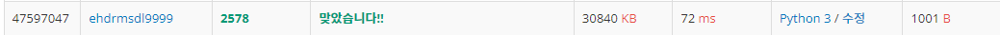
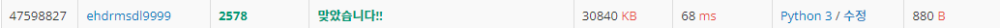

# 빙고

| 시간 제한 | 메모리 제한 | 제출    | 정답   | 맞힌 사람 | 정답 비율   |
| ----- | ------ | ----- | ---- | ----- | ------- |
| 1 초   | 128 MB | 11580 | 5346 | 4433  | 46.240% |

## 문제

빙고 게임은 다음과 같은 방식으로 이루어진다.

먼저 아래와 같이 25개의 칸으로 이루어진 빙고판에 1부터 25까지 자연수를 한 칸에 하나씩 쓴다


다음은 사회자가 부르는 수를 차례로 지워나간다. 예를 들어 5, 10, 7이 불렸다면 이 세 수를 지운 뒤 빙고판의 모습은 다음과 같다.

  
 

차례로 수를 지워가다가 같은 가로줄, 세로줄 또는 대각선 위에 있는 5개의 모든 수가 지워지는 경우 그 줄에 선을 긋는다.


이러한 선이 세 개 이상 그어지는 순간 "빙고"라고 외치는데, 가장 먼저 외치는 사람이 게임의 승자가 된다.


철수는 친구들과 빙고 게임을 하고 있다. 철수가 빙고판에 쓴 수들과 사회자가 부르는 수의 순서가 주어질 때, 사회자가 몇 번째 수를 부른 후 철수가 "빙고"를 외치게 되는지를 출력하는 프로그램을 작성하시오.

## 입력

첫째 줄부터 다섯째 줄까지 빙고판에 쓰여진 수가 가장 위 가로줄부터 차례대로 한 줄에 다섯 개씩 빈 칸을 사이에 두고 주어진다. 여섯째 줄부터 열째 줄까지 사회자가 부르는 수가 차례대로 한 줄에 다섯 개씩 빈 칸을 사이에 두고 주어진다. 빙고판에 쓰여진 수와 사회자가 부르는 수는 각각 1부터 25까지의 수가 한 번씩 사용된다.

## 출력

첫째 줄에 사회자가 몇 번째 수를 부른 후 철수가 "빙고"를 외치게 되는지 출력한다.

## 예제 입력 1

11 12 2 24 10
16 1 13 3 25
6 20 5 21 17
19 4 8 14 9
22 15 7 23 18
5 10 7 16 2
4 22 8 17 13
3 18 1 6 25
12 19 23 14 21
11 24 9 20 15

## 예제 출력 1

15

## 나의 코드

```python
def check(BINGO_LIST):  # 빙고 체크
    cnt = 0 # 빙고 갯수
    cnt_d1 = 0  # 대각선 빙고 체크
    cnt_d2 = 0  # 반대 대각선 빙고 체크
    for j in range(5):
        cnt_x, cnt_y = 0, 0 # x, y방향 빙고 체크
        for k in range(5):
            if BINGO_LIST[j * 5 + k] == 0:  # x방향 체크
                cnt_x += 1
            if BINGO_LIST[j + k * 5] == 0:  # y방향 체크
                cnt_y += 1
        if BINGO_LIST[j * 6] == 0:  # 대각선 체크
            cnt_d1 += 1
        if BINGO_LIST[4 + j * 4] == 0:  # 반대 대각선 체크
            cnt_d2 += 1
        if cnt_x == 5:  # 체크 값이 5이면 빙고 값 1더하기
            cnt += 1
        if cnt_y == 5:
            cnt += 1
        if cnt_d1 == 5:
            cnt += 1
        if cnt_d2 == 5:
            cnt += 1

    return cnt  # 빙고 갯수 반환

BINGO_LIST = []
BINGO_ORDER = []
for i in range(5):
    BINGO_LIST += list(map(int, input().split()))
for i in range(5):
    BINGO_ORDER += list(map(int, input().split()))
nums = 0
for i in range(25): # 빙고 탐색
    for j in range(25):
        if BINGO_LIST[j] == BINGO_ORDER[i]:
            BINGO_LIST[j] = 0
            break
    nums += 1   # 탐색 횟수
    cnt = check(BINGO_LIST)
    if cnt >= 3:
        break
print(nums)
```



빙고를 2차원 리스트로 받아도 되겠지만, 1차원 리스트로 받았다. 왜냐하면 1차원으로 풀면

더 빠를것 같았기 때문이다. 근데 최적화를 안하고 막 풀어봐서 그런지 72ms가 나왔고 좀더 간단해 보이게 변수를 줄였다.

## 나의 코드 2(변수 갯수 단축)

```python
def check(BINGO_LIST):  # 빙고 체크
    cnt = 0 # 빙고 갯수
    for j in range(5):
        if BINGO_LIST[j * 5:j * 5 + 5] == [0, 0, 0, 0, 0]:  # x방향 체크
            cnt += 1
        if BINGO_LIST[j:25:5] == [0, 0, 0, 0, 0]:  # y방향 체크
            cnt += 1
    if BINGO_LIST[0:25:6] == [0, 0, 0, 0, 0]:  # 대각선 체크
        cnt += 1
    if BINGO_LIST[4:21:4] == [0, 0, 0, 0, 0]:  # 반대 대각선 체크
        cnt += 1
    return cnt  # 빙고 갯수 반환

BINGO_LIST = []
BINGO_ORDER = []
for i in range(5):
    BINGO_LIST += list(map(int, input().split()))
for i in range(5):
    BINGO_ORDER += list(map(int, input().split()))
nums = 0
for i in range(25): # 빙고 탐색
    for j in range(25):
        if BINGO_LIST[j] == BINGO_ORDER[i]:
            BINGO_LIST[j] = 0
            break
    nums += 1   # 탐색 횟 수
    cnt = check(BINGO_LIST)
    if cnt >= 3:
        break
print(nums)
```



1개씩 체크하기보다는 1열씩 체크하게해서 변수를 줄였다. 사실 함수를 안쓰고 하면 더 줄일 수 있지만, 함수를 쓰고하면 더 시간이 단축된다고 해서 쓰고 하였다.

## 다른 사람 코드(가장 빠른 코드)

```python
import itertools as I
g=lambda:[[*map(int,input().split())]for i in[0]*5] # 함수 선언 
m=g() # 선언한 함수 사용 
d={m[i][j]:[i,j]for i in range(5)for j in range(5)} #  [i,j] 리스트들 넣기. 
for c,i in enumerate(I.chain(*g())): # enumerate 사용하여 빙번호 매김.
    v,w=d[i];m[v][w]=0
    if sum([1 for i in m if {*i}=={0}]+[1 for i in zip(*m) if {*i}=={0}]+[{m[i][i]for i in range(5)}=={0},{m[i][4-i]for i in range(5)}=={0}])>=3:print(c+1);break
```


itertools 모듈의 chain이라는 함수를 사용했다. chain 함수는 여러 리스트를 1개의 리스트로 합쳐준다. 또한 찾아보니 sum 함수로도 list를 함칠 수 있고, 2중 포문, numpy 와 같은 것들도 사용된다.  
