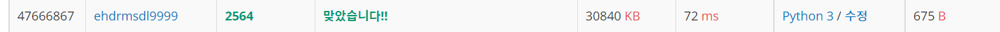
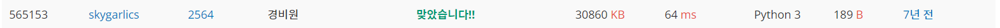

# 경비원

| 시간 제한 | 메모리 제한 | 제출   | 정답   | 맞힌 사람 | 정답 비율   |
| ----- | ------ | ---- | ---- | ----- | ------- |
| 1 초   | 128 MB | 6359 | 3186 | 2629  | 52.059% |

## 문제

동근이는 무인 경비 회사 경비원으로 항상 대기하고 있다가 호출이 들어오면 경비차를 몰고 그 곳으로 달려가야 한다. 동근이가 담당하고 있는 곳은 직사각형 모양의 블록으로 블록 중간을 가로질러 차가 통과할만한 길이 없다. 이 블록 경계에 무인 경비를 의뢰한 상점들이 있다.

예를 들어 가로의 길이가 10, 세로의 길이가 5인 블록의 경계에 무인 경비를 의뢰한 3개의 상점이 있다고 하자. <그림 1>과 같이 이들은 1, 2, 3으로 표시되어 있고, 동근이는 X로 표시한 위치에 있다.


< 그림 1 >

1번 상점에서 호출이 들어 왔을 때 동근이가 블록을 시계방향으로 돌아 이동하면 이동 거리가 12가 된다. 반면 반시계방향으로 돌아 이동하면 이동 거리는 18이 된다. 따라서 동근이가 1번 상점으로 가는 최단 거리는 12가 된다. 마찬가지로 동근이의 위치에서 2번 상점까지의 최단 거리는 6, 3번 상점까지의 최단 거리는 5가 된다.

블록의 크기와 상점의 개수 및 위치 그리고 동근이의 위치가 주어질 때 동근이의 위치와 각 상점 사이의 최단 거리의 합을 구하는 프로그램을 작성하시오.

## 입력

첫째 줄에 블록의 가로의 길이와 세로의 길이가 차례로 주어진다. 둘째 줄에 상점의 개수가 주어진다. 블록의 가로의 길이와 세로의 길이, 상점의 개수는 모두 100이하의 자연수이다. 이어 한 줄에 하나씩 상점의 위치가 주어진다. 상점의 위치는 두 개의 자연수로 표시된다. 첫째 수는 상점이 위치한 방향을 나타내는데, 1은 블록의 북쪽, 2는 블록의 남쪽, 3은 블록의 서쪽, 4는 블록의 동쪽에 상점이 있음을 의미한다. 둘째 수는 상점이 블록의 북쪽 또는 남쪽에 위치한 경우 블록의 왼쪽 경계로부터의 거리를 나타내고, 상점이 블록의 동쪽 또는 서쪽에 위치한 경우 블록의 위쪽 경계로부터의 거리를 나타낸다. 마지막 줄에는 동근이의 위치가 상점의 위치와 같은 방식으로 주어진다. 상점의 위치나 동근이의 위치는 블록의 꼭짓점이 될 수 없다.

## 출력

첫째 줄에 동근이의 위치와 각 상점 사이의 최단 거리의 합을 출력한다.

## 예제 입력 1

10 5
3
1 4
3 2
2 8
2 3

## 예제 출력 1

23

## 나의 코드

```python
x, y = map(int, input().split())
motion = [0, [0, 1], [2*x+y, -1], [2*x+2*y, -1], [x, 1]]    # x값에 따라 다르게 배치하는 리스트.
position = [list(map(int,input().split())) for i in range(int(input())+1)]  # 상점의 위치와 경비원 위치 리스트
SOL= 0  # 경비원의 최단거리 합
for i in range(len(position)-1, -1, -1):    # 경비원 위치부터 거리파악.
    if i == len(position)-1:    # 경비원 이라면
        police = motion[position[i][0]][0] + position[i][1]*motion[position[i][0]][1] # 경비원 위치(1차원)
    else:
        if abs(police-(motion[position[i][0]][0] + position[i][1]*motion[position[i][0]][1])) > x+y:    # 거리 차가 x+y보다 높으면 최단거리 아님
            SOL += 2*x+2*y-abs(police-(motion[position[i][0]][0] + position[i][1]*motion[position[i][0]][1]))
        else:
            SOL += abs(police-(motion[position[i][0]][0] + position[i][1]*motion[position[i][0]][1]))
print(SOL)  # 계산한 거리합 계산
```



경비원 문제는 처음에는 2차원으로 생각해서 풀려고 했지만, 1차원으로도 가능할 거라고 생각했다. 그래서 1차원으로 풀려다 1차원 조차 필요 없다는 것을 알았다. 그래서 그냥 단순 수식으로 계산하여 풀었다. 확실히 빠른 코드는 수학적 지식이 필요하다.

## 다른 사람 코드(가장 빠른 코드)

```python
def dist(d, num):
    if d == 1:      # 북
        return num
    elif d == 2:    # 남
        return C + R + C - num
    elif d == 3:    # 서
        return C + R + C + R - num
    elif d == 4:    # 동
        return C + num

C, R = map(int, input().split())
h_list = []
total = (C + R) * 2
T = int(input())

for i in range(T + 1):
    i, num = map(int, input().split())
    h_list.append(dist(i, num)) # 동 서 남 북 에 따른 거리 넣어주기.
tmp = h_list.pop() # tmp는 경비원의 위치를 의미한다.

ans = 0
for i in range(T):
    ans += min(abs(h_list[i] - tmp), total - abs(h_list[i] - tmp)) # min 함수로 더 작은값 사용
print(ans)
```

가장 빠른 코드도 list로 1차원으로 풀지않고 그냥 수식으로 생각해서 풀었다. 그리고 나는 위치를 list에 담아서 한번에 처리했지만, 이 코드는 받자마자 1개씩 거리를 리스트에 담았다. 그리고 굳이 if문을 쓰지 않고 min 이라는 함수를 이용하여 간단하게 처리하였다.

## 다른 사람 코드(가장 짧고 빠른 코드)

```python
w,h=map(int,input().split());l=w+h+w+h;s=[];c=0
for i in range(int(input())+1):a,b=map(int,input().split());s+=[[0,l-b,h+b,b,l-w-b][a]] # 동 서 남 북 나누기.     
for i in s[:-1]:t=abs(i-s[-1]);c+=min(t,l-t) # 더 작은수 반환
print(c)
```



이분은 사실 위와 같은 매커니즘으로 풀었는데, 코드만 극한으로 줄였다. 그래도 코드를 줄이는 스킬을 배울 수 있었다. 예를 들면 s+=[[0,l-b,h+b,b,l-w-b][a]] 와 같이 바로바로 케이스가 나눠지는 동시에 리스트에 추가하는 것이였다. 그리고 위와 똑같이 앞으로 대소비교로 수를 더할때는 min 함수가 더 좋을 수 있겠다는 것을 배웠다.
