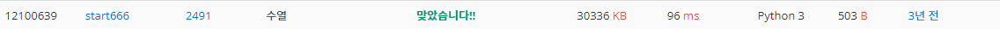
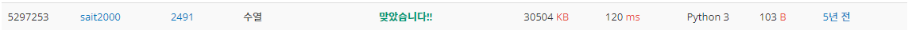

# 수열

| 시간 제한 | 메모리 제한 | 제출    | 정답   | 맞힌 사람 | 정답 비율   |
| ----- | ------ | ----- | ---- | ----- | ------- |
| 1 초   | 128 MB | 13515 | 4356 | 3512  | 32.372% |

## 문제

0에서부터 9까지의 숫자로 이루어진 N개의 숫자가 나열된 수열이 있다. 그 수열 안에서 연속해서 커지거나(같은 것 포함), 혹은 연속해서 작아지는(같은 것 포함) 수열 중 가장 길이가 긴 것을 찾아내어 그 길이를 출력하는 프로그램을 작성하라. 

예를 들어 수열 1, 2, 2, 4, 4, 5, 7, 7, 2 의 경우에는 1 ≤ 2 ≤ 2 ≤ 4 ≤ 4 ≤ 5 ≤ 7 ≤ 7 이 가장 긴 구간이 되므로 그 길이 8을 출력한다. 수열 4, 1, 3, 3, 2, 2, 9, 2, 3 의 경우에는 3 ≥ 3 ≥ 2 ≥ 2 가 가장 긴 구간이 되므로 그 길이 4를 출력한다. 또 1, 5, 3, 6, 4, 7, 1, 3, 2, 9, 5 의 경우에는 연속해서 커지거나 작아지는 수열의 길이가 3 이상인 경우가 없으므로 2를 출력하여야 한다.

## 입력

첫째 줄에는 수열의 길이 N이 주어지고, 둘째 줄에는 N개의 숫자가 빈칸을 사이에 두고 주어진다. N은 1 이상 100,000 이하의 정수이다.

## 출력

첫째 줄에 가장 긴 길이를 출력한다.


## 나의 코드

```python
N = int(input())
NUM = list(map(int, input().split()))
cnt_max = 1     # cnt의 최대값
cnt_up = 1      # 올라가는 숫자의 최대 길이 값
cnt_down = 1    # 내려가는 숫자의 최대 길이 값
for i in range(N-1):
    if NUM[i] < NUM[i+1]:       # 숫자가 올라가면
        cnt_up += 1             # 올라가는 값 +1
        cnt_down = 1            # 내려가는 값 초기화
    elif NUM[i] > NUM[i+1]:     # 숫자가 내려가면
        cnt_down += 1           # 위와 같은 방식
        cnt_up = 1
    else:                       # 숫자가 동일하면 둘다 +1
        cnt_up += 1
        cnt_down += 1
    cnt_max = max(cnt_up, cnt_down, cnt_max)    # max값 반환
print(cnt_max)
```


처음 코드를 짰을 때 cnt_max = 0으로 해서 만약 입력받은 값의 길이가 1일때 출력값이 0이 되어버려서 틀린 반례를 가지게 되었다. cnt_max = 1로 고쳤더니 바로 정답이였다. 이를 통해 느낀 점은 가장 중요한건 프로그래밍에서 조건에 맞게 새어나갈 틀임 없도록 하는 것이라 느꼈다. 아무리 잘 짜여도, 예외가 있으면 잘 진행되는줄 알아도 큰 부작용 가질 수 있기 때문이다. 그래서 다음에는 미리 반례가 없을지, 범위가 괜찮은지 한번더 보고 제출해야 겠다.

## 다른 사람 코드(빠른 코드)

```python
import sys
N = int(input())
iterator = map(int,sys.stdin.readline().split())
prev = next(iterator)
inc_cnt = 1
dec_cnt = 1
max_inc_cnt = 1
max_dec_cnt = 1
for val in iterator:
    dec_cnt += 1 # 미리 1 더해
    inc_cnt += 1
    if prev < val:
        if max_dec_cnt < dec_cnt:
            max_dec_cnt = dec_cnt - 1 # 최대값보다 크면 최대값에 할당
        dec_cnt = 1 # 오름차 순이면 dec_cnt 초기화
    elif prev > val:
        if max_inc_cnt < inc_cnt:
            max_inc_cnt = inc_cnt - 1 #위와 반대로 마찬가지.
        inc_cnt = 1
    prev = val # prev 는 계속 전의 값 갖게 갱신.

print(max(max_dec_cnt,max_inc_cnt, dec_cnt, inc_cnt)) # 최대값 출
```



sys를 도입해서 시간을 우선 줄였고, next라는 함수를 써서 prev의 첫번째 값을 받아왔다. (왜 이렇게 받았는지는 공부해야할 것 같다. 더 빠른지 혹은 메모리를 덜 쓰는지) 그리고 내가 했던 방법과 비슷한 매커니즘으로 계속 최대로 이어지는 값을 찾았다.

## 다른 사람 코드(짧은 코드)

```python
input();r=a=b=p=0
for c in map(int,input().split()):a=a*(c>=p)+1;b=b*(c<=p)+1;p=c;r=max(a,b,r)
print(r)
```



c는 입력된 값이 순서대로 들어가고, p는 c가 가졌던 전의 값을 의미한다. 이때 bull타입인 조건문은 거짓이면 0, 사실이면 1을 반환한다. 따라서 이코드는 이를 이용하여 변수를 초기화 하였다. 이는 정말 좋은 매커니즘이라 생각하고, 한번 더 생각의 발상을 전환해보는 계기를 가졌다. a * (a==b) 와 같이 if대신 bull 타입도 수식에 넣어 써봐야 되겠다.!!


