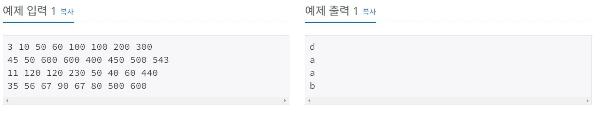
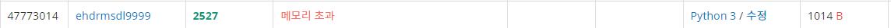
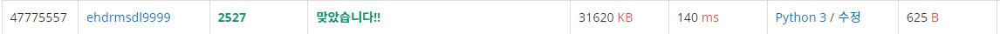
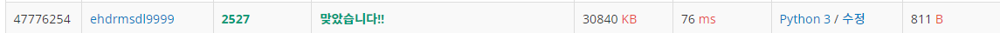
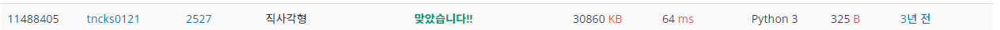

# 직사각형

| 시간 제한 | 메모리 제한 | 제출   | 정답   | 맞힌 사람 | 정답 비율   |
| ----- | ------ | ---- | ---- | ----- | ------- |
| 1 초   | 128 MB | 6982 | 1706 | 1403  | 30.211% |

## 문제

2차원 격자공간에 두 개의 꼭짓점 좌표로 표현되는 직사각형이 있다. 직사각형은 아래와 같이 왼쪽 아래 꼭짓점 좌표 (x, y)와 오른쪽 위 꼭짓점 좌표 (p, q)로 주어진다.


이 문제에서 모든 직사각형은 두 꼭짓점의 좌표를 나타내는 4개의 정수 x y p q 로 표현된다. 단 항상 x<p, y<q 이다. 예를 들어 위 그림에 제시된 직사각형이라면 아래와 같이 표현된다.

**3 2 9 8**

두 개의 직사각형은 그 겹치는 부분의 특성에 따라 다음 4가지 경우로 분류될 수 있다. 

먼저 두 직사각형의 겹치는 부분이 직사각형인 경우이다. 아래 그림(a)는 공통부분이 직사각형인 경우의 3가지 예를 보여준다,


그림 (a)

또는 겹치는 부분이 아래 그림 (b)와 같이 선분이 될 수도 있고, 그림 (c)와 같이 점도 될 수 있다. 


그림 (b)


그림 (c)

마지막으로 아래 그림 (d)와 같이 공통부분 없이 두 직사각형이 완전히 분리된 경우도 있다.


그림 (d)

여러분은 두 직사각형의 겹치는 부분이 직사각형인지, 선분인지, 점인지, 아니면 전혀 없는 지를 판별해서 해당되는 코드 문자를 출력해야 한다. 

| 공통부분의 특성 | 코드 문자 |
| -------- | ----- |
| 직사각형     | a     |
| 선분       | b     |
| 점        | c     |
| 공통부분이 없음 | d     |

## 입력

4개의 줄로 이루어져 있다. 각 줄에는 8개의 정수가 하나의 공백을 두고 나타나는데, 첫 4개의 정수는 첫 번째 직사각형을, 나머지 4개의 정수는 두 번째 직사각형을 각각 나타낸다. 단 입력 직사각형의 좌표 값은 1이상 50,000 이하의 정수로 제한된다. 

## 출력

4개의 각 줄에 주어진 두 직사각형의 공통부분을 조사해서 해당하는 코드 문자를 출력파일의 첫 4개의 줄에 각각 차례대로 출력해야 한다.



## 나의 코드(첫번째 방법)

```python

```



예시예시

## 나의 코드(두번째 방법)

```python

```



예시예시

## 나의 코드(세번째 방법)

```python

```



예시예시

## 다른 사람의 코드(빠른 코드)

```python
for _ in range(4):
    x1, y1, x2, y2, x3, y3, x4, y4 = map(int, input().split())
    a1 = max(x1, x3)
    a2 = min(x2, x4)
    b1 = max(y1, y3)
    b2 = min(y2, y4)
    if a1 < a2 and b1 < b2:
        print('a')
    elif a1 <= a2 and b1 <= b2:
        print('b' if (a1, b1) != (a2, b2) else 'c')
    else:
        print('d')
```



 예시예시

## 다른 사람의 코드(짧은 코드)

```python
def g(a):
  d = max(a) - min(a) - a[1] + a[0] - a[3] +a[2]
  return (d < 0) + (d <= 0)
for _ in '....':
  a = list(map(int, input().split()))
  print("dcb.a"[g(a[0::2]) * g(a[1::2])])
```


예시예시
