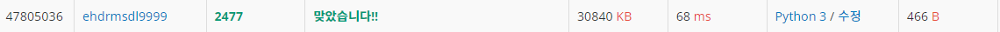
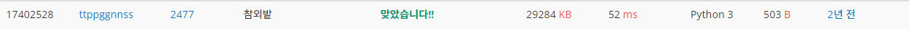
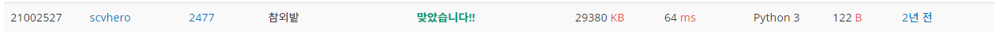

# 참외밭

| 시간 제한 | 메모리 제한 | 제출    | 정답   | 맞힌 사람 | 정답 비율   |
| ----- | ------ | ----- | ---- | ----- | ------- |
| 1 초   | 128 MB | 15038 | 5426 | 4642  | 37.457% |

## 문제

시골에 있는 태양이의 삼촌 댁에는 커다란 참외밭이 있다. 문득 태양이는 이 밭에서 자라는 참외가 도대체 몇 개나 되는지 궁금해졌다. 어떻게 알아낼 수 있는지 골똘히 생각하다가 드디어 좋은 아이디어가 떠올랐다. 유레카! 1m2의 넓이에 자라는 참외 개수를 헤아린 다음, 참외밭의 넓이를 구하면 비례식을 이용하여 참외의 총개수를 구할 수 있다.

1m2의 넓이에 자라는 참외의 개수는 헤아렸고, 이제 참외밭의 넓이만 구하면 된다. 참외밭은 ㄱ-자 모양이거나 ㄱ-자를 90도, 180도, 270도 회전한 모양(┏, ┗, ┛ 모양)의 육각형이다. 다행히도 밭의 경계(육각형의 변)는 모두 동서 방향이거나 남북 방향이었다. 밭의 한 모퉁이에서 출발하여 밭의 둘레를 돌면서 밭경계 길이를 모두 측정하였다.


예를 들어 참외밭이 위 그림과 같은 모양이라고 하자. 그림에서 오른쪽은 동쪽, 왼쪽은 서쪽, 아래쪽은 남쪽, 위쪽은 북쪽이다. 이 그림의 왼쪽위 꼭짓점에서 출발하여, 반시계방향으로 남쪽으로 30m, 동쪽으로 60m, 남쪽으로 20m, 동쪽으로 100m, 북쪽으로 50m, 서쪽으로 160m 이동하면 다시 출발점으로 되돌아가게 된다.

위 그림의 참외밭  면적은 6800m2이다. 만약 1m2의 넓이에 자라는 참외의 개수가 7이라면, 이 밭에서 자라는 참외의 개수는 47600으로 계산된다.

1m2의 넓이에 자라는 참외의 개수와, 참외밭을 이루는 육각형의 임의의 한 꼭짓점에서 출발하여 반시계방향으로 둘레를 돌면서 지나는 변의 방향과 길이가 순서대로 주어진다. 이 참외밭에서 자라는 참외의 수를 구하는 프로그램을 작성하시오.

## 입력

첫 번째 줄에 1m2의 넓이에 자라는 참외의 개수를 나타내는 양의 정수 K (1 ≤ K ≤ 20)가 주어진다. 참외밭을 나타내는 육각형의 임의의 한 꼭짓점에서 출발하여 반시계방향으로 둘레를 돌면서 지나는 변의 방향과 길이 (1 이상 500 이하의 정수) 가 둘째 줄부터 일곱 번째 줄까지 한 줄에 하나씩 순서대로 주어진다. 변의 방향에서 동쪽은 1, 서쪽은 2, 남쪽은 3, 북쪽은 4로 나타낸다.

## 출력

첫째 줄에 입력으로 주어진 밭에서 자라는 참외의 수를 출력한다.


## 나의코드

```python
K = int(input())
field = [list(map(int, input().split())) for i in range(6)]
max_num = max(field, key=lambda x: x[1]) # 가장 긴 값을 기준.
for i in range(len(field)):
    if field[i] == max_num: # 긴 값을 찾았다면.
        if field[i-5][1] == field[i-3][1] + field[i-1][1]: # +로 하면 인덱스가 넘치지만 -로 하면 다쉬 맨뒤로 돌아갈 수 있어서 - 사용
            solution = field[i][1] * field[i-5][1] - field[i-3][1] * field[i-2][1] # 2번 움직이는 구간의 가운데 2부분을 곱하면 빈공간의 넓이
            break
        else:
            solution = field[i][1] * field[i-1][1] - field[i-4][1] * field[i-3][1]
            break
print(solution*K) # 총 공간 * 1당 수확량 K
```



처음에 패턴부터 찾기 시작했다. 그리고 자르지 않은부분의 다음다음 부분을 자른다는 것을 알았다. 그래서 처음 만든 코드는 field가 받은 값을 2배로 하여 인덱스를 크게해도 되게 해서 넓이의 빈공간을 나타내는 길이를 찾았는데, 생각해보니 인덱스가 음수로 하면 맨뒤로 돌아가기 때문에, 음수 인덱스로 더 간단하게 만들었다.

## 다른 사람 코드(빠른 코드)

```python
n = int(input())

L=[]
for _ in range(6):
    a, b = map(int,input().split())
    L.append(b)

lmax=max(L[0],L[2],L[4])
cmax=max(L[1],L[3],L[5])

if L[0]==lmax and L[1]==cmax: # 가장 긴 축 2개는 바로 옆에 붙어있다. 따라서 이에따라 넓이를 구할 수 있다. 
    s=L[0]*L[1]-L[3]*L[4]
elif L[2]==lmax and L[1]==cmax:
    s=L[2]*L[1]-L[4]*L[5]
elif L[2]==lmax and L[3]==cmax:
    s=L[2]*L[3]-L[5]*L[0]
elif L[4]==lmax and L[3]==cmax:
    s=L[4]*L[3]-L[0]*L[1]
elif L[4]==lmax and L[5]==cmax:
    s=L[4]*L[5]-L[1]*L[2]
elif L[0]==lmax and L[5]==cmax:
    s=L[5]*L[0]-L[2]*L[3]

print(n*s)
```



이 코드는 가장 긴 축 2개와 그 위치를 찾으면 그 길이를 기준으로 넓이를 구할 수 있기 때문에, 조건문만을 사용하여 이를 찾았다. 그래서 모든 구간을 조사하지 않아도 되서 빠른 것 같다.

## 다른 사람 코드(짧은 코드)

```python
n,*l=map(int,open(0).read().split()[::2])
while l[:2]!=[l[2]+l[4],l[3]+l[5]]:l=l[1:]+[l[0]] #가장 긴값 2개 탐색(1칸씩 밀린다 계속) 
print(n*(l[0]*l[1]-l[4]*l[3]))
```



n과 *l을 이용하여 변수를 한번에 받았다. 그리고 open(0).read()로 한번에 입력값을 읽어왔다. *l로 다양한 값을 한번에 받는 것도 꼭 기억해 둬야할 스킬이라고 생각한다. 그리고 무엇보다 가장 중요한건 리스트를 맨앞의 값을 맨 뒤로 보내면서 1칸씩 밀리며 원하는 값을 찾는 것이였다. 1칸씩 밀리는 것을 이렇게 쉽게 구현할 수 있다는 것을 기억해야만 한다!!
