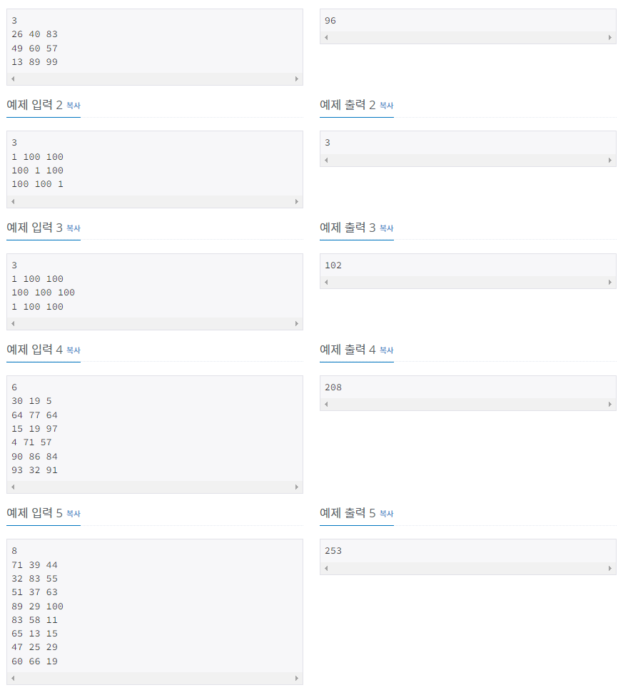
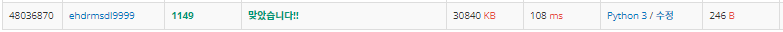
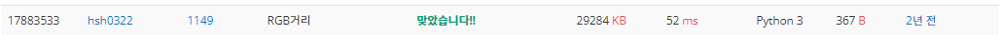

# RGB거리

| 시간 제한            | 메모리 제한 | 제출    | 정답    | 맞힌 사람 | 정답 비율   |
| ---------------- | ------ | ----- | ----- | ----- | ------- |
| 0.5 초 (추가 시간 없음) | 128 MB | 83115 | 43323 | 32402 | 51.663% |

## 문제

RGB거리에는 집이 N개 있다. 거리는 선분으로 나타낼 수 있고, 1번 집부터 N번 집이 순서대로 있다.

집은 빨강, 초록, 파랑 중 하나의 색으로 칠해야 한다. 각각의 집을 빨강, 초록, 파랑으로 칠하는 비용이 주어졌을 때, 아래 규칙을 만족하면서 모든 집을 칠하는 비용의 최솟값을 구해보자.

- 1번 집의 색은 2번 집의 색과 같지 않아야 한다.
- N번 집의 색은 N-1번 집의 색과 같지 않아야 한다.
- i(2 ≤ i ≤ N-1)번 집의 색은 i-1번, i+1번 집의 색과 같지 않아야 한다.

## 입력

첫째 줄에 집의 수 N(2 ≤ N ≤ 1,000)이 주어진다. 둘째 줄부터 N개의 줄에는 각 집을 빨강, 초록, 파랑으로 칠하는 비용이 1번 집부터 한 줄에 하나씩 주어진다. 집을 칠하는 비용은 1,000보다 작거나 같은 자연수이다.

## 출력

첫째 줄에 모든 집을 칠하는 비용의 최솟값을 출력한다.



## 나의 코드

```python
n = int(input())                                            # 집 갯수
RGB = [list(map(int,input().split())) for _ in range(n)]    # 각각의 집 도색 가격
dp = [[] for _ in range(n)]                                 # 최적의 가격 저장
dp[0] = RGB[0]
for i in range(1, n):
    for j in range(3):
        dp[i].append(RGB[i][j] + min(dp[i-1][j-1], dp[i-1][j-2]))   # i에서 RGB 중 1개 골랐을때 i-1번째 에서 최소값
print(min(dp[-1]))
```



처음에는 앞에서 뒤로 계산해 나가는 방식으로 생각했다가. 뒤에서 앞으로 계산해 나가는 방식을 생각하다보니 다음 꺼의 최적 합은 앞에서 누적해 나가면 된다는 것을 알았습니다. 그래서 다행히 운이좋게 쉽게 해결할 수 있었던 것 같습니다. 물론 이런 고민을 되게 오래했기 때문에, 아직 DP 문제는 더 수련이 필요할 것같습니다. 

## 다른 사람 코드(빠른 코드)

```python
import sys
read = sys.stdin.readline

n = int(read().strip())
dp = [list(map(int, read().strip().split()))] # 첫번째집 RGB값 
for i in range(1, n):
    r, g, b = map(int, read().strip().split()) # 다음집 RGB 값
    nxt_r = r + min(dp[i-1][1], dp[i-1][2])
    nxt_g = g + min(dp[i-1][0], dp[i-1][2])
    nxt_b = b + min(dp[i-1][0], dp[i-1][1])
    dp.append([nxt_r, nxt_g, nxt_b])           # dp 업데이트 

print(min(dp[n-1]))
```



저도 빠르게 풀렸다고 생각했는데 이 코드는 절반의 시간으로 단축했습니다. 그래서 상당히 놀랐고, 아직 나는 많이 부족하다는 것을 느꼈습니다. 아무래도 그 차이점은 명확히 보입니다. 바로 리스트를 한번에 받아온 것이 아니라 리스트를 받으면 바로 전단계 값과 비교해 최적값을 계속 갱신한다는 점입니다. 그래서 저의 코드는 for문이 사실상 변수 받는데 1번, 처리하는데 1번쓰였지만, 이 코드는 for문 1번으로 다 처리했습니다. 그래서 훨씬 빨랐습니다.

## 다른 사람 코드(짧은 코드)

```python
v=[0]*6;exec("v=[*map(sum,zip(map(int,input().split()),map(min,v[1:5],v[2:])))]*2;"*int(input()));print(min(v))
# 1줄에 다 적은 코드 *int(input()) 은 집 갯수 받는 부분이고 *로 그 수만큼 exec내부의 계산식을 수행합니다.
# zip(입력받은 RGB 3가지, map(min, a ,b)) 의 각각 값을 sum 해서 최적값을 찾습니다.
```

코드가 너무 짧아서 당황하기도 했고, 이해하기도 어려웠습니다. 그래서 하나하나 해부해보았습니다. 일단 map(min, v[1:5], v[2:]) 는 둘다 길이는 3인 리스트이고, 양 값에서 최소값을 찾는것으로 위에 나의 코드처럼 기존에 고른 1가지가 제외된 나머지 중 min값을 뽑는 것입니다. 그리고 앞의 입력받은 새로입력받은 3가지와 zip이 되어 tuple로 묶입니다. 그리고 나서 그 튜플들은 map(sum, 튜플들()) 에 의해서 각각의 튜플들은 합친값이 나오고, *(에스터리스크)에 의해서 풀어져 list안에 들어간 뒤 [A, B, C]*2 가 되어 같은 모양의 리스트 가 2배길이로 됩니다. 그리고 다시 다음 변수를 받으면  2배된 길이로 인해, map(min, v[1:5], v[2:])로 3가지 값이 나오고 다시 같은 방식으로 작동됩니다.


