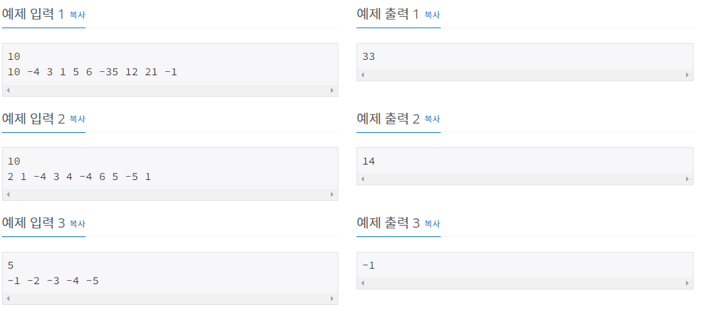
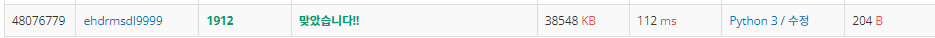
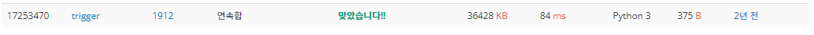
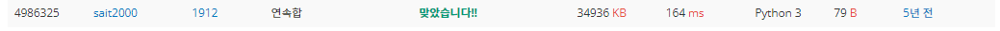

# 연속합

| 시간 제한          | 메모리 제한 | 제출     | 정답    | 맞힌 사람 | 정답 비율   |
| -------------- | ------ | ------ | ----- | ----- | ------- |
| 1 초 (추가 시간 없음) | 128 MB | 107365 | 37881 | 26544 | 34.009% |

## 문제

n개의 정수로 이루어진 임의의 수열이 주어진다. 우리는 이 중 연속된 몇 개의 수를 선택해서 구할 수 있는 합 중 가장 큰 합을 구하려고 한다. 단, 수는 한 개 이상 선택해야 한다.

예를 들어서 10, -4, 3, 1, 5, 6, -35, 12, 21, -1 이라는 수열이 주어졌다고 하자. 여기서 정답은 12+21인 33이 정답이 된다.

## 입력

첫째 줄에 정수 n(1 ≤ n ≤ 100,000)이 주어지고 둘째 줄에는 n개의 정수로 이루어진 수열이 주어진다. 수는 -1,000보다 크거나 같고, 1,000보다 작거나 같은 정수이다.

## 출력

첫째 줄에 답을 출력한다.



## 나의 코드

```python
N = int(input())
nums = list(map(int, input().split()))
sum_ = 0                                 # 합
max_ = -1001                             # 최대값
for i in range(N):
    if sum_ < 0:                         # 합이 0미만이면 초기화
        sum_ = 0
    sum_ += nums[i]                      # sum에 누적 

    if max_ < sum_:
        max_ = sum_                      # max값 
print(max_)
```



정답 비율이 34%라서 엄청 어려울 줄 알았지만 생각보다는 쉬웠다. 물론 생각하는 시간은 꽤 가졌지만, 의외로 핵심만 관통하면 할만했다. 바로 계속 합을 더하다가 그 합이 음수가 되면 굳이 앞의 값을 뒤에서 더할때 사용하지 않아도 된다는 것을 의미한다. 따라서 이 점만 생각할 수 있으면 쉬웠던 문제다.

## 다른 사람 코드(가장 빠른 코드)

```python
def find_max(arr, num):
    if num == 0:
        return 0
    tot = arr[0]
    max_tot = tot
    for i in range(1, num):
        if tot > 0 and tot + arr[i] >= 0:
            tot += arr[i]
        else:
            tot = arr[i]
        if max_tot < tot:
            max_tot = tot
    return max_tot

n = int(input())
a = list(map(int, input().split()))
print(find_max(a, n))
```



이 코드가 가장 빠른 코드였다.  그런데 방식은 나의 코드와 완전 같은데 왜 더빠른지 생각해 보게되었다. 우선 찾아보니 함수로 감싸면 더 빠르다는 것은 알고 있었고, 지역변수가 글로벌 변수보다 훨씬 빠르기 때문에 지역변수를 사용하면 더 빠르다고 한다. 그래서 def 안의 변수들은 지역변수고 main의 변수들은 전역변수이기 때문에 지역변수로 문제를 푸는게 훨씬 빠르다는 것을 알았다.

## 다른 사람 코드(가장 짧은 코드)

```python
input()
a=m=-1e9      # 최저값
for x in input().split():a=max(0,a)+int(x);m=max(m,a) # a가 0보다 크면 a값. 
print(m)
```



방식은 나의 코드와 같았지만, 1개의 변수를 받을때마다 새로 갱신될 수 있도록 만들었다. 그렇지만 시간은 훨씬 오래 걸리는데 그 이유는 아마 max함수이지 않을까 생각된다.
