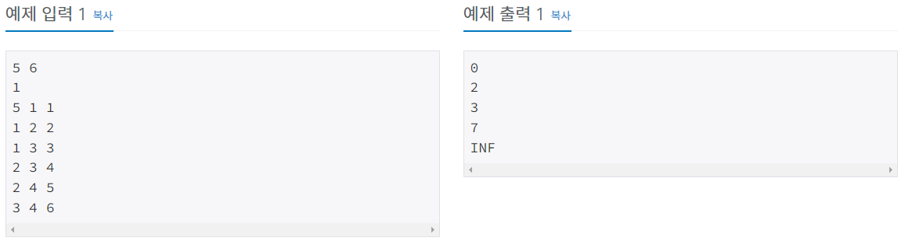

# 최단경로 성공

| 시간 제한 | 메모리 제한 | 제출     | 정답    | 맞힌 사람 | 정답 비율   |
| ----- | ------ | ------ | ----- | ----- | ------- |
| 1 초   | 256 MB | 140240 | 40365 | 19979 | 24.452% |

## 문제

방향그래프가 주어지면 주어진 시작점에서 다른 모든 정점으로의 최단 경로를 구하는 프로그램을 작성하시오. 단, 모든 간선의 가중치는 10 이하의 자연수이다.

## 입력

첫째 줄에 정점의 개수 V와 간선의 개수 E가 주어진다. (1 ≤ V ≤ 20,000, 1 ≤ E ≤ 300,000) 모든 정점에는 1부터 V까지 번호가 매겨져 있다고 가정한다. 둘째 줄에는 시작 정점의 번호 K(1 ≤ K ≤ V)가 주어진다. 셋째 줄부터 E개의 줄에 걸쳐 각 간선을 나타내는 세 개의 정수 (u, v, w)가 순서대로 주어진다. 이는 u에서 v로 가는 가중치 w인 간선이 존재한다는 뜻이다. u와 v는 서로 다르며 w는 10 이하의 자연수이다. 서로 다른 두 정점 사이에 여러 개의 간선이 존재할 수도 있음에 유의한다.

## 출력

첫째 줄부터 V개의 줄에 걸쳐, i번째 줄에 i번 정점으로의 최단 경로의 경로값을 출력한다. 시작점 자신은 0으로 출력하고, 경로가 존재하지 않는 경우에는 INF를 출력하면 된다.



## 나의 코드

```python
import heapq
import sys
input = sys.stdin.readline


V, E = map(int, input().split())
S = int(input())-1
NODE = [[] for i in range(V)]
visited = [100000000]*V                 # 최단 거리 저장
for i in range(E):
    u, v, w = map(int, input().split())
    NODE[u-1].append((w , v-1))             # NODE[노드번호1].append((거리, 노드번호2))

pos = []
visited[S] = 0
heapq.heappush(pos,(0, S))                  # 초기값 pos에 (0,s) 넣어주기

while pos:
    now1, now2 = heapq.heappop(pos)
    if visited[now2] < now1:                # now1이 이미 visited[now2]에 나온 최단거리보다 크면 넘어가기
        continue
    for i, k in NODE[now2]:
        if visited[now2] + i < visited[k]:  # 이미 나온 최단거리보다 작으면 실행
            visited[k] = visited[now2] + i
            heapq.heappush(pos, (visited[k], k))

for i in visited:
    if i == 100000000:
        print('INF')
    else:
        print(i)
```

아직 heapq에 대해 잘 모른다. 그래서 아주 오랫동안 풀다가 다른 풀이를 참고했는데 다 heapq를 쓰길래 heapq로 대체해서 사용했다. 근데 그래도 시간초과가 나서 그 원인을 알아봤더니 정렬 순서가 영향을 받는다고 한다. 아무래도 더 많이 공부해야할 거 같다. 그래서 공부한 뒤에 다시 이어서 써야할 거 같다. 하루 시간이 한정되어있는데 이 문제를 너무 오래풀어서 시간이 없어서 잠시 보류한다.
