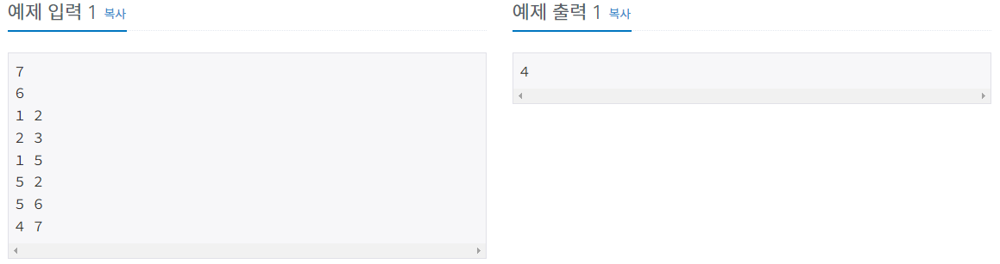
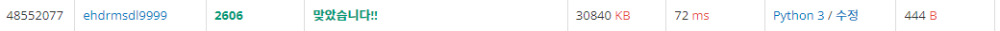
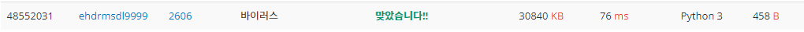
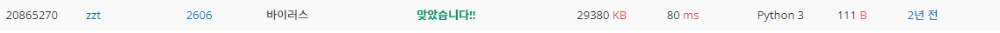

# 바이러스

| 시간 제한 | 메모리 제한 | 제출     | 정답    | 맞힌 사람 | 정답 비율   |
| ----- | ------ | ------ | ----- | ----- | ------- |
| 1 초   | 128 MB | 108865 | 52110 | 35164 | 46.047% |

## 문제

신종 바이러스인 웜 바이러스는 네트워크를 통해 전파된다. 한 컴퓨터가 웜 바이러스에 걸리면 그 컴퓨터와 네트워크 상에서 연결되어 있는 모든 컴퓨터는 웜 바이러스에 걸리게 된다.

예를 들어 7대의 컴퓨터가 <그림 1>과 같이 네트워크 상에서 연결되어 있다고 하자. 1번 컴퓨터가 웜 바이러스에 걸리면 웜 바이러스는 2번과 5번 컴퓨터를 거쳐 3번과 6번 컴퓨터까지 전파되어 2, 3, 5, 6 네 대의 컴퓨터는 웜 바이러스에 걸리게 된다. 하지만 4번과 7번 컴퓨터는 1번 컴퓨터와 네트워크상에서 연결되어 있지 않기 때문에 영향을 받지 않는다.


어느 날 1번 컴퓨터가 웜 바이러스에 걸렸다. 컴퓨터의 수와 네트워크 상에서 서로 연결되어 있는 정보가 주어질 때, 1번 컴퓨터를 통해 웜 바이러스에 걸리게 되는 컴퓨터의 수를 출력하는 프로그램을 작성하시오.

## 입력

첫째 줄에는 컴퓨터의 수가 주어진다. 컴퓨터의 수는 100 이하이고 각 컴퓨터에는 1번 부터 차례대로 번호가 매겨진다. 둘째 줄에는 네트워크 상에서 직접 연결되어 있는 컴퓨터 쌍의 수가 주어진다. 이어서 그 수만큼 한 줄에 한 쌍씩 네트워크 상에서 직접 연결되어 있는 컴퓨터의 번호 쌍이 주어진다.

## 출력

1번 컴퓨터가 웜 바이러스에 걸렸을 때, 1번 컴퓨터를 통해 웜 바이러스에 걸리게 되는 컴퓨터의 수를 첫째 줄에 출력한다.



## 나의 코드(BFS)

```python
T = int(input())                    # BFS 탐색.
node = [[] for i in range(T+1)]
for i in range(int(input())):
    a, b = map(int, input().split())
    node[a].append(b)
    node[b].append(a)
visited = [0]*(T+1)
visited[1] = 1                      # 1번 컴퓨터부터 시작. 
Q = [1]
cnt = 0
while Q:
    next = Q.pop(0)                 # 큐 사용
    for i in node[next]:
        if visited[i] == 1:
            continue
        else:
            Q.append(i)             # 안들렸던 곳 append
            visited[i] = 1
            cnt += 1
print(cnt)
```

 

처음 방법은 BFS로 풀어보았다. 그런데 어처피 1번 들렸던곳은 다시 안들려도 되고, 갈수 있는 노드가 몇개인지만 체크하면 돼서 DFS나 BFS의 차이는 크지 않기도 하고 여기서는 거의 똑같이 코딩을 할 수 있을 것이다. 그래서 DFS도 풀어보았다. BFS는 큐를 이용하였다.

## 나의 코드(DFS)

```python
T = int(input())                    # DFS 탐색.
node = [[] for i in range(T+1)]
for i in range(int(input())):
    a, b = map(int, input().split())
    node[a].append(b)
    node[b].append(a)
visited = [0]*(T+1)
visited[1] = 1
stack = [1]                         # 스택 사용
cnt = 0
while stack:
    next = stack.pop()              # 끝까지 깊이까지 갔다 돌아옴. 
    for i in node[next]:
        if visited[i] == 1:
            continue
        else:
            stack.append(i)
            visited[i] = 1
            cnt += 1
```



DFS 에서는 stack을 이용하여 먼저 들어간 자료가 나중에 나오게 했다. 이렇게 하면 가장 깊은곳 까지 갔다오는 탐색을 한다. 그래도 시간은 BFS와 크게 차이는 없었다. 아무래도 좀 더 복잡한 문제를 풀어볼까 라는 생각을 하게 한다.

## 다른 사람 코드 (빠른 코드)

```python
import sys
_=input();T={};V=[0]*101 # V는 들렀는지 여부. 
def D(k):
 while T[k]:
  t=T[k].pop()
  if not V[t]:V[t]=1;D(t) # V[t]가 0이면 들르지 않았기 때문에 V[t]=1로 변경. 그리고 t 노드로 이동. 
A={(*map(int,sys.stdin.readline().split()),) for i in range(int(input()))}
for a in A:
 for i in [0,1]:T.setdefault(a[i],[]).append(a[1-i])
try:
 while T[1]:D(T[1].pop())
except:pass
print(sum(V[2:]))
```


이 방법은 DFS를 함수로 만들어서 사용하고 있다.  근데 여기서 처음보는 함수가 있었는데 바로 setdefault 함수이다. setdefault는 값을 고정적으로 할당해 줄 수 있다. 위에서는 value값을 빈 리스트로 만들고 거기에 append를 하여 넣어주고 있다.

## 다른 사람 코드 (짧은 코드)

```python
_,_,*i=open(0)
for _ in(n:=[-1,1]+[0]*99):
 for l in i:a,b=map(int,l.split());n[b]=n[a]=n[a]|n[b]
print(sum(n))
```



비트연산자인 |을 사용한 코드이다. 


