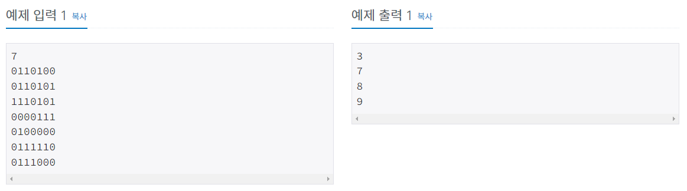
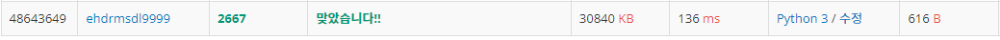
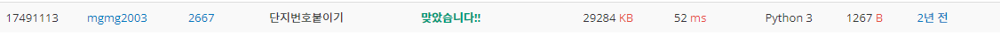

# 단지번호붙이기

| 시간 제한 | 메모리 제한 | 제출     | 정답    | 맞힌 사람 | 정답 비율   |
| ----- | ------ | ------ | ----- | ----- | ------- |
| 1 초   | 128 MB | 127723 | 55069 | 34787 | 40.929% |

## 문제

<그림 1>과 같이 정사각형 모양의 지도가 있다. 1은 집이 있는 곳을, 0은 집이 없는 곳을 나타낸다. 철수는 이 지도를 가지고 연결된 집의 모임인 단지를 정의하고, 단지에 번호를 붙이려 한다. 여기서 연결되었다는 것은 어떤 집이 좌우, 혹은 아래위로 다른 집이 있는 경우를 말한다. 대각선상에 집이 있는 경우는 연결된 것이 아니다. <그림 2>는 <그림 1>을 단지별로 번호를 붙인 것이다. 지도를 입력하여 단지수를 출력하고, 각 단지에 속하는 집의 수를 오름차순으로 정렬하여 출력하는 프로그램을 작성하시오.


## 입력

첫 번째 줄에는 지도의 크기 N(정사각형이므로 가로와 세로의 크기는 같으며 5≤N≤25)이 입력되고, 그 다음 N줄에는 각각 N개의 자료(0혹은 1)가 입력된다.

## 출력

첫 번째 줄에는 총 단지수를 출력하시오. 그리고 각 단지내 집의 수를 오름차순으로 정렬하여 한 줄에 하나씩 출력하시오.



## 나의 코드

```python
N = int(input())
apt = [list(map(int, list(input()))) for i in range(N)]
al = []                                                  # 좌표 리스트 저장 할 공간
m = [(0, 1), (0, -1), (1, 0), (-1, 0)]                   # 상하 좌우 탐색
for i in range(N):
    for j in range(N):
        if apt[i][j] == 1:
            al.append((i, j))                            # 1인 좌표 리스트 저장
total = []                                               # 아파트 단지별 sum 저장
cnt2 = 0                                                 # cnt2에 아파트 단지 개수 저장.
while al:
    cnt2 += 1                                            # stack 1개 길이 0 된 횟수마다 아파트 단지 개수 1 더함
    stack = [al.pop()]
    cnt = 1
    while stack:
        temp = stack.pop()
        for y, x in m:
            for k in range(len(al)):
                if (temp[0]+y, temp[1]+x) == al[k]:      # 상하좌우 맞는 좌표 있으면 +1 없으면 pop만 되다가 stack 사라지고 다시 저장됐던 좌표에서 1개 꺼내서 시작.
                    stack.append(al.pop(k))
                    cnt += 1
                    break
    total.append(cnt)
total.sort()
print(cnt2, *total, sep='\n')
```



나는 DFS를 사용하여 개수를 구했다 사실 BFS가 더 빠를 수 있겠다는 생각은 했지만 당장 생각나는 건 DFS였다. 1개의 좌표를 꺼낸다음 거기서 연결되는 좌표들을 계속해서 더해줬다. 그런데 다른 사람 코드보다 2배는 느리기 때문에 다시한번 최적화 하고 습관을 바꿔야 겠다는 생각이 든다.

## 다른 사람 코드(빠른 코드)

```python
N  = int(input())

arr = []

for i in range(N):
    arr.append(list(map(int,list(input()))))

def bfs(startx,starty):
    num = 1                # 뽑은 것 1개 빼고 시작 num+1했
    queuex = []
    queuey = []
    queuex.append(startx)
    queuey.append(starty)
    arr[startx][starty]=0 # 이미 방문한곳은 0 설정. 
        
    while(len(queuex)>0 and len(queuey)>0):
        px = queuex[0]
        del queuex[0]
        py = queuey[0]
        del queuey[0] # px py에 할당후 삭제 (pop과 같음)

        if ((py-1)>=0 and arr[px][py-1]==1):
            queuex.append(px)
            queuey.append(py-1)
            arr[px][py - 1] = 0
            num+=1

        if ((px-1)>=0 and arr[px-1][py]==1):
            queuex.append(px-1)
            queuey.append(py)
            arr[px - 1][py] = 0
            num+=1
        if (py+1<N and arr[px][py+1]==1):
            queuex.append(px)
            queuey.append(py+1)
            arr[px][py + 1] = 0
            num+=1
        if (px+1<N and arr[px+1][py]==1):
            queuex.append(px+1)
            queuey.append(py)
            arr[px + 1][py] = 0
            num+=1  # 상하좌우 탐색.
    return num


flag = 0
quantity=[]

for i in range(N):
    for j in range(N):
        if arr[i][j]==1:
            m = bfs(i,j)
            quantity.append(m)
            flag+=1

print(flag)
quantity.sort()
for i in range (flag):
    print(quantity[i])
```



이 코드는 상하좌우를 탐색하며 있으면 바로바로 넣어주고 0값으로 바꿔준 뒤 계속 실행한다. 그리고 1번의 함수 사이클로 1개의 아파트가 끝이난다.

## 다른 사람 코드 (짧은 코드)

```python
r,d,*a=0,{(x,y)for y in range(int(input()))for x,c in enumerate(input())if'0'<c}
while d:
 s=[d.pop()];r+=1;b=0 # s가 1번씩 NULL이 될때마다 단지수 1개 더해진다.
 while s:
  x,y=s.pop();b+=1 # s에서 1개씩 꺼낼때마다 1개씩 더해진다.
  for e in-2,0,2,4:
   p=x+e//3,y+e%3-1 # -2//3 은 -1이 나온다. 0//3==0, 2//3 == 0, 4//3 == 1...
   if{p}<=d:d-={p};s+=p,
 a+=b,
print(*[r]+sorted(a))
```


되게 수학적으로 짧게짧게 써냈다. 물로 그 매커니즘은 사실상 상하좌우 를 탐색하는 거고,  set에 있는 튜플 1개씩 꺼내는 것이다. 
