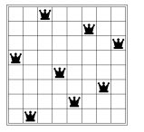
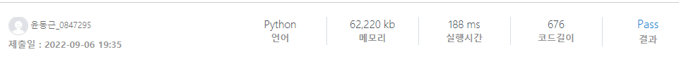
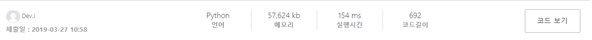

2806. N-Queen D3


- 시간 : 10개 테스트케이스를 합쳐서 *C++의 경우 2초* / *Java의 경우 4초* / *Python의 경우 8초*

- 메모리 : 힙, 정적 메모리 합쳐서 *256MB* 이내, 스택 메모리 *256MB* 이내

**※ SW Expert 아카데미의 문제를 무단 복제하는 것을 금지합니다.**  

8*8 체스보드에 8개의 퀸을 서로 공격하지 못하게 놓는 문제는 잘 알려져 있는 문제이다.  

퀸은 같은 행, 열, 또는 대각선 위에 있는 말을 공격할 수 있다. 이 문제의 한가지 정답은 아래 그림과 같다.  
 



이 문제의 조금 더 일반화된 문제는 Franz Nauck이 1850년에 제기했다.  

N*N 보드에 N개의 퀸을 서로 다른 두 퀸이 공격하지 못하게 놓는 경우의 수는 몇가지가 있을까?  

N이 주어졌을 때, 퀸을 놓는 방법의 수를 구하는 프로그램을 작성하시오.  

**[입력]**  

첫 번째 줄에 테스트 케이스의 수 T가 주어진다.  

각 테스트 케이스의 첫 번째 줄에는 하나의 자연수 N(1 ≤ N ≤ 10)이 주어진다.  

**[출력]**  

각 테스트 케이스마다 ‘#x ’(x는 테스트케이스 번호를 의미하며 1부터 시작한다)를 출력하고, 퀸 N개를 서로 공격할 수 없게 놓는 경우의 수를 출력한다.


## 나의 코드

```python
def search():
    global cnt
    ny = len(STACK)
    if ny == N:        # N개 만큼 퀸을 뒀으면 cnt ++
        cnt += 1
    else:
        for nx in range(N):
            if used_x[nx] == 1:   # 이미 사용한 nx면 넘어가기. 
                continue
            for y, x in STACK:
                if abs(nx-x) == abs(ny-y): # 대각선에 있으면 넘어가기. 
                    break
            else:                    # 대각석, 같은 라인 아니면 추가해보기. 
                used_x[nx] = 1
                STACK.append((ny, nx))
                search()
                used_x[nx] = 0
    STACK.pop()                    # 다 끝나면 1개씩 pop. 
 
for t in range(1,int(input())+1):
    N = int(input())
    used_x = [0]*N                 # x 인덱스에서 사용 여부 확인.
    cnt = 0
    STACK = []                     # 스택이 N개가 돼면 cnt++
    for i in range(N):
        STACK.append((0, i))       # 0번행의 x모두 넣어보며 돌리기. 
        used_x[i] = 1
        search()                   # 재귀함수. 
        used_x[i] = 0
    print(f'#{t} {cnt}')
```



백 트래킹으로 풀라는데 이게 백 트래킹인지는 잘 모르겠다... 우선 퀸을 놓을때는 1개의 행 그리고 1개의 열에 딱 1개만 존재 가능하다. 따라서 x좌표, y좌표는 각각 N개중에 1개씩만 사용 가능하다. 따라서 y=0부터 y=N-1 까지 1칸씩 전진하며 x좌표의 어느구간에 1개씩 넣으며 전진할지 선택하는 방식이다. 그래서 y는 사용여부를 체크할 필요가 없지만 x는 사용여부를 체크해야 해당하는 열을 사용하지 않을 수 있다. 이런 방식으로 STACK에 8개가 쌓이면 cnt를 1씩 하는 구조이다. 다음 칸에 놓을 수 있는지 판단 여부는 같은 x좌표를 사용하는 퀸이 지금까지 둔 퀸중에 없으며, 지금까지 둔 퀸중에 대각선으로도 해당 x좌표를 지나가는지 확인하는 방식이다.

## 다른 사람 코드(빠른 코드)

```python
def f(i, N):
    global cnt
    if i == N:
        cnt += 1
    else:
        for j in range(N):
            if col[j] == 0 and del_right[i+N-1-j] == 0 and del_left[i+j] == 0:
                col[j] = 1
                del_right[i+N-1-j] = 1 # 이코드도 끝까지 돌아보는 코드이다.
                del_left[i+j] = 1      # 대각선 지우는 것을 이 리스트로 해결.
 
                f(i+1, N)
 
                col[j] = 0
                del_right[i+N-1-j] = 0
                del_left[i+j] = 0
 
 
T = int(input())
for t in range(1, T+1):
    N = int(input())
    arr = [[0 for i in range(N)] for i in range(N)]
    col = [0 for i in range(N)]
    del_right = [0 for i in range(2*N-1)]
    del_left = [0 for i in range(2*N-1)]
    cnt = 0
    f(0, N)
    print("#{} {}".format(t,cnt))
```



이 사람은 2차원 배열로 좌표를 나타내어 해결했다. 이때,  대각선의 경우 del_right,del_left를 사용하여 배치 불가능한 x좌표를 지워나갔다. 따라서 다음 번에도 불가능한 x좌표가 계속 저장되서 계산이 훨씬 줄어들었다. 이런 점은 엄청난 장점이였던거 같다.

## 짧은코드는 정답만 써놓는 장난을 해서 리뷰하지 않았습니다.
