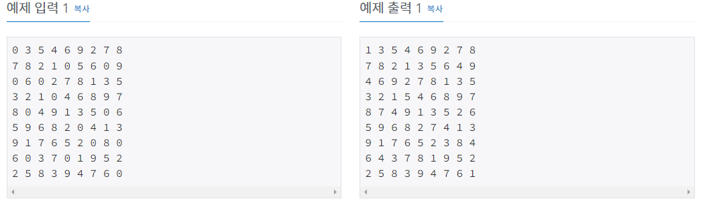
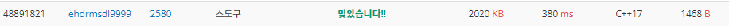

# 스도쿠

| 시간 제한 | 메모리 제한 | 제출    | 정답    | 맞힌 사람 | 정답 비율   |
| ----- | ------ | ----- | ----- | ----- | ------- |
| 1 초   | 256 MB | 72117 | 21091 | 13262 | 27.087% |

## 문제

스도쿠는 18세기 스위스 수학자가 만든 '라틴 사각형'이랑 퍼즐에서 유래한 것으로 현재 많은 인기를 누리고 있다. 이 게임은 아래 그림과 같이 가로, 세로 각각 9개씩 총 81개의 작은 칸으로 이루어진 정사각형 판 위에서 이뤄지는데, 게임 시작 전 일부 칸에는 1부터 9까지의 숫자 중 하나가 쓰여 있다.


나머지 빈 칸을 채우는 방식은 다음과 같다.

1. 각각의 가로줄과 세로줄에는 1부터 9까지의 숫자가 한 번씩만 나타나야 한다.
2. 굵은 선으로 구분되어 있는 3x3 정사각형 안에도 1부터 9까지의 숫자가 한 번씩만 나타나야 한다.

위의 예의 경우, 첫째 줄에는 1을 제외한 나머지 2부터 9까지의 숫자들이 이미 나타나 있으므로 첫째 줄 빈칸에는 1이 들어가야 한다.


또한 위쪽 가운데 위치한 3x3 정사각형의 경우에는 3을 제외한 나머지 숫자들이 이미 쓰여있으므로 가운데 빈 칸에는 3이 들어가야 한다.


이와 같이 빈 칸을 차례로 채워 가면 다음과 같은 최종 결과를 얻을 수 있다.


게임 시작 전 스도쿠 판에 쓰여 있는 숫자들의 정보가 주어질 때 모든 빈 칸이 채워진 최종 모습을 출력하는 프로그램을 작성하시오.

## 입력

아홉 줄에 걸쳐 한 줄에 9개씩 게임 시작 전 스도쿠판 각 줄에 쓰여 있는 숫자가 한 칸씩 띄워서 차례로 주어진다. 스도쿠 판의 빈 칸의 경우에는 0이 주어진다. 스도쿠 판을 규칙대로 채울 수 없는 경우의 입력은 주어지지 않는다.

## 출력

모든 빈 칸이 채워진 스도쿠 판의 최종 모습을 아홉 줄에 걸쳐 한 줄에 9개씩 한 칸씩 띄워서 출력한다.

스도쿠 판을 채우는 방법이 여럿인 경우는 그 중 하나만을 출력한다.

## 제한

- 12095번 문제에 있는 소스로 풀 수 있는 입력만 주어진다.
  - C++14: 80ms
  - Java: 292ms
  - PyPy3: 1172ms



## 나의 코드

```c
#include <iostream>
using namespace std;
int Sudoku[9][9];
int k, cnt, cnt2;
void check(int, int);
void search(int);

void search(int q) # 스도쿠의 빈 부분을 찾는 함수.
{
	int b = 0;
	for (int i = q; i < 9; i++)
	{
		for (int j = 0; j < 9; j++)
		{
			if(Sudoku[i][j] == 0)
			{
				cnt2++;
				check(i, j); # 빈부분을 찾으면 check한다.
				cnt2--;
				b = 1;
				break;
			}
			
		}
		if (b == 1)
		{
			break;
		}
	}
}

void check(int e, int r)
{

	for (int ii = 1; ii < 10; ii++)
	{
		int ch = 0;
		for (int iii = 0; iii < 9; iii++)
		{
			if (Sudoku[e][iii] == ii) # 0을 채워넣기 위해 그 행에 숫자  탐색 
			{
				ch = 1;
				break;
			}
			if (Sudoku[iii][r] == ii) # 해당하는 열에 없는 숫자  탐색.
			{
				ch = 1;
				break;
			}
		}
		if (ch == 0)
		{
			for (int xx = 0; xx < 3; xx++)
			{
				for (int yy = 0; yy < 3; yy++)
				{
					if (Sudoku[(e / 3)*3 + xx][(r / 3)*3 + yy] == ii)
					{
						ch = 1; # 해당하는 9칸 없는 숫자 탐색.
						break;
					}
				}
				if (ch == 1)
				{
					break;
				}
			}
		}
		if (ch == 0) # ch=0이면 행,열,해당하는 9칸 안에 없는 숫자가 ii이다.
		{
			Sudoku[e][r] = ii; # 0인 곳에 ii 숫자를 넣는다. 
			if (cnt2 == cnt) # 총 빈칸이 cnt개인데 cnt2가 1개를 채울때마다 ++1된다. 
			{                # 따라서 cnt개를 채웠으면 출력하고 함수를 종료한다. 
				for (int i = 0; i < 9; i++)
				{
					for (int j = 0; j < 9; j++)
					{
						cout << Sudoku[i][j] << ' ';

					}
					cout << '\n';
				}

				return;
			}
			search(e); # Sudoku[e][r]에 채워넣은뒤 그다음 0을 찾아서 채워넣기 수행. 
			Sudoku[e][r] = 0;
		}
	}

}

int main()
{
	cnt = 0;
	cnt2 = 0;
	for (int i = 0; i < 9; i++)
	{
		for (int j = 0; j < 9; j++)
		{
			cin >> k;
			Sudoku[i][j] = k;
			if(k == 0)
			{
				cnt++;
			}
		}
	}
	search(0);
	/*for (int ss = 0; ss < 9; ss++)
	{
		for (int dd = 0; dd < 9; dd++)
		{
			cout << Sudoku[ss][dd] << ' ';
		}
		cout << '\n';
	}*/

	return 0;
}
```



C++로 처음부터 너무 어려운걸 시도했나 싶기도 했다. 우선 아직 너무 지식이 부족해서 리스트 한개도 제대로 다루지 못한다. 동적할당이나 비트연산이나 함수가 어떻게 작동돼고 안에 들어간 변수들은 어디까지 적용이 돼는지, 또한 함수에서 return은 1개의 함수만 종료하는지 모든것을 종료하는지 등등 문제 한개를 풀면서 많은 부분을 공부해야했다. 다른 사람 코드도 리뷰할 수 있지만, 코드를 봐도 우선 공부하는게 우선이겠다는 생각이 들었다.


