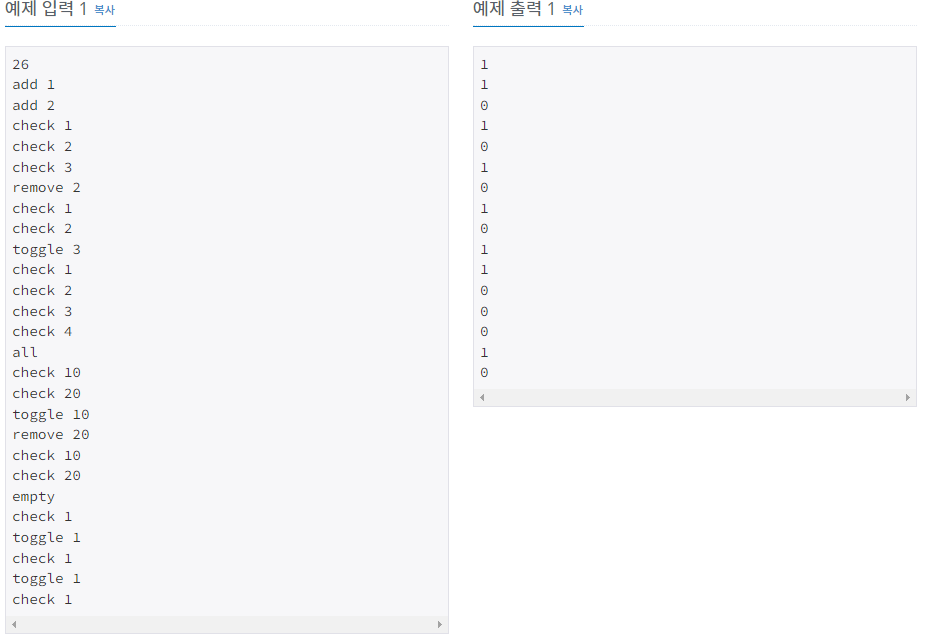

# 집합

| 시간 제한 | 메모리 제한                                                 | 제출    | 정답    | 맞힌 사람 | 정답 비율   |
| ----- | ------------------------------------------------------ | ----- | ----- | ----- | ------- |
| 1.5 초 | 4 MB ([하단 참고](https://www.acmicpc.net/problem/11723#)) | 62858 | 19397 | 13844 | 29.397% |

## 문제

비어있는 공집합 S가 주어졌을 때, 아래 연산을 수행하는 프로그램을 작성하시오.

- `add x`: S에 x를 추가한다. (1 ≤ x ≤ 20) S에 x가 이미 있는 경우에는 연산을 무시한다.
- `remove x`: S에서 x를 제거한다. (1 ≤ x ≤ 20) S에 x가 없는 경우에는 연산을 무시한다.
- `check x`: S에 x가 있으면 1을, 없으면 0을 출력한다. (1 ≤ x ≤ 20)
- `toggle x`: S에 x가 있으면 x를 제거하고, 없으면 x를 추가한다. (1 ≤ x ≤ 20)
- `all`: S를 {1, 2, ..., 20} 으로 바꾼다.
- `empty`: S를 공집합으로 바꾼다. 

## 입력

첫째 줄에 수행해야 하는 연산의 수 M (1 ≤ M ≤ 3,000,000)이 주어진다.

둘째 줄부터 M개의 줄에 수행해야 하는 연산이 한 줄에 하나씩 주어진다.

## 출력

`check` 연산이 주어질때마다, 결과를 출력한다.



## 나의 코드

```c
#include <iostream>
int S=0, x;
void add(int x);
void remove(int x);
void check(int x);
void toggle(int x);
void all();
void empty();
void make(char temp[]);

int main(void)
{
	std::ios::sync_with_stdio(0);
	std::cin.tie(0);
	std::cout.tie(0);

	int M;
	char temp[7];
	std::cin >> M;
	for (int i = 0; i < M; i++)
	{
		std::cin >> temp;
		make(temp);
	}
	return 0;

}


void make(char temp[])
{

	switch (temp[1])
	{
	case 'd'://add
		std::cin >> x;
		add(x);
		break;

	case 'e': //remove
		std::cin >> x;
		remove(x);
		break;

	case 'h': //check
		std::cin >> x;
		check(x);
		break;

	case 'o': //toggle
		std::cin >> x;
		toggle(x);
		break;

	case 'l':  //all
		all();
		break;

	default:
		empty();
		break;
	}
}

void add(int x)
{
	S |= 1 << x;
}

void remove(int x)
{
	S &= ~(1 << x);
}

void check(int x)
{
	(S & (1 << x) ) ? std::cout << "1\n" : std::cout << "0\n";
}

void toggle(int x)
{
	S ^= 1 << x;
}

void all()
{
	S = ~0;
}

void empty()
{
	S = 0;
}
```


이 문제도 input 받는 시간이 너무 오래걸려서 480ms가 나온것 같다. 왜냐하면 cin.tie(0)을 해야 시간초과가 나지 않았기 때문이다. 비트마스킹을 연습하는 문제였는데,  왜 1등같은 사람들은 50ms 안쪽으로 나오는지 잘 살펴봐야 할 거 같다. 왜냐하면 비트연산으로 하긴 했는데, 속도가 너무 느리기 때문이다.

## 다른 사람 코드

```c
#include <cstdio>
#include <cstring>
#define SIZ     (1<<20)

char read_buf[SIZ], write_buf[SIZ];
int read_idx = SIZ, write_idx;

inline char read_char()
{
    if (read_idx == SIZ) {
        fread(read_buf, sizeof(char), SIZ, stdin);
        read_idx = 0;
    }   
    return read_buf[read_idx++];
}

int read_int()
{
    int ret = 0;
    char ch; 
    bool is_neg = false;
    while ((ch = read_char()) > '9' || ch < '0') ;
    if (ch == '-') {
        is_neg = true;
        ch = read_char();
    }   
    while ('0' <= ch && ch <= '9') {
        ret = ret * 10 + (ch & 0xF);
        ch = read_char();
    }   

    return is_neg ? -ret : ret;
}

inline int get_size(int n)
{
    int ret = 1;
    n = n > 0 ? n : -n; 
    while (n >= 10) ret++, n /= 10; 
    return ret;
}

void write_int(int n, char delim)
{
    int siz = get_size(n);
    if (write_idx + siz + 2 > SIZ) {    // '-' and delim
        fwrite(write_buf, sizeof(char), write_idx, stdout);
        write_idx = 0;
    }   
    if (n < 0) {
        write_buf[write_idx++] = '-';
        n = -n; 
    }   
    int temp = siz-1;
    while (temp >= 0) {
        write_buf[write_idx + temp--] = n % 10 | '0';
        n /= 10;
    }
    write_idx += siz;
    write_buf[write_idx++] = delim;
}

inline void write_str(const char str[], int len)
{
    // NOT a loop: suitable size of write_buf needed
    if (write_idx + len > SIZ) {
        fwrite(write_buf, sizeof(char), write_idx, stdout);
        write_idx = 0;
    }
    memcpy(write_buf + write_idx, str, len);
    write_idx += len;
}

struct Flusher {
    ~Flusher() {
        if (write_idx) {
            fwrite(write_buf, sizeof(char), write_idx, stdout);
            write_idx = 0;
        }
    }
} flusher;

int main(int argc, char *argv[])
{
    int X, M = read_int();
    char op;
    int S = 0;
    while (M--) {
        read_char();        // first character
        op = read_char();   // second character
        switch (op) {
            case 'd': X = read_int(); S |= 1 << (X-1); break;
            case 'e': X = read_int(); S &= ~(1 << (X-1)); break;
            case 'h': X = read_int(); \
                      write_int((S & (1 << (X-1))) >> (X-1), '\n'); break;
            case 'o': X = read_int(); S ^= 1 << (X-1); break;
            case 'l': S = (1 << 20) - 1; \
                      read_char(); read_char(); break;
            case 'm': S = 0; read_char(); \
                      read_char(); read_char(); read_char(); break;
        }
    }
    return 0;
}
```

그나마 읽기 쉬운 코드를 가져왔다.  하지만 여전히 fread 와 같은 함수들이 어떻게 작동되는지 알아야 했따.

```c
int main() {
  FILE* pFile;
  long lSize;
  char* buffer;
  size_t result;

  pFile = fopen("myfile.bin", "rb");
  if (pFile == NULL) {
    fputs("File error", stderr);
    exit(1);
  }

  // 파일의 크기를 ISize 에 저장한다.
  fseek(pFile, 0, SEEK_END);
  lSize = ftell(pFile);
  rewind(pFile);

  // 전체 파일의 내용을 받을 수 있을 정도의 크기로 메모리를 할당한다.
  buffer = (char*)malloc(sizeof(char) * lSize);
  if (buffer == NULL) {
    fputs("Memory error", stderr);
    exit(2);
  }

  // 그 파일의 내용을 버퍼에 저장한다.
  result = fread(buffer, 1, lSize, pFile);
  if (result != lSize) {
    fputs("Reading error", stderr);
    exit(3);
  }

  /* 이제 파일의 모든 내용은 버퍼에 들어가게 된다. */

  // 종료
  fclose(pFile);
  free(buffer);
  return 0;
}
```

그래서 알아낸 것이, 버퍼에 내용 전체를 받고 시작하는 코드이다. 그래서 따로따로 input을 받으려면 여러번 함수를 호출해야되기 때문에, 한번에 받아서 분석하는 것이 훨 씬 빠를 것이라는 것을 눈으로 볼 수 있었다.
