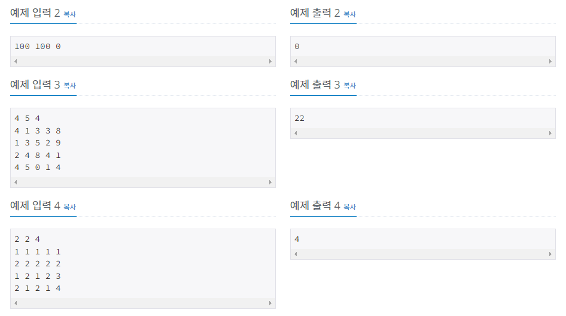

# 낚시왕

| 시간 제한 | 메모리 제한 | 제출    | 정답    | 맞힌 사람 | 정답 비율   |
| ----- | ------ | ----- | ----- | ----- | ------- |
| 1 초   | 512 MB | 37501 | 10940 | 6208  | 25.857% |

## 문제

낚시왕이 상어 낚시를 하는 곳은 크기가 R×C인 격자판으로 나타낼 수 있다. 격자판의 각 칸은 (r, c)로 나타낼 수 있다. r은 행, c는 열이고, (R, C)는 아래 그림에서 가장 오른쪽 아래에 있는 칸이다. 칸에는 상어가 최대 한 마리 들어있을 수 있다. 상어는 크기와 속도를 가지고 있다.


낚시왕은 처음에 1번 열의 한 칸 왼쪽에 있다. 다음은 1초 동안 일어나는 일이며, 아래 적힌 순서대로 일어난다. 낚시왕은 가장 오른쪽 열의 오른쪽 칸에 이동하면 이동을 멈춘다.

1. 낚시왕이 오른쪽으로 한 칸 이동한다.
2. 낚시왕이 있는 열에 있는 상어 중에서 땅과 제일 가까운 상어를 잡는다. 상어를 잡으면 격자판에서 잡은 상어가 사라진다.
3. 상어가 이동한다.

상어는 입력으로 주어진 속도로 이동하고, 속도의 단위는 칸/초이다. 상어가 이동하려고 하는 칸이 격자판의 경계를 넘는 경우에는 방향을 반대로 바꿔서 속력을 유지한채로 이동한다.

왼쪽 그림의 상태에서 1초가 지나면 오른쪽 상태가 된다. 상어가 보고 있는 방향이 속도의 방향, 왼쪽 아래에 적힌 정수는 속력이다. 왼쪽 위에 상어를 구분하기 위해 문자를 적었다.


상어가 이동을 마친 후에 한 칸에 상어가 두 마리 이상 있을 수 있다. 이때는 크기가 가장 큰 상어가 나머지 상어를 모두 잡아먹는다.

낚시왕이 상어 낚시를 하는 격자판의 상태가 주어졌을 때, 낚시왕이 잡은 상어 크기의 합을 구해보자.

## 입력

첫째 줄에 격자판의 크기 R, C와 상어의 수 M이 주어진다. (2 ≤ R, C ≤ 100, 0 ≤ M ≤ R×C)

둘째 줄부터 M개의 줄에 상어의 정보가 주어진다. 상어의 정보는 다섯 정수 r, c, s, d, z (1 ≤ r ≤ R, 1 ≤ c ≤ C, 0 ≤ s ≤ 1000, 1 ≤ d ≤ 4, 1 ≤ z ≤ 10000) 로 이루어져 있다. (r, c)는 상어의 위치, s는 속력, d는 이동 방향, z는 크기이다. d가 1인 경우는 위, 2인 경우는 아래, 3인 경우는 오른쪽, 4인 경우는 왼쪽을 의미한다.

두 상어가 같은 크기를 갖는 경우는 없고, 하나의 칸에 둘 이상의 상어가 있는 경우는 없다.

## 출력

낚시왕이 잡은 상어 크기의 합을 출력한다.

## 예제 입력 1 복사

4 6 8
4 1 3 3 8
1 3 5 2 9
2 4 8 4 1
4 5 0 1 4
3 3 1 2 7
1 5 8 4 3
3 6 2 1 2
2 2 2 3 5

## 예제 출력 1 복사

22

각 칸의 왼쪽 아래에 적힌 수는 속력, 오른쪽 아래는 크기, 왼쪽 위는 상어를 구분하기 위한 문자이다. 오른쪽 위에 ❤️는 낚시왕이 잡은 물고기 표시이다.


초기 상태


1초


2초 (E번 상어는 B번에게 먹혔다)


3초


4초


5초


6초




## 나의 코드

```c
#include <iostream>
struct sh {
	int v;				// 상어 속도
	int d;				// 상어 방향     1=위, 2=아래, 3=오른쪽, 4=왼쪽
};


int main(void)
{
	int R, C, M, y, x, v, d, size, ch, sum_size, ch2, recur_X, recur_Y, dx, dy;
	sh shark[10001];
	int SH[101][101][2];
	std::cin >> R >> C >> M; // R y길이, C x길이, M 상어 수
	for (int i = 1; i <= C; i++)                   // 초기화
	{
		for (int j = 1; j <= R; j++)
		{
			SH[j][i][0] = 0;
			SH[j][i][1] = 0;
		}
	}
	for (int i = 0; i < M; i++)
	{
		std::cin >> y >> x >> v >> d >> size;         //y위치,x위치,속도,방향,크기
		SH[y][x][0] = size;
		shark[size] = { v,d };
	}


	ch = 0, sum_size = 0, recur_X = 2*(C-1), recur_Y = 2*(R-1);
	for (int i = 1; i <= C; i++)
	{
		for (int j = 1; j <= R; j++)        //i는 1칸, 1초, 
		{
			if (SH[j][i][ch])
			{
				sum_size += SH[j][i][ch];    // 잡은 상어 크기만큼 더하기
				SH[j][i][ch] = 0;            // 잡은 상어 없애기
				break;                       // 잡으면 넘어가기
			}
		}
		if (i == C)                           // 맨 오른쪽 에서 잡았으면 그만 하기.
		{
			break;
		}

		ch2 = ch;                            // 차원 ch, ch2가 있는데, ch에는 움직인 후의 상어 위치가 갱신.
		ch = (++ch) % 2;
		for (int j = 1; j <= R; j++)             //y
		{
			for (int k = 1; k <= C; k++)         //x
			{
				if (size = SH[j][k][ch2])       // size 가 0 아니면 있는거
				{
					SH[j][k][ch2] = 0;         // 움직일 상어는 0으로 초기화하고 ch 차원에서 옮긴 위치 설정
					v = shark[size].v; 
					d = shark[size].d;
					if (d == 1)					// 위
					{
						v %= recur_Y;
						if (v < j - 1)                     //맨위로 가는방향
						{
							dy = j - v;
							if (SH[dy][k][ch] < size)
							{
								SH[dy][k][ch] = size;
							}
						}
						else if (j - 1 <= v && v < j + R - 2)    // 맨 위에서 아래로 가는방향 1에서 R로
						{
							dy = 2 + v - j;
							if (SH[dy][k][ch] < size)
							{
								SH[dy][k][ch] = size;
								shark[size].d = 2;
							}
						}
						else if (j + R - 2 <= v && v < j + R + R - 3)   // 맨 아래에서 위로 가는 방향 R에서 1로
						{
							dy = R + R - v + j - 2;
							if (SH[dy][k][ch] < size)
							{
								SH[dy][k][ch] = size;
							}
						}										  //  1에서 제자리로
						else
						{
							dy = j - recur_Y + v;
							if (SH[dy][k][ch] < size)
							{
								SH[dy][k][ch] = size;
								shark[size].d = 2;
							}
						}
					}
					else if (d == 2)			// 아래
					{
						v %= recur_Y;
						if (v < R-j)
						{
							dy = j + v;
							if (SH[dy][k][ch] < size)
							{
								SH[dy][k][ch] = size;
							}
						}
						else if (R-j <= v && v < R+R-j-1)    // R 에서 1로
						{
							dy = R - (v - R + j);
							if (SH[dy][k][ch] < size)
							{
								SH[dy][k][ch] = size;
								shark[size].d = 1;
							}
						}
						else if (R+R-j-1 <= v && v < R+R+R-j-2)   // 1 에서 R로
						{
							dy = v + 2 - R - R + j;
							if (SH[dy][k][ch] < size)
							{
								SH[dy][k][ch] = size;
							}
						}										  //  R에서 제자리로
						else
						{
							dy = j + recur_Y - v;
							if (SH[dy][k][ch] < size)
							{
								SH[dy][k][ch] = size;
								shark[size].d = 1;
							}
						}
					}
					else if (d == 3)			// 오른쪽으로
					{
						v %= recur_X;
						if (v < C - k)
						{
							dx = k + v;
							if (SH[j][dx][ch] < size)
							{
								SH[j][dx][ch] = size;
							}
						}
						else if (C - k <= v && v < C + C - k - 1)    // C 에서 1로
						{
							dx = C + C - v - k;
							if (SH[j][dx][ch] < size)
							{
								SH[j][dx][ch] = size;
								shark[size].d = 4;
							}
						}
						else if (C + C - k - 1 <= v && v < C + C + C - k - 2)   // 1 에서 C로
						{
							dx = 2 + v + k - C - C;
							if (SH[j][dx][ch] < size)
							{
								SH[j][dx][ch] = size;
							}
						}										  //  C에서 제자리로
						else
						{
							dx = k + recur_X - v;
							if (SH[j][dx][ch] < size)
							{
								SH[j][dx][ch] = size;
								shark[size].d = 4;
							}
						}
					}
					else                        // 왼쪽
					{
						v %= recur_X;
						if (v < k - 1)                   // 처음자리에서 왼쪽
						{
							dx = k - v;
							if (SH[j][dx][ch] < size)
							{
								SH[j][dx][ch] = size;
							}
						}
						else if (k - 1 <= v && v < k + C - 2)   // x좌표 1에서 오른쪽
						{
							dx = 2 + v - k;
							if (SH[j][dx][ch] < size)
							{
								SH[j][dx][ch] = size;
								shark[size].d = 3;
							}
						}
						else if (k + C - 2 <= v && v< k + C + C - 3)  // x좌표 C에서 다시 왼쪽
						{
							dx = C + C - v + k - 2;
							if (SH[j][dx][ch] < size)
							{
								SH[j][dx][ch] = size;
							}
						}								
						else                                        // x좌표 1에서 다시 원래 위치로
						{
							dx = k - recur_X + v;
							if (SH[j][dx][ch] < size)
							{
								SH[j][dx][ch] = size;
								shark[size].d = 3;
							}
							
						}
					}
				}
			}
		}
	}
	std::cout << sum_size << '\n';
	return 0;
}
```


이 문제가 사실 그렇게 어려운 문제는 아니다. 다만 어려웠던 점은, 상어가 상하로 왔다갔다 했을때의 위치와 방향을 정확히 특정하는게 헷갈렸다. 그래서 이부분만 해결했다면, 훨씬 빨리 풀었을 것 같다.

## 다른 사람 코드

```c
#include <stdio.h>
#include <cstring>

struct Dir {
	int x, y, s, d, z;
};

struct Map {
	int shark, index;
};
Map map[100][100];
int main() {
    int R, C, M;
    Dir v[10000];    
	scanf("%d %d %d", &R, &C, &M);
	for (int i = 0; i < M; i++) {
		scanf("%d %d %d %d %d", &v[i].x, &v[i].y, &v[i].s, &v[i].d, &v[i].z);
		v[i].x--; v[i].y--; v[i].d--;
		if (v[i].d == 0 || v[i].d == 1)
			v[i].s %= ((R - 1) * 2);
		else
			v[i].s %= ((C - 1) * 2);
		map[v[i].x][v[i].y].shark = v[i].z;
		map[v[i].x][v[i].y].index = i;
	}

	int ans = 0;
    int dx[4] = { -1,1,0,0 };
    int dy[4] = { 0,0,1,-1 };
	for (int k = 0; k < C; k++) {

		for (int j = 0; j < R; j++) {
			if (map[j][k].shark) {
				ans += map[j][k].shark;
				v[map[j][k].index].z = 0;
				map[j][k].shark = 0;
				break;
			}
		}

		memset(map, 0, sizeof(map));
		for (int i = 0; i < M; i++) {
			if (!v[i].z) continue;
			int nd = v[i].d;
			int nx = v[i].x + v[i].s * dx[nd];
			int ny = v[i].y + v[i].s * dy[nd];
			if (nx < 0 || nx >= R) {
				if (nx < 0) {
					if (nx / (R - 1) == 0) { nx = -nx; nd ^= 1; }
					else nx += 2 * (R - 1);
				}
				else {
					if (nx / (R - 1) == 1) { nx = 2 * (R - 1) - nx;	nd ^= 1; }
					else nx -= 2 * (R - 1);
				}
			}
			if (ny < 0 || ny >= C) {
				if (ny < 0) {
					if (ny / (C - 1) == 0) { ny = -ny; nd ^= 1; }
					else ny += 2 * (C - 1);
				}

				else {
					if (ny / (C - 1) == 1) { ny = 2 * (C - 1) - ny; nd ^= 1; }
					else ny -= 2 * (C - 1);
				}
			}

			if (!map[nx][ny].shark)
				map[nx][ny].shark = v[i].z,	map[nx][ny].index = i;
			else {
				if (map[nx][ny].shark > v[i].z)
					v[i].z = 0;

				else {
					v[map[nx][ny].index].z = 0;
					map[nx][ny].shark = v[i].z;
					map[nx][ny].index = i;
				}
			}
			v[i].x = nx; v[i].y = ny; v[i].d = nd;
		}
	}
	printf("%d", ans);
	return 0;
}
```


나의 코드는 차원 2개를 번갈아 쓰면서 상어의 이동을 표현했는데, 이사람은 memset을 이용하여 그 값들을 메모리 복사하였다. 그리고 상어 이동에 관한 식이 훨씬 간단해서 빠른것 같다.
