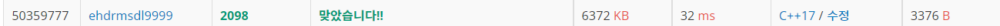

# 외판원 순회

| 시간 제한 | 메모리 제한 | 제출    | 정답   | 맞힌 사람 | 정답 비율   |
| ----- | ------ | ----- | ---- | ----- | ------- |
| 1 초   | 128 MB | 36063 | 9212 | 5578  | 28.342% |

## 문제

외판원 순회 문제는 영어로 Traveling Salesman problem (TSP) 라고 불리는 문제로 computer science 분야에서 가장 중요하게 취급되는 문제 중 하나이다. 여러 가지 변종 문제가 있으나, 여기서는 가장 일반적인 형태의 문제를 살펴보자.

1번부터 N번까지 번호가 매겨져 있는 도시들이 있고, 도시들 사이에는 길이 있다. (길이 없을 수도 있다) 이제 한 외판원이 어느 한 도시에서 출발해 N개의 도시를 모두 거쳐 다시 원래의 도시로 돌아오는 순회 여행 경로를 계획하려고 한다. 단, 한 번 갔던 도시로는 다시 갈 수 없다. (맨 마지막에 여행을 출발했던 도시로 돌아오는 것은 예외) 이런 여행 경로는 여러 가지가 있을 수 있는데, 가장 적은 비용을 들이는 여행 계획을 세우고자 한다.

각 도시간에 이동하는데 드는 비용은 행렬 W[i][j]형태로 주어진다. W[i][j]는 도시 i에서 도시 j로 가기 위한 비용을 나타낸다. 비용은 대칭적이지 않다. 즉, W[i][j] 는 W[j][i]와 다를 수 있다. 모든 도시간의 비용은 양의 정수이다. W[i][i]는 항상 0이다. 경우에 따라서 도시 i에서 도시 j로 갈 수 없는 경우도 있으며 이럴 경우 W[i][j]=0이라고 하자.

N과 비용 행렬이 주어졌을 때, 가장 적은 비용을 들이는 외판원의 순회 여행 경로를 구하는 프로그램을 작성하시오.

## 입력

첫째 줄에 도시의 수 N이 주어진다. (2 ≤ N ≤ 16) 다음 N개의 줄에는 비용 행렬이 주어진다. 각 행렬의 성분은 1,000,000 이하의 양의 정수이며, 갈 수 없는 경우는 0이 주어진다. W[i][j]는 도시 i에서 j로 가기 위한 비용을 나타낸다.

항상 순회할 수 있는 경우만 입력으로 주어진다.

## 출력

첫째 줄에 외판원의 순회에 필요한 최소 비용을 출력한다.

## 나의 코드

```c
#include <iostream>
const int size = 1 << 16;
int N, X;
int M[16][16], Q[size];
int DP[16][1<<16];   // 0에서 시작. 모든 곳 순회후 끝. 0번 마지막 방문은 마지막에 더해주면 돼니까 1<<15로 충분 헷갈려서 16
                       // y축 사실 0번 인덱스도 없앨 수 있겠지만, 그러면 연산량이 많아질지도..?
void search();

int main(void)
{
    std::cin >> N;
    for (int i = 0; i < N; i++)
    {
        for (int j = 0; j < N; j++)
        {
            std::cin >> M[i][j];
        }
    }
    for (int i = 0; i < N; i++)
    {
        for (int j = 1; j < (1 << N); j++)
        {
            DP[i][j] = 17000000;
        }
    }
    DP[0][1] = 0;
    DP[0][0] = 17000000;
    search();
    std::cout << DP[0][0] << '\n';
    // 가장 끝에서 즉 모든 곳을 돌았을때 부터 시작 해서 가장 처음으로 간다. (나의 의식의 흐름) 끝에서 시작하면 탑다운. 아래에서 시작하면 다운 탑.
    // 1에서 2로 가는 최단, 1에서 3으로 가는 최단... 1에서 2거쳐 3으로가는 최단 1에서 4거쳐 3으로 가는 최단... 1에서 2거쳐 3거쳐 4로가는 최단 1에서 2거쳐 5거쳐 4로가는최단 1에서 3거쳐 5거쳐 4로가는 최단...
    // 1에서 1개거쳐 4로가는 최단은 1에서 3거쳐 4로가기 vs 1에서 2거쳐 4로가기 vs 1에서 5거쳐 4로가기
    // 1-2-3-4-5  1-2-4-3-5  1-3-2-4-5  1-3-4-2-5  1-4-2-3-5 1-4-3-2-5
    // 1-2-3-4    1-2-4-3    1-3-2-4    1-3-4-2    1-4-2-3   1-4-3-2
    // 1-2-3-4 vs 1-3-2-4        1-2-4-3 vs 1-4-2-3     1-3-4-2 vs 1-4-3-2  흐름 생각 결론
    // 중간에 못가면 어떻게 처리할 것인가. 최소값은 어떻게 불러오는 것이 효율 적일것인가. 경로 변경에 따른 영향은?
    // 저장 형태 X(1000 0100 0111...) 에서 현재 위치에 따른 값들은 1인 곳만 가능. 그곳에서 어디로 도착할 것인가.
    // 위 상태에서 가야할 곳들중. 못가는 곳을 처리. 갈 수 있는 곳은 갱신 하지만 현재 값은 가장 낮은 값으로
    // 가장 낮은 값에서 갈 수 있는 곳을 적용 하는 것이 거칠때의 최단거리
    // 1,1000 2,0100 3,0010 4,0001 
    // 2,1100 3,1010 4,1001
    // 1,1100 3,0110 4,0101
    // 1010 0110 0011
    // 1001 0101 0011
    // 3, 1110(최소값 결정) 4,1101
    // 3, 1110(다시 안해도돼) 4,1011
    // 1101 1011
    // ...
}

void search()
{
    int NEW, NEW2, st, md, ed, X;
    st = 0, ed = 1;
    Q[st] = 1;
    while (st != ed)
    {
        md = ed;
        while (st != md)
        {
            X = Q[st++];
            st &= ~size;
            for (int i = 1; i < N; i++)
            {
                if (X & (1 << i))  //이미 간곳은 넘겨
                {
                    continue;
                }
                else              // 안 간곳 가자
                {
                    NEW2 = X | (1 << i);
                    if (DP[i][NEW2] != 17000000)  // 이미 계산 됐으면 넘겨
                    {
                        continue;
                    }
                    DP[i][NEW2] = 17000001;
                    Q[ed++] = NEW2;
                    ed &= ~size;
                    for (int j = 0; j < N; j++) //어디서 오는 것이 최소값
                    {
                        if ((X & (1 << j)) && (DP[j][X] != 17000000)) // 이미 갔던곳 시작 j에서 i로
                        {
                            if (M[j][i])         // 갈수 있으면 가자
                            {
                                NEW = M[j][i] + DP[j][X];
                                if (DP[i][NEW2] > NEW)
                                {
                                    DP[i][NEW2] = NEW;
                                }
                            }
                        }
                    }
                    //DP[갈곳의 위치][갈곳] 갱신완료
                }
            }

        }
    }

    for (int i = 1; i < N; i++)
    {
        if (M[i][0] && DP[0][0] > M[i][0] + DP[i][(1 << N) - 1])
        {
            DP[0][0] = M[i][0] + DP[i][(1 << N) - 1];
        }
    }
}
```



순회원 문제를 다시 풀었다. 맨 처음 순회원1에서는 어찌저찌 다르 사람 코드보면서 top-down 방식의 코드를 차근차근 따라가며 어떻게 풀었다. 하지만 완전히 내 것이 아니였고, 꺼름칙한 곳이 여럿이였다. 그래서 다시 공부하고 차근차근 생각해보며 이해한 것을 바탕으로 좀더 쉬운 순회원2를 브루트포스 방식+BFS로 풀었다. 그리고 다시 순회원 1을 내것으로 만들기 위해(TSP알고리즘) 이번에는 BOTTOM-UP 방식으로 코드를 짰다. 물론 하면서 되게 여러번 돌려봤기에 여전히 뭔가 나의 것은 아닌 느낌이다. 이 코드는 내가 어떻게든 완벽히 마스터 해봐야 할 거 같다. 그리고 1등의 코드를 보는데 작동 방식이 어떤지 아직 난해하다. 쫌 봤지만, 비트 마스킹이 어떤식으로 되는지 완벽히 이해해서 그 순서에따라 알아서 작동하는 것 같았다. 그 분의 코드도 마스터 해야할 거 같고, 순회원은 여러번 더 해봐야 할 거 같다. 아직은 내것이 아니다. 이해는 한 것 같지만...ㅜㅜ
