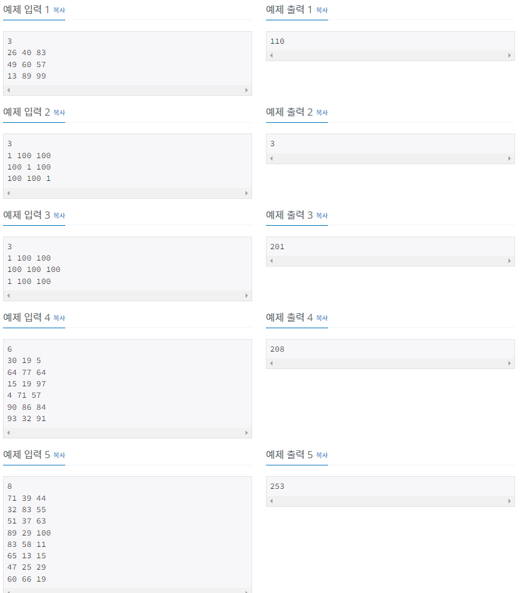
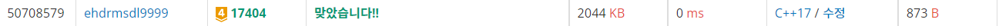

# RGB거리 2

| 시간 제한            | 메모리 제한 | 제출   | 정답   | 맞힌 사람 | 정답 비율   |
| ---------------- | ------ | ---- | ---- | ----- | ------- |
| 0.5 초 (추가 시간 없음) | 128 MB | 8479 | 4899 | 4033  | 58.029% |

## 문제

RGB거리에는 집이 N개 있다. 거리는 선분으로 나타낼 수 있고, 1번 집부터 N번 집이 순서대로 있다.

집은 빨강, 초록, 파랑 중 하나의 색으로 칠해야 한다. 각각의 집을 빨강, 초록, 파랑으로 칠하는 비용이 주어졌을 때, 아래 규칙을 만족하면서 모든 집을 칠하는 비용의 최솟값을 구해보자.

- 1번 집의 색은 2번, N번 집의 색과 같지 않아야 한다.
- N번 집의 색은 N-1번, 1번 집의 색과 같지 않아야 한다.
- i(2 ≤ i ≤ N-1)번 집의 색은 i-1, i+1번 집의 색과 같지 않아야 한다.

## 입력

첫째 줄에 집의 수 N(2 ≤ N ≤ 1,000)이 주어진다. 둘째 줄부터 N개의 줄에는 각 집을 빨강, 초록, 파랑으로 칠하는 비용이 1번 집부터 한 줄에 하나씩 주어진다. 집을 칠하는 비용은 1,000보다 작거나 같은 자연수이다.

## 출력

첫째 줄에 모든 집을 칠하는 비용의 최솟값을 출력한다.



## 나의 코드

```c
#include <iostream>
int N;
int DP[1001][3] = {0, };
int M[1000][3];
int temp[3] = { 100000000 };
int ans;
int min(int a, int b) {
	return a < b ? a : b;
}
int main(void)
{
	std::cin >> N;
	for (int i = 0; i < N; i++)
	{
		std::cin >> M[i][0] >> M[i][1] >> M[i][2];
	}
	DP[0][0] = M[0][0];
	DP[0][1] = M[0][1];
	DP[0][2] = M[0][2];
	for (int j = 0; j < 3; j++)
	{
		for (int k = 0; k < 3; k++)
		{
			if (k == j)
			{
				DP[0][k] = M[0][k];
			}
			else
			{
				DP[0][k] = 100000000;
			}
		}
		for (int i = 1; i < N; i++)
		{
			DP[i][0] = M[i][0] + min(DP[i - 1][1], DP[i - 1][2]);
			DP[i][1] = M[i][1] + min(DP[i - 1][0], DP[i - 1][2]);
			DP[i][2] = M[i][2] + min(DP[i - 1][0], DP[i - 1][1]);
		}
		temp[j] = min(DP[N - 1][(j + 1)%3], DP[N - 1][(j + 2)%3]);
	}
	ans = temp[0];
	for (int i = 1; i < 3; i++)
	{
		ans = min(ans, temp[i]);
	}
	std::cout << ans << '\n';
}
```



이 문제는 1번집에서 출발하면 2,3번은 무한의 숫자로 둬서 1번집에서 시작한 값만을 다 반영한 뒤에, 마지막에 1을 제외한 집의 값들중 최소값을 이용하여 그 값들로 최소 값을 구하는 방식이다. RGB1을 풀면 쉽게 할 수 있을 것 같다.


