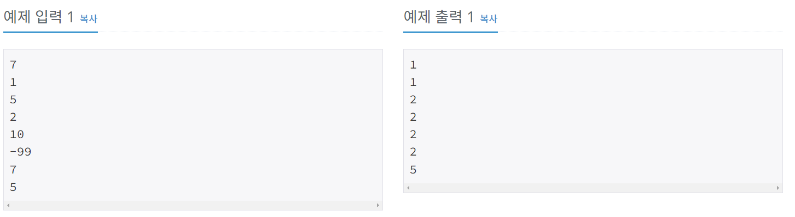
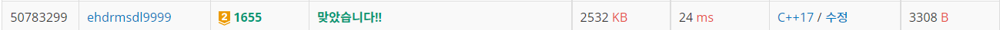

.# 가운데를 말해요

| 시간 제한                                                  | 메모리 제한 | 제출    | 정답    | 맞힌 사람 | 정답 비율   |
| ------------------------------------------------------ | ------ | ----- | ----- | ----- | ------- |
| 0.1 초 ([하단 참고](https://www.acmicpc.net/problem/1655#)) | 128 MB | 44015 | 12807 | 9655  | 30.700% |

## 문제

백준이는 동생에게 "가운데를 말해요" 게임을 가르쳐주고 있다. 백준이가 정수를 하나씩 외칠때마다 동생은 지금까지 백준이가 말한 수 중에서 중간값을 말해야 한다. 만약, 그동안 백준이가 외친 수의 개수가 짝수개라면 중간에 있는 두 수 중에서 작은 수를 말해야 한다.

예를 들어 백준이가 동생에게 1, 5, 2, 10, -99, 7, 5를 순서대로 외쳤다고 하면, 동생은 1, 1, 2, 2, 2, 2, 5를 차례대로 말해야 한다. 백준이가 외치는 수가 주어졌을 때, 동생이 말해야 하는 수를 구하는 프로그램을 작성하시오.

## 입력

첫째 줄에는 백준이가 외치는 정수의 개수 N이 주어진다. N은 1보다 크거나 같고, 100,000보다 작거나 같은 자연수이다. 그 다음 N줄에 걸쳐서 백준이가 외치는 정수가 차례대로 주어진다. 정수는 -10,000보다 크거나 같고, 10,000보다 작거나 같다.

## 출력

한 줄에 하나씩 N줄에 걸쳐 백준이의 동생이 말해야 하는 수를 순서대로 출력한다.



## 나의 코드

```c
#include <iostream>
using namespace std;
int N;
int T[1<<17];
int cntL=0, cntR=0;
int Lflag = 2, Rflag = 2;
int Lsize=0, Rsize=0;
void push(int a);
void alignR(int index);
void alignL(int index);
void alignR2();
void alignL2();

void alignL(int index)
{
	if (index < 2)
		return;
	while (index != 2)
	{
		int index2 = index / 2;
		if (T[index] > T[index2])
		{
			int temp = T[index];
			T[index] = T[index2];
			T[index2] = temp;
		}
		else
		{
			break;
		}
		index = index2;
	}
	return;
}
void alignR(int index)
{
	if (index < 3)
		return;
	while (index != 3)   //최소힙 정렬
	{
		int index2 = index / 2;
		if (T[index] < T[index2])
		{
			int temp = T[index];
			T[index] = T[index2];
			T[index2] = temp;
		}
		else
		{
			break;
		}
		index = index2;
	}
	return;
}


void alignR2()
{
	int index = 3;
	while (index <= Rsize/2)
	{
		int idx1 = index * 2 + 1;
		int idx2 = index * 2;
		if (T[idx2] < T[idx1])
		{
			if (T[index] > T[idx2])
			{
				int temp = T[index];
				T[index] = T[idx2];
				T[idx2] = temp;
				index = idx2;
			}
			else
			{
				break;
			}
		}
		else
		{
			if (T[index] > T[idx1])
			{
				int temp = T[index];
				T[index] = T[idx1];
				T[idx1] = temp;
				index = idx1;
			}
			else
			{
				break;
			}
		}
	}
}

void alignL2()
{
	int index = 2;
	while (index <= Lsize / 2)
	{
		int idx1 = index * 2 + 1;
		int idx2 = index * 2;
		if (T[idx2] < T[idx1])
		{
			if (T[index] < T[idx1])
			{
				int temp = T[index];
				T[index] = T[idx1];
				T[idx1] = temp;
				index = idx1;
			}
			else
			{
				break;
			}
		}
		else
		{
			if (T[index] < T[idx2])
			{
				int temp = T[index];
				T[index] = T[idx2];
				T[idx2] = temp;
				index = idx2;
			}
			else
			{
				break;
			}
		}
	}
}
void push(int a)
{
	if (cntL < cntR) //오른쪽 크면 왼쪽넣어
	{
		cntL++;
		if (Lflag <= cntL)  //2개되면 4개되면  8개 되면  
		{
			Lflag *= 2;
		}
		int insert = Lflag + cntL - Lflag / 2;

		if (T[1] >= a) //a가 작으면 a를 왼쪽 넣어
		{
			T[insert] = a;
		}
		else // a가 크면 T[1]을 왼쪽넣고 a는 T[1]넣어
		{
			if (a > T[3])
			{
				T[insert] = T[1];
				T[1] = T[3];
				T[3] = a;
				alignR2(); //index 3에서 뒤로
			}
			else
			{
			T[insert] = T[1];
			T[1] = a;
			}
		}
		Lsize = insert;
		alignL(insert);
	}
	else           //같으면 오른쪽 넣어. 오른쪽 최소힙 왼쪽 최대힙
	{
		cntR++;
		int insert = Rflag + cntR;
		if (cntR >= Rflag-1)
		{
			Rflag *= 2;
		}
		// 새로온 얘를 오른쪽 갈지, 기존 얘를 오른쪽 갈지.
		if (T[1] <= a) // a를 오른쪽으로 넣어
		{
			T[insert] = a;
		}
		else            // T[1]을 오른쪽으로 , a는 T[1]으로
		{
			if (a < T[2])
			{
				T[insert] = T[1];
				T[1] = T[2];
				T[2] = a;
				alignL2();
			}
			else
			{
				T[insert] = T[1];
				T[1] = a;
			}

		}
		Rsize = insert;
		alignR(insert);
	}

	cout << T[1] << '\n';
}

int main(void)
{
	ios::sync_with_stdio(false);
	cin.tie(0);
	cin >> N;
	for (int i = 2; i < 100000; i *= 2)
	{
		for (int j = 0; j < (i/2); j++)
		{
			T[i + j] = -20000;
		}
	}
	for (int i = 2; i < 100000; i *= 2)
	{
		for (int j = 1; j <= i/2; j++)
		{
			T[i*2 - j] = 20000;
		}
	}
	int temp;
	cin >> temp;
	T[1] = temp;
	cout << temp << '\n';

	for (int i = 1; i < N; i++)
	{
		cin >> temp;
		push(temp);
	}
}
```



이 문제는 중간값을 찾는 문제인데 이렇게 찾으면 되게 빠르다는 것을 알 수 있는 필수 문제 같았다. 직접 힙을 구현해서 힘들었다. 왜냐하면 오타가 너무 많았다... 그래서 힙 구조를 만들때 훨씬 간단하고 명료하게 만드는 방법을 연구해야할 것 같다.


## 다른 사람 코드

```c

```

입 출력 방법이 다른 경우들이 빠른것 같아서.. 우선 보류해야 할 것 같습니다.
