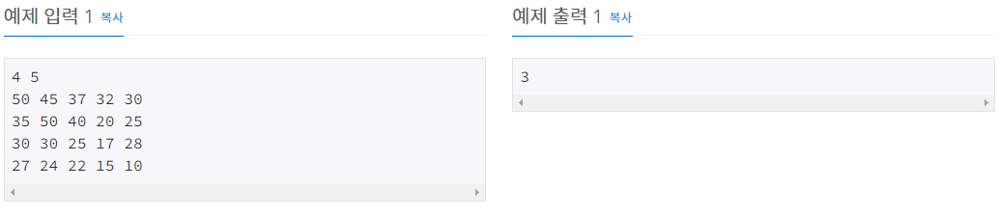

# 내리막 길

| 시간 제한 | 메모리 제한 | 제출    | 정답    | 맞힌 사람 | 정답 비율   |
| ----- | ------ | ----- | ----- | ----- | ------- |
| 2 초   | 128 MB | 61142 | 16788 | 11982 | 27.800% |

## 문제

여행을 떠난 세준이는 지도를 하나 구하였다. 이 지도는 아래 그림과 같이 직사각형 모양이며 여러 칸으로 나뉘어져 있다. 한 칸은 한 지점을 나타내는데 각 칸에는 그 지점의 높이가 쓰여 있으며, 각 지점 사이의 이동은 지도에서 상하좌우 이웃한 곳끼리만 가능하다.


현재 제일 왼쪽 위 칸이 나타내는 지점에 있는 세준이는 제일 오른쪽 아래 칸이 나타내는 지점으로 가려고 한다. 그런데 가능한 힘을 적게 들이고 싶어 항상 높이가 더 낮은 지점으로만 이동하여 목표 지점까지 가고자 한다. 위와 같은 지도에서는 다음과 같은 세 가지 경로가 가능하다.

  

지도가 주어질 때 이와 같이 제일 왼쪽 위 지점에서 출발하여 제일 오른쪽 아래 지점까지 항상 내리막길로만 이동하는 경로의 개수를 구하는 프로그램을 작성하시오.

## 입력

첫째 줄에는 지도의 세로의 크기 M과 가로의 크기 N이 빈칸을 사이에 두고 주어진다. 이어 다음 M개 줄에 걸쳐 한 줄에 N개씩 위에서부터 차례로 각 지점의 높이가 빈 칸을 사이에 두고 주어진다. M과 N은 각각 500이하의 자연수이고, 각 지점의 높이는 10000이하의 자연수이다.

## 출력

첫째 줄에 이동 가능한 경로의 수 H를 출력한다. 모든 입력에 대하여 H는 10억 이하의 음이 아닌 정수이다.



## 나의 풀이

```c
#include <iostream>
using namespace std;

int map[502][502], N, M;
int visited[502][502] = { 0, };
int dy[4] = { 0,0,1,-1 };
int dx[4] = { 1,-1,0,0 };


int search(int y, int x)
{
	int ny, nx;
	if (visited[y][x]>0)
	{
		return visited[y][x];
	}
	if (visited[y][x] == -1)
	{
		return 0;
	}
	for (int i = 0; i < 4; i++)
	{
		ny = y + dy[i];
		nx = x + dx[i];
		if (map[ny][nx] < map[y][x])
		{
			if (visited[ny][nx]>0)
			{
				visited[y][x] += visited[ny][nx];
			}
			else if(visited[ny][nx] != -1)
			{
				visited[y][x] += search(ny, nx);
			}
		}
	}


	if (!visited[y][x])
	{
		visited[y][x] = -1;
		return 0;
	}
	return visited[y][x];
}


int main(void)
{
	cin >> N >> M;
	for (int i = 0; i <= N + 1; i++)
	{
		map[i][0] = 10001;
		map[i][M + 1] = 10001;
	}
	for (int j = 0; j <= M + 1; j++)
	{
		map[0][j] = 10001;
		map[N + 1][j] = 10001;
	}
	for (int i = 1; i <= N; i++)
	{
		for (int j = 1; j <= M; j++)
		{
			cin >> map[i][j];
		}
	}

	visited[N][M] = 1;
	search(1, 1);
	if (visited[1][1] == -1)
	{
		visited[1][1] = 0;
	}
	cout << visited[1][1];

	return 0;
}
```

이 코드는 DP 

## 나의 풀이 2

```c
#include <iostream>
using namespace std;

int map[502][502], N, M;           // 최대 25만개라서 전역변수로 선언. 또한 테두리는 -1로 채우기 위해서 2칸 더 크게 했다.
int visited[502][502];    // 방문 하는 곳에서 골인 지점까지(N,M)까지 가는 경우의 수를 저장한다.
int dy[4] = { 0,0,1,-1 };         // 상하좌우 움직이는 델타
int dx[4] = { 1,-1,0,0 };


int search(int y, int x)           // y,x에서 N,M까지 가는 경우의 수를 visited[y][x]에 저장한다. 이때 y,x에서 갈수 있는 길에서 N,M까지 가는 경우의 수를 더한다.
{
	int ny, nx;
	if (visited[y][x]>0)          // 만약 visited[y][x]가 이미 방문이 되서 y,x에서 N,M까지 가는경우의 수가 알려진 경우 그만큼 더해준다.
	{
		return visited[y][x];
	}
	visited[y][x] = 0;            // 방문 하면 0으로 만들어 줘서 기존의 -1과 차별화 해준다.
	for (int i = 0; i < 4; i++)   // 4방향 탐색
	{
		ny = y + dy[i];
		nx = x + dx[i];
		if (map[ny][nx] < map[y][x])   // 만약 현재의 값이 갈 곳보다 크면 내리막이니까 이때 시행.
		{
			if (visited[ny][nx]>0)     // 만약 갈 곳이 이미 거기서 가는 경우의 수가 몇개인지 알아냈으면 더해준다.
			{
				visited[y][x] += visited[ny][nx];
			}
			else if(visited[ny][nx] == -1)  // 만약 갈곳이 이미 거기서 가는 경우의 수가 몇개인지 못알아 냈으면 거기서의 가는 경우의수를 구해준다.
			{
				visited[y][x] += search(ny, nx);
			}
		}
	}


	return visited[y][x]; // 최종적으로 경우의 수 구했으면 그값을 리턴해준다.
}


int main(void)
{
	cin >> N >> M;
	for (int i = 0; i <= N + 1; i++) //테두리 처리
	{
		map[i][0] = 10001;
		map[i][M + 1] = 10001;
		visited[i][0] = 0;
		visited[i][M + 1] = 0;
	}
	for (int j = 0; j <= M + 1; j++) //테두리 처리
	{
		map[0][j] = 10001;
		map[N + 1][j] = 10001;
		visited[0][j] = 0;
		visited[N + 1][j] = 0;
	}

	for (int i = 1; i <= N; i++)
	{
		for (int j = 1; j <= M; j++) // 지도 값 입력받기
		{
			cin >> map[i][j];
			visited[i][j] = -1;      // visited값 -1로 초기화
		}
	}

	visited[N][M] = 1;              // 도착지점에서 도착지점 가는 경우의 수 1로 만들기/
	search(1, 1);                   // 1,1에서 도착지점 까지 가는 경우의 수 구하기.
	cout << visited[1][1];

	return 0;
}
```


